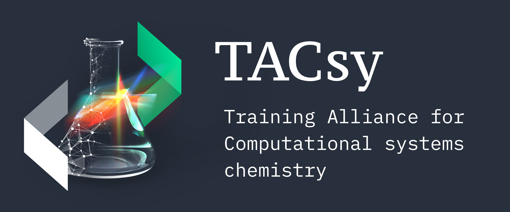

<a class="synedu-to-top" href="#skip-to-frontmatter" aria-label="Back to top">Back to top</a>

  

    
<strong>SynEdu: Teaching reaction informatics via formal graph theory.</strong>

    
<a href="/docs/talktorials">Talktorials</a> · <a href="/docs/installing">Installation</a> · <a href="/docs/api">API</a> · <a href="/docs/contribute">Contribute</a> · <a href="/docs/citation">Citation</a> · <a href="/docs/contact">Contact</a>

    
© Copyright 2026, SynEco Team. Content CC-BY-4.0, code MIT.

    
Created using <a href="https://mystmd.org/">MyST</a>.

  

  

    
    
    
  

