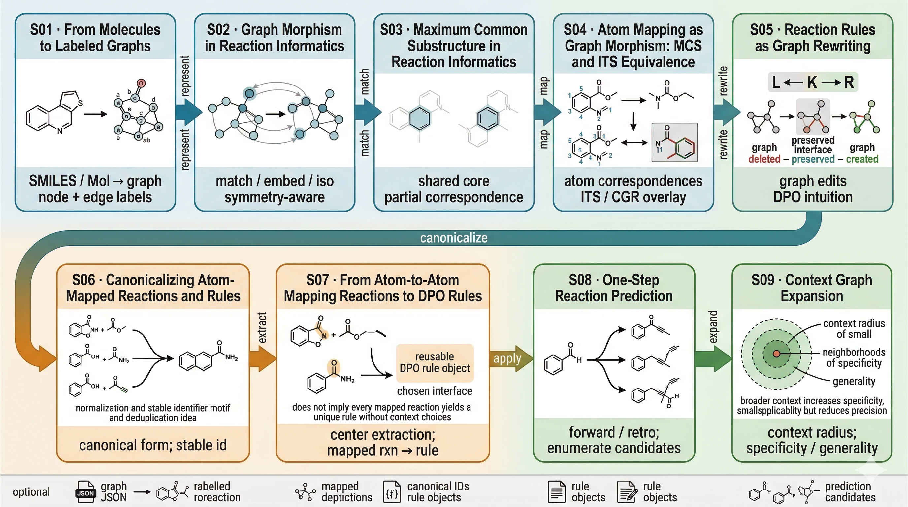

SynEdu
======

Computational reaction chemistry increasingly depends on open software,
reproducible datasets, and reusable graph-based workflows. The individual
tools are often documented, but learners still need worked examples that
connect chemical intuition, mathematical abstractions, and executable code.

SynEdu is a nine-part talktorial series for learning reaction informatics
through molecular graphs, graph morphisms, reaction rules, and prediction
workflows. The notebooks use RDKit as the chemical authority layer and
NetworkX as an explicit graph engine, with links to the broader
:doc:`SynEco <syneco_ecosystem>` where production-ready tooling is
useful.

The material is designed for self-study, classroom teaching, and early
research prototyping. Each talktorial combines a concept explanation with a
runnable Python workflow, so readers can inspect the assumptions, modify the
code, and reuse the workflow in their own projects.

What you learn
--------------

SynEdu is organized as a practical route through reaction informatics rather
than a loose collection of notebooks.

.. rst-class:: synedu-learning-path

.. list-table::
   :widths: 18 27 55
   :header-rows: 1

   * - Stage
     - Focus
     - Outcome
   * - 01
     - Molecules to graphs
     - Represent molecules and reactions as labelled graph objects that can be
       inspected, compared, and transformed.
   * - 02
     - Graphs to reaction rules
     - Build atom mappings, ITS graphs, DPO rules, and reusable rule libraries.
   * - 03
     - Rules to prediction
     - Apply rules for one-step prediction, retrosynthesis-style exploration,
       evaluation, and context expansion.

.. rst-class:: synedu-context-chips

- ``RDKit``
- ``NetworkX``
- ``Molecular graphs``
- ``Graph morphisms``
- ``Reaction rules``
- ``Executable notebooks``

   The SynEdu talktorial series follows a learning path from molecular graph
   representation to graph rewriting rules and one-step reaction prediction.

Software and resources
----------------------

- :doc:`SynEdu talktorials <talktorials/index>` · Runnable notebooks for
  learning reaction informatics workflows.
- :doc:`Run locally <installing>` · Installation notes for setting up RDKit,
  JupyterLab, and SynEdu.
- :doc:`API reference <api>` · Small helper API used by the notebooks and
  reproducible workflows.
- `GitHub repository <https://github.com/TieuLongPhan/SynEdu>`_ · Source code,
  notebooks, issues, and pull requests.

Learning path
-------------

- :ref:`Fundamentals <fundamentals>` · S01-S03 introduce molecular graphs,
  graph morphisms, symmetry, substructure search, and MCS.
- :ref:`Rule library construction <rule-library>` · S04-S07 cover atom mapping,
  ITS graphs, DPO rewriting, canonicalization, and rule library construction.
- :ref:`Rule application <rule-application>` · S08-S09 apply reaction rules for
  prediction, retrosynthesis, evaluation, and context expansion.

Project details
-------------------

Maintainer
   Tieu Long Phan

Funding
   SynEdu is part of a broader research and training effort in computational
   chemistry and reaction informatics. See :doc:`funding` for details.

Citation
   If you use SynEdu in academic work, please cite the project. Citation
   information is available in :doc:`citation`.

Contributing
   Feedback, issue reports, notebook improvements, and documentation fixes are
   welcome. See :doc:`contribute` for the contribution workflow.

.. toctree::
   :maxdepth: 2
   :hidden:

   api

.. toctree::
   :maxdepth: 1
   :hidden:

   external_dependencies
   external_tutorials_collections
   syneco_ecosystem

.. toctree::
   :maxdepth: 1
   :hidden:

   funding
   license
