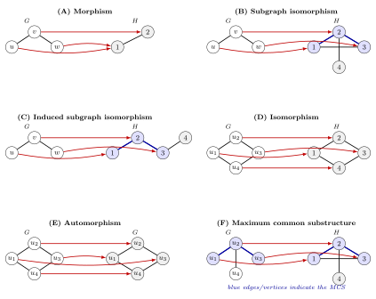

# S02: Graph Morphisms in Reaction Informatics

This talktorial studies graph morphisms as the matching language behind molecular equivalence, symmetry, substructure search, and later reaction-rule application. RDKit provides chemistry-native matching, while NetworkX keeps the graph morphism explicit and inspectable [\[1\]](#6.-References), [\[2\]](#6.-References).


## Aim of this talktorial

1. Define and compute **graph isomorphism** for exact equivalence under atom renumbering.
2. Use **graph automorphism** to understand molecular symmetry and duplicate-looking matches.
3. Compare **subgraph isomorphism** in NetworkX with chemistry-aware RDKit substructure matching.

---

## Learning outcomes

After completing this talktorial, you will be able to:

- Formulate **labeled subgraph matching** as an **injective labeled graph morphism**
  $$
  \varphi : V(P) \hookrightarrow V(H),
  $$
- compute **graph isomorphisms** and interpret molecule equivalence under atom renumbering,
- enumerate **automorphisms** and explain how symmetry creates duplicate-looking matches,
- compute **subgraph isomorphisms** in **NetworkX** and inspect multiple pattern-to-host mappings,
- use **RDKit substructure matching** and explain why it can differ from a pure graph matcher,
- compute **MCS with RDKit** and convert it into an alignment map between two molecules, and
- decide which matching semantics are appropriate for later tasks such as rule extraction, reaction-center localization, and DPO rule application.

---

## Outline

<ul class="synedu-outline">
  <li><a href="#0-setup--data">0. Setup &amp; Data</a></li>
  <li><a href="#1-graph-isomorphism">1. Graph isomorphism</a></li>
  <li><a href="#2-graph-automorphisms">2. Graph automorphisms</a></li>
  <li><a href="#3-subgraph-isomorphism">3. Subgraph isomorphism</a></li>
  <li><a href="#4-discussion">4. Discussion</a></li>
  <li><a href="#5-quiz">5. Quiz</a></li>
  <li><a href="#6.-References">6. References</a></li>
</ul>


## 0. Setup & Data


## 1. Graph isomorphism

To make “same molecule” precise, we model molecules as labeled graphs and compare them via
**label-preserving maps**. This section introduces **labeled graph morphisms** and the induced notion of
**graph isomorphism** [\[3\]](#6.-References), [\[4\]](#6.-References).

<figure style="text-align: center;">
  
  <figcaption>
    <b>Figure 1.</b> Examples of graph morphism-related mappings: morphism,
    subgraph isomorphism, induced subgraph isomorphism, isomorphism,
    automorphism, and maximum common substructure.
  </figcaption>
</figure>

---

### 1.1 Graph morphisms

Let $G,H \in \mathcal{G}$ be labeled molecular graphs with atom/bond labeling functions
$(a_G,b_G)$ and $(a_H,b_H)$.

A **(labeled) graph morphism** from $G$ to $H$ is a map

$$
\varphi : V(G) \to V(H)
$$

that preserves atom types and bond structure. Concretely, for all $v \in V(G)$ and $uv \in E(G)$:

**(M1) Atom-label preservation**
$$
a_H(\varphi(v)) = a_G(v).
$$

**(M2) Adjacency preservation**
$$
\varphi(u)\varphi(v) \in E(H).
$$

**(M3) Bond-label preservation**
$$
b_H\!\big(\varphi(u)\varphi(v)\big) = b_G(uv).
$$

---

### 1.2 Graph isomorphism

Two labeled molecular graphs $G,H\in\mathcal{G}$ are **isomorphic**, written

$$
G \cong H,
$$

if there exists a **bijective** morphism

$$
\varphi : V(G) \to V(H)
$$

satisfying (M1)–(M3), whose inverse $\varphi^{-1}$ also satisfies (M1)–(M3).


> **Chemical intuition**  
> $G \cong H$ means the two graphs encode the *same chemical structure* up to a renumbering of atoms.

### 1.3. Practice

In practice, `networkx` tests $G \cong H$ by searching for such a bijection under the chosen
`node_match` / `edge_match`. The result therefore depends on the label scheme (and any compatibility rules).

$$
\Phi_V : V(G)\times V(H)\to\{\text{true},\text{false}\},
\qquad
\Phi_E : E(G)\times E(H)\to\{\text{true},\text{false}\},
$$

Throughout this talktorials, we use a *strict-but-minimal* label model:

- atom: `element`, `formal_charge`, `aromatic`,
- bond: `order`.

This keeps the equivalence relation explicit and reproducible; later notebooks revisit and relax these choices.


**Q1 - Isomorphism**

Implement `node_match` that requires matching `symbol` **and** either `hcount` or `formal_charge` (or both). Replace the existing `node_match` with your function and re-run the demo so that:

- `benzene` still matches, and  
- `aniline` (`c1ccccc1N`) **does not** match `anilinium` (`c1ccccc1[NH3+]`).

> Hint: `mol_to_graph(..., include_implicit_h=True)` stores H as `hcount`. Use `n.get("hcount",0)` or `n.get("formal_charge",0)`.

<details class="synedu-solution">
<summary><strong>Solution</strong></summary>

```python
def enhanced_node_match(n1, n2):
    return (
        n1.get("element") == n2.get("element")
        and (
            int(n1.get("hcount", 0)) == int(n2.get("hcount", 0))
            or int(n1.get("formal_charge", 0)) == int(n2.get("formal_charge", 0))
        )
    )

print("=== enhanced matcher (element + hcount/charge) ===")
for name in pairs:
    G1 = graphs[f"{name}_a"]; G2 = graphs[f"{name}_b"]
    iso_flag, n_maps = iso_and_count(G1, G2, enhanced_node_match, edge_match)
    print(f"{name:8} | isomorphic: {int(iso_flag):1d} | mappings: {n_maps}")

# quick instructor checks
assert iso_and_count(graphs["benzene_a"], graphs["benzene_b"], enhanced_node_match, edge_match)[0]
assert not iso_and_count(graphs["aniline_a"], graphs["aniline_b"], enhanced_node_match, edge_match)[0]
```

</details>


## 2. Graph automorphisms

### 2.1. Automorphsim

**Observation.** In the benzene example you enumerated **12 mappings** - these are the automorphisms of the benzene heavy-atom graph (the dihedral group \(D_6\), where \(|D_6| = 12\)).

**Definition.** An automorphism [\[3\]](#6.-References), [\[4\]](#6.-References) is a graph isomorphism from the graph to itself:

$$
f : G \longrightarrow G.
$$

The automorphism group is

$$
\mathrm{Aut}(G) \subseteq \mathrm{Iso}(G, G).
$$


##### Automorphism group as permutation matrices

Each automorphism $\sigma \in \mathrm{Aut}(G)$ is a bijection $\sigma: V \to V$.
We represent it as a **permutation matrix** $P_\sigma \in \{0,1\}^{|V| \times |V|}$
where $P_\sigma[i,j] = 1$ iff $\sigma(v_i) = v_j$.

For benzene the full group has order $|\mathrm{Aut}(G)| = 12$ (dihedral group $D_6$).


**Q2 - Automorphism group**

Consider the molecular graph of **aniline** (`c1ccccc1N`).

1. Enumerate **all graph automorphisms** that preserve atom and bond labels.
2. Identify which atoms are **symmetry-equivalent** under these automorphisms.

<details class="synedu-solution">
<summary><strong>Solution</strong></summary>

```python
smiles = 'c1ccccc1N'
mol = Chem.MolFromSmiles(smiles)
graph = mol_to_graph(mol)

draw_molecular_graph(graph)
enumerate_automorphisms(graph)

```

</details>


### 3.2 Orbit

The **orbit** of an atom \(v\) is the set of atoms it can be mapped to by
molecular symmetries [\[3\]](#6.-References), [\[4\]](#6.-References):
$$
\mathrm{Orbit}(v)=\{\psi(v)\mid \psi\in\mathrm{Aut}(G)\}.
$$

Two atoms are **symmetry-equivalent** if one can be exchanged for the other
without changing the molecule:
$$
u \sim v
\;\Longleftrightarrow\;
\exists\,\varphi\in\mathrm{Aut}(G)\ \text{s.t.}\ \varphi(u)=v .
$$

**Chemical intuition.**  
Atoms in the same orbit are indistinguishable by connectivity alone-they
share the same local environment and chemical role.

**Benzene example.**
$$
|\mathrm{Aut}(G)| = |D_6| = 12,
$$
and all six carbon atoms form a **single orbit**.

**Why it matters.**  
Orbits identify symmetry-equivalent atoms, enabling symmetry-aware
deduplication, canonical mappings, and reduced search in subgraph matching.


**Stored in `synedu.Utils`** - the symmetry helpers used here are reusable in later matching and rule-application tasks:
```python
from synedu.Utils.graph import enumerate_automorphisms, compute_orbits_from_automorphisms
```
We keep the first implementation visible for teaching, then import the packaged version later when the workflow becomes repetitive.


**Orbit coloring**

Nodes are coloured by orbit index - atoms of the same colour are **symmetry-equivalent** under $\mathrm{Aut}(G)$.
Breaking symmetry (a methyl group, a chiral centre) splits large orbits into smaller ones.


**Q3 - Orbits**

You have computed the automorphisms and orbits for **benzene**, where all
carbons fall into a single orbit.

**Goal.** Explore how small chemical changes break symmetry and split orbits.

**Tasks.**
1. Starting from the benzene example, **modify only the SMILES input** to:
   - pyridine: `c1ccncc1`
   - toluene: `Cc1ccccc1`
2. Re-run the same code and record:
   - the number of automorphisms,
   - the number of orbits,
   - the atoms in each orbit.
3. Compare the results to benzene.


## 3. Subgraph isomorphism

In rule-based reaction modeling, we repeatedly solve the **pattern-in-host** query:

$$
\text{Does a pattern graph } P \text{ occur inside a host graph } G?
\quad \text{If yes, what are the embeddings?}
$$

Formally, a **subgraph isomorphism** [\[3\]](#6.-References), [\[4\]](#6.-References) is an **injective, label-preserving graph morphism**

$$
f : V(P) \hookrightarrow V(G)
$$

such that:

- **Atom (node) labels are preserved**
  $$a_G(f(v)) = a_P(v)\quad \forall v \in V(P)$$

- **Bond existence and bond types are preserved**
  $$uv \in E(P)\ \Rightarrow\ f(u)f(v) \in E(G), \quad b_G(f(u)f(v)) = b_P(uv)$$

Intuitively, \(f\) is a **labeled monomorphism**: it embeds the pattern into the host
without collisions (injective), while respecting chemical identity (types).


### 3.1. NetworkX subgraph match

NetworkX exposes this via the VF2-style matcher implemented in `networkx.algorithms.isomorphism` [\[2\]](#6.-References), [\[5\]](#6.-References):

- `GraphMatcher.subgraph_isomorphisms_iter()` - enumerates all injective embeddings
  that satisfy `node_match` and `edge_match`.

For downstream tasks (reaction center extraction, rule application, deduplication),
we often need to **post-process** these matches to remove symmetry-equivalent
embeddings, typically by orbit-based canonicalization or choosing a canonical
representative embedding.


For matching **benzene** \(P\) inside **naphthalene** \(G\), the algorithm reports
**24 matches**, arising purely from symmetry:

- **Host symmetry**: automorphisms of \(G\) create multiple placements.
- **Pattern symmetry**: automorphisms of \(P\) create equivalent labelings.
- **Combined effect**:
$$
\#\text{matches} \;\sim\; |\mathrm{Aut}(G)| \cdot |\mathrm{Aut}(P)|
$$


### 3.2. Deduplication of subgraph embeddings

We give a minimal, renderer-friendly description of the **host-image**
deduplication strategy.

Let
$$
m : V(P) \longrightarrow V(G)
$$
be a mapping from pattern nodes to host nodes.
The **image** of \( m \) is the set of host nodes occupied by the embedding:

$$
\mathrm{img}(m) = \{\, m(v) \mid v \in V(P) \,\} \subseteq V(G).
$$

We deduplicate embeddings by grouping all mappings that share the same image.
Operationally, we use the sorted tuple of \( \mathrm{img}(m) \) as a canonical key:

$$
\mathrm{key}(m) = \mathrm{tuple}\!\left(\mathrm{sorted}\big(\mathrm{img}(m)\big)\right).
$$

This collapses symmetry variants that differ only by permutations of pattern
nodes (i.e., different bijections with the same image) and yields the distinct
*placements* of the pattern inside the host.


**Stored in `synedu.Utils`** - the subgraph-matching and deduplication helpers are now available for later talktorials:
```python
from synedu.Utils.graph import nx_subgraph_matches, dedup_by_host_image_with_orbits
```
These functions become important when reaction-rule matching produces many symmetry-equivalent embeddings.


**Deduplication - before / after**

Raw match counts grow with molecular symmetry; deduplication by host-image collapses them to the number of **chemically distinct placements**.
The reduction factor equals $|\mathrm{Aut}(P)| \times$ (host symmetry multiplicity).


**Q4 - Deduplicate modulo pattern automorphisms**

Implement a function `dedup_by_pattern_image_with_orbits(matches, pattern_autos, ...)` that groups pattern-to-host mappings **modulo pattern automorphisms**.

Intuitively, two mappings are equivalent when they differ only by a symmetry operation of the pattern graph. A robust implementation should:

1. choose a deterministic pattern-node order,
2. apply every pattern automorphism to each mapping,
3. convert each transformed mapping into a tuple of host nodes,
4. keep the lexicographically smallest tuple as the canonical key, and
5. return one deterministic representative per key.

<details class="synedu-solution">
<summary><strong>Solution idea</strong></summary>

use a dictionary keyed by the canonical tuple. This is the same orbit-aware deduplication idea used later for reaction-rule matches.

</details>


**Q5 - Detect ethanol as a subgraph in a molecule table**

**Goal.**  
Given a table of molecules represented by SMILES strings, determine which
molecules contain **ethanol** as a subgraph, and store the result in a new
boolean column `is_subgraph_ethanol`.

This exercise connects **subgraph isomorphism** with a practical,
dataframe-based workflow.

---

**Tasks**

1. **Convert SMILES to RDKit molecules**  
   Create a column `mol` by parsing the SMILES strings with RDKit.

2. **Convert molecules to labeled graphs**  
   Create a column `graph` by converting each RDKit molecule to a
   NetworkX graph using `mol_to_graph`.

3. **Select ethanol as the pattern graph**  
   Use the graph of ethanol (row 0) as the subgraph pattern.

4. **Test subgraph containment**  
   For each molecule, check whether the ethanol graph is a subgraph of
   the molecule graph using `nx_subgraph_matches`.

5. **Store the result**  
   Add a boolean column `is_subgraph_ethanol` indicating whether at least
   one subgraph embedding exists.

<details class="synedu-solution">
<summary><strong>Solution</strong></summary>

```python
from rdkit import Chem

# 1. Convert SMILES to RDKit molecules
df["mol"] = df["smiles"].apply(Chem.MolFromSmiles)

# 2. Convert molecules to labeled NetworkX graphs
df["graph"] = df["mol"].apply(mol_to_graph)

# 3. Select ethanol as the pattern graph
ethanol_G = df.loc[0, "graph"]

# 4. Subgraph test: ethanol subgraph in host
def has_ethanol_subgraph(host_G):
    matches = nx_subgraph_matches(
        host_G=host_G,
        pattern_G=ethanol_G,
        invert=True,  # pattern_idx -> host_idx
    )
    return len(matches) > 0

# 5. Add boolean result column
df["is_subgraph_ethanol"] = df["graph"].apply(has_ethanol_subgraph)

```

</details>


### 3.3. RDKit subgraph search


RDKit performs pattern-in-host queries via **substructure matching**, a chemistry-specific form of subgraph isomorphism [\[1\]](#6.-References), [\[6\]](#6.-References):

```python
host_mol.GetSubstructMatches(pattern_mol)
```
Each returned match is a mapping **pattern atom index -> host atom index**.

**Practical limitations:**
- Atom indices are fixed by RDKit’s internal molecule ordering and cannot be
  freely relabeled or manipulated.
- Node/edge matching criteria are not user-definable; they are hard-coded into
  RDKit’s chemistry model.
- Automorphisms and orbit structure are not exposed, making symmetry handling implicit.
- Fine-grained control over which atom or bond attributes participate in matching
  is limited compared to explicit graph-based approaches.

As a result, RDKit substructure matching is efficient and chemically robust,
but less flexible for algorithmic experimentation and symmetry-aware workflows.


**Stored in `synedu.Utils`** - the RDKit comparison wrapper is also packaged:
```python
from synedu.Utils.graph import rdkit_subgraph_matches
```
We will use this side-by-side with NetworkX matching when checking chemical substructure behaviour.


**RDKit vs NetworkX matching comparison**

Applying both matchers to a common test set (ethanol pattern across six host molecules) lets us verify that orbit-based deduplication matches RDKit's `uniquify=True` result, and flag any edge cases where the two frameworks disagree.


**Why aspirin differs**

Aspirin is the useful edge case in this table. The difference is **not a deduplication problem**: deduplication only groups matches that the matcher has already found. The mismatch appears earlier, during subgraph matching.

Our NetworkX matcher uses the explicit graph labels from S01 and requires atom `element`, `formal_charge`, and `aromatic` to agree. RDKit's molecule-query match for `CCO` is more permissive in this context. It also finds an embedding where the first carbon of the ethanol pattern maps onto an aromatic ring carbon in aspirin. NetworkX rejects that embedding because the pattern carbon is non-aromatic but the host atom is aromatic.

So the interpretation is:

- **NetworkX strict** = graph morphism with our chosen labels.
- **RDKit uniquify** = toolkit substructure semantics for the query molecule.
- **Deduplication** = post-processing; it cannot recover embeddings rejected by the matcher.


**Q6 - Detect ethanol subgraphs using RDKit and compare with NetworkX**

**Goal.**  
Repeat **Q5** using **RDKit substructure matching** instead of NetworkX,
and compare the resulting boolean column with the NetworkX-based result.

This exercise highlights practical differences between:
- explicit graph-based subgraph isomorphism (NetworkX), and
- chemistry-native substructure matching (RDKit).

---

**Step-by-step tasks**

0. **Reuse the RDKit molecule column**  
   Use the existing `mol` column created from SMILES.

1. **Select ethanol as the pattern molecule**  
   Use the RDKit molecule corresponding to ethanol (row 0).

2. **Test RDKit substructure containment**  
   For each molecule, check whether RDKit finds at least one substructure
   match of ethanol using `GetSubstructMatches`.

3. **Store the result**  
   Add a boolean column `is_subgraph_ethanol_rdkit`.

4. **Compare with the NetworkX result**  
   Identify molecules where RDKit and NetworkX disagree.


<details class="synedu-solution">
<summary><strong>Solution</strong></summary>

```python
from rdkit import Chem

# 1. Select ethanol as RDKit pattern molecule
ethanol_mol = df.loc[0, "mol"]

# 2. RDKit-based subgraph test
def has_ethanol_subgraph_rdkit(host_mol):
    matches = rdkit_subgraph_matches(
        host_mol=host_mol,
        pattern_mol=ethanol_mol,
        uniquify=True,
    )
    return len(matches) > 0

# 3. Add RDKit result column
df["is_subgraph_ethanol_rdkit"] = df["mol"].apply(has_ethanol_subgraph_rdkit)

# 4. Comparison
comparison = df[
    df["is_subgraph_ethanol"] != df["is_subgraph_ethanol_rdkit"]
][["smiles", "name", "is_subgraph_ethanol", "is_subgraph_ethanol_rdkit"]]

comparison
```

</details>


## 4. Discussion

- **Graph automorphisms** encode molecular symmetry. Unchecked, they inflate
  match enumeration and lead to redundant computation. Orbit-aware
  deduplication (e.g. by host-atom sets or orbit representatives) converts
  symmetry from a liability into a computational advantage.

- **Subgraph isomorphism** is the core operation for rule application later in SynEdu.
- **MCS** is a chemistry-aware alignment primitive, but it is heuristic and sometimes non-unique; always log settings and timeouts.
- **RDKit vs NetworkX**:
  - RDKit: SMARTS matching, built-in `uniquify`.
  - NetworkX: full control over attributes and morphism semantics; you manage deduplication and interpretation.


## 5. Quiz

Answer the following questions using **both chemical intuition** and **formal
graph-theoretic language**. When appropriate, describe your answer in terms of
**graph morphisms**, **automorphism groups**, and **equivalence classes**.

---

### 1. Isomorphism  
What **additional requirement** must a graph morphism
$$
f : G \to H
$$
satisfy in order to be an **isomorphism**?

- How does bijectivity relate to the statement  
  *“two molecules have the same structure”*?
- What chemical information (atom types, bond orders) must be preserved?

---

### 2. Automorphisms and symmetry  
What is an **automorphism** of a molecular graph?

- Formally, how is an automorphism defined as a map
  $$
  \varphi : G \to G \, ?
  $$
- Why do highly symmetric molecules (e.g. benzene) have a **large**
  automorphism group
  $$
  \mathrm{Aut}(G) \, ?
  $$
- Explain why the existence of non-trivial automorphisms leads to
  **multiple equivalent subgraph matches** during pattern matching.

---

### 3. Deduplicating subgraph matches  
Subgraph matching algorithms often return many **equivalent morphisms**.

- Explain how representing a match by the **set of host atom indices**
  $$
  \{\, m(v) \mid v \in V(P) \,\}
  $$
  can be used to **deduplicate** equivalent matches.
- Why does this strategy work even when the mappings differ by a permutation
  of pattern nodes?


## 6. References

1. RDKit documentation. https://www.rdkit.org/docs/
2. NetworkX documentation. https://networkx.org/documentation/stable/
3. Bonchev, D.; Rouvray, D. H., eds. *Chemical Graph Theory: Introduction and Fundamentals*. Abacus Press (1991).
4. Diestel, R. *Graph Theory*, 5th ed. Springer (2017). https://doi.org/10.1007/978-3-662-53622-3
5. Cordella, L. P.; Foggia, P.; Sansone, C.; Vento, M. A (Sub)Graph Isomorphism Algorithm for Matching Large Graphs. *IEEE Transactions on Pattern Analysis and Machine Intelligence* **26**, 1367-1372 (2004). https://doi.org/10.1109/TPAMI.2004.75
6. Ullmann, J. R. An Algorithm for Subgraph Isomorphism. *Journal of the ACM* **23**, 31-42 (1976). https://doi.org/10.1145/321921.321925
