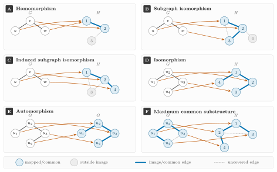

---
jupytext:
  text_representation:
    extension: .md
    format_name: myst
    format_version: 0.13
    jupytext_version: 1.19.4
kernelspec:
  display_name: synedu
  language: python
  name: python3
---

# S02: Graph Homomorphisms in Reaction Informatics

<div class="synedu-lesson-shell not-prose" style="box-sizing:border-box;margin:8px 0 24px;padding:20px;border:1px solid #243b53;border-radius:16px;background:#102a43;color:#fff;font-family:system-ui,-apple-system,BlinkMacSystemFont,'Segoe UI',sans-serif"><div class="synedu-lesson-shell__top" style="display:flex;align-items:flex-start;justify-content:space-between;gap:16px;flex-wrap:wrap"><div><div class="synedu-lesson-shell__eyebrow" style="margin-bottom:5px;color:#5eead4;font-size:11px;font-weight:800;letter-spacing:.12em;text-transform:uppercase">SynEdu learning path</div><div class="synedu-lesson-shell__meta" style="font-size:16px;font-weight:750">Lesson 2 of 9 <span style="color:#9fb3c8;font-weight:500">· Stage 1 · Fundamentals</span></div></div><span class="synedu-lesson-shell__progress-label" style="color:#bcccdc;font-size:12px;font-weight:700">22% complete</span></div><div class="synedu-lesson-shell__track" style="height:5px;margin:16px 0 18px;overflow:hidden;border-radius:999px;background:#334e68"><span style="display:block;width:22%;height:100%;border-radius:inherit;background:#2dd4bf"></span></div><div class="synedu-notebook-actions" style="display:flex;align-items:center;gap:10px;flex-wrap:wrap" role="group" aria-label="Run this lesson"><a class="synedu-launch-badge" href="https://colab.research.google.com/github/TieuLongPhan/SynEdu/blob/main/docs/downloads/S02.ipynb"></a><a class="synedu-launch-badge" href="https://mybinder.org/v2/gh/TieuLongPhan/SynEdu/main?urlpath=lab/tree/docs/downloads/S02.ipynb"></a><a class="synedu-launch-badge" href="https://github.com/TieuLongPhan/SynEdu/raw/main/docs/downloads/S02.ipynb"></a><a class="synedu-launch-badge" href="../../docs/installing"></a></div></div>

This talktorial studies graph homomorphisms as the matching language behind molecular equivalence, symmetry, substructure search, and later reaction-rule application. RDKit provides chemistry-native matching, while NetworkX keeps the graph homomorphism explicit and inspectable [@rdkit_docs; @networkx_docs].

+++

## Aim of this talktorial

1. Define and compute **graph isomorphism** for exact equivalence under atom renumbering.
2. Use **graph automorphism** to understand molecular symmetry and duplicate-looking matches.
3. Compare **subgraph isomorphism** in NetworkX with chemistry-aware RDKit substructure matching.

---

## Learning outcomes

After completing this talktorial, you will be able to:

- Formulate **labeled subgraph matching** as an **injective labeled graph homomorphism**
  $$
  \varphi : V(P) \hookrightarrow V(H),
  $$
- compute **graph isomorphisms** and interpret molecule equivalence under atom renumbering,
- enumerate **automorphisms** and explain how symmetry creates duplicate-looking matches,
- compute **subgraph isomorphisms** in **NetworkX** and inspect multiple pattern-to-host mappings,
- use **RDKit substructure matching** and explain why it can differ from a pure graph matcher,
- compute **MCS with RDKit** and convert it into an alignment map between two molecules, and
- decide which matching semantics are appropriate for later tasks such as rule extraction, reaction-center localization, and DPO rule application.

+++

## 0. Setup & Data

```{code-cell}
import warnings

import rdkit
import networkx as nx
import pandas as pd
from pathlib import Path
from synedu.Utils import draw_molecular_graph, mol_to_graph

# Matplotlib warns about layouts we set deliberately; not a lesson result.
warnings.filterwarnings("ignore", category=UserWarning)

print("RDKit version:", rdkit.__version__)
print("NetworkX version:", nx.__version__)
```

```{code-cell}
DATA_DIR = Path("data")
CSV_PATH = DATA_DIR / "molecules.csv"
df = pd.read_csv(CSV_PATH)
display(df.head())
```

## 1. Graph isomorphism

To make “same molecule” precise, we model molecules as labeled graphs and compare them via
**label-preserving maps**. This section introduces **labeled graph homomorphisms** and the induced notion of
**graph isomorphism** [@bonchev1991chemical; @diestel2017graph].

<figure class="se-figure">
  
  <figcaption>
    <b>Figure 1.</b> The family of label-preserving maps between graphs.
    <b>(A)</b> A homomorphism need not be injective — two vertices of <i>G</i>
    may share an image. <b>(B)</b> A subgraph isomorphism is injective, but the host
    may carry extra edges between matched vertices. <b>(C)</b> An induced
    subgraph isomorphism additionally preserves non-edges. <b>(D)</b> An
    isomorphism is bijective and preserves edges and non-edges both ways.
    <b>(E)</b> An automorphism is an isomorphism from <i>G</i> to itself — here
    a rotation of the four-cycle. <b>(F)</b> The maximum common substructure is
    the largest shared labelled subgraph; uncovered edges stay outside the
    image. Blue marks mapped vertices and image edges; grey marks everything
    outside the image.
  </figcaption>
</figure>

---

### 1.1 Graph homomorphisms

Let $G,H \in \mathcal{G}$ be labeled molecular graphs with atom/bond labeling functions
$(a_G,b_G)$ and $(a_H,b_H)$.

A **(labeled) graph homomorphism** from $G$ to $H$ is a map

$$
\varphi : V(G) \to V(H)
$$

that preserves atom types and bond structure. Concretely, for all $v \in V(G)$ and $uv \in E(G)$:

**(M1) Atom-label preservation**
$$
a_H(\varphi(v)) = a_G(v).
$$

**(M2) Adjacency preservation**
$$
\varphi(u)\varphi(v) \in E(H).
$$

**(M3) Bond-label preservation**
$$
b_H\!\big(\varphi(u)\varphi(v)\big) = b_G(uv).
$$

---

### 1.2 Graph isomorphism

Two labeled molecular graphs $G,H\in\mathcal{G}$ are **isomorphic**, written

$$
G \cong H,
$$

if there exists a **bijective** homomorphism

$$
\varphi : V(G) \to V(H)
$$

satisfying (M1)–(M3), whose inverse $\varphi^{-1}$ also satisfies (M1)–(M3).


> **Chemical intuition**  
> $G \cong H$ means the two graphs encode the *same chemical structure* up to a renumbering of atoms.

### 1.3. Practice

In practice, `networkx` tests $G \cong H$ by searching for such a bijection under the chosen
`node_match` / `edge_match`. The result therefore depends on the label scheme (and any compatibility rules).

$$
\Phi_V : V(G)\times V(H)\to\{\text{true},\text{false}\},
\qquad
\Phi_E : E(G)\times E(H)\to\{\text{true},\text{false}\},
$$

For molecular isomorphism, the strict label model used later in this
talktorial is:

- atom: `element`, `formal_charge`, `aromatic`, `hcount`,
- bond: `order`.

The first comparison below deliberately starts with a coarser atom matcher so
the exercise can show why the additional atom attributes matter.

```{code-cell}
from rdkit import Chem
from networkx.algorithms import isomorphism as iso

pairs = {
    "benzene": ("c1ccccc1", "C1=CC=CC=C1"),
    "aniline": ("c1ccccc1N", "c1ccccc1[NH3+]"),
}

graphs = {}
for name, (sa, sb) in pairs.items():
    graphs[f"{name}_a"] = mol_to_graph(Chem.MolFromSmiles(sa))
    graphs[f"{name}_b"] = mol_to_graph(Chem.MolFromSmiles(sb))


def node_match(n1, n2):
    return n1.get("element") == n2.get("element")


def edge_match(e1, e2):
    return (
        abs(float(e1.get("order", 1.0)) - float(e2.get("order", 1.0))) < 1e-9
        and bool(e1.get("aromatic", False)) == bool(e2.get("aromatic", False))
    )


def iso_and_count(G1, G2, nm, em):
    gm = iso.GraphMatcher(G1, G2, node_match=nm, edge_match=em)
    return gm.is_isomorphic(), sum(1 for _ in gm.isomorphisms_iter())


print("=== simple matcher (element + bond labels) ===")
for name in pairs:
    G1 = graphs[f"{name}_a"]
    G2 = graphs[f"{name}_b"]
    iso_flag, n_maps = iso_and_count(G1, G2, node_match, edge_match)
    print(f"{name:8} | isomorphic: {int(iso_flag):1d} | mappings: {n_maps}")
```

**Q1 - Isomorphism**

Implement `node_match` that requires matching `element` **and** either `hcount` or `formal_charge` (or both). Replace the existing `node_match` with your function and re-run the demo so that:

- `benzene` still matches, and  
- `aniline` (`c1ccccc1N`) **does not** match `anilinium` (`c1ccccc1[NH3+]`).

> Hint: `mol_to_graph(...)` stores implicit hydrogens as `hcount`. Use `n.get("element")`, `n.get("hcount",0)`, and `n.get("formal_charge",0)`.

<details class="synedu-solution">
<summary><strong>Solution</strong></summary>

```python
def enhanced_node_match(n1, n2):
    return (
        n1.get("element") == n2.get("element")
        and (
            int(n1.get("hcount", 0)) == int(n2.get("hcount", 0))
            or int(n1.get("formal_charge", 0)) == int(n2.get("formal_charge", 0))
        )
    )

print("=== enhanced matcher (element + hcount/charge) ===")
for name in pairs:
    G1 = graphs[f"{name}_a"]; G2 = graphs[f"{name}_b"]
    iso_flag, n_maps = iso_and_count(G1, G2, enhanced_node_match, edge_match)
    print(f"{name:8} | isomorphic: {int(iso_flag):1d} | mappings: {n_maps}")

# quick instructor checks
assert iso_and_count(graphs["benzene_a"], graphs["benzene_b"], enhanced_node_match, edge_match)[0]
assert not iso_and_count(graphs["aniline_a"], graphs["aniline_b"], enhanced_node_match, edge_match)[0]
```

</details>

+++

## 2. Graph automorphisms

### 2.1. Automorphism

**Observation.** In the benzene example you enumerated **12 mappings**—the
automorphisms of the benzene heavy-atom graph. We denote this dihedral group
by \(\operatorname{Dih}_6\), with
\(\lvert\operatorname{Dih}_6\rvert=12\), avoiding the two competing
conventions for the symbol \(D_6\).

**Definition.** An automorphism [@bonchev1991chemical; @diestel2017graph] is a graph isomorphism from the graph to itself:

$$
f : G \longrightarrow G.
$$

The automorphism group is

$$
\mathrm{Aut}(G) = \mathrm{Iso}(G, G).
$$

```{code-cell}
def node_match(n1, n2):
    keys = ("element", "formal_charge", "aromatic", "hcount")
    return all(n1.get(key) == n2.get(key) for key in keys)


def edge_match(e1, e2):
    return (
        abs(float(e1.get("order", 1.0)) - float(e2.get("order", 1.0))) < 1e-9
        and bool(e1.get("aromatic", False)) == bool(e2.get("aromatic", False))
    )


def enumerate_automorphisms(G: nx.Graph):
    GM_self = iso.GraphMatcher(G, G, node_match=node_match, edge_match=edge_match)
    return list(GM_self.isomorphisms_iter())


smiles = 'c1ccccc1'
mol = Chem.MolFromSmiles(smiles)
graph = mol_to_graph(mol)
draw_molecular_graph(graph, show_indices=True)
enumerate_automorphisms(graph)
```

#### Automorphism group as permutation matrices

Each automorphism $\sigma \in \mathrm{Aut}(G)$ is a bijection $\sigma: V \to V$.
We represent it as a **permutation matrix** $P_\sigma \in \{0,1\}^{|V| \times |V|}$
where $P_\sigma[i,j] = 1$ iff $\sigma(v_i) = v_j$.

For benzene the full group has order
$|\mathrm{Aut}(G)| = 12$ (the dihedral group
$\operatorname{Dih}_6$).

```{code-cell}
:tags: [hide-input]
import matplotlib.pyplot as plt
import numpy as np
from rdkit import Chem
from synedu.Utils import mol_to_graph
from networkx.algorithms.isomorphism import GraphMatcher


def _node_match_sym(n1, n2):
    keys = ("element", "formal_charge", "aromatic", "hcount")
    return all(n1.get(key) == n2.get(key) for key in keys)


_mol = Chem.MolFromSmiles('c1ccccc1')  # benzene
_G = mol_to_graph(_mol)
_nodes = list(_G.nodes())
_gm = GraphMatcher(_G, _G, node_match=_node_match_sym)
_autos = list(_gm.isomorphisms_iter())

n = len(_nodes)
node_idx = {v: i for i, v in enumerate(_nodes)}
n_show = min(len(_autos), 12)
ncols = min(6, n_show)
nrows = (n_show + ncols - 1) // ncols

fig, axes = plt.subplots(nrows, ncols, figsize=(ncols * 1.9, nrows * 2.3))
axes = axes.flatten() if hasattr(axes, 'flatten') else [axes]

for k, sigma in enumerate(_autos[:n_show]):
    P = np.zeros((n, n), dtype=int)
    for src, dst in sigma.items():
        P[node_idx[src], node_idx[dst]] = 1
    ax = axes[k]
    ax.imshow(P, cmap='Blues', vmin=0, vmax=1, aspect='equal')
    elem = [_G.nodes[v].get('element', '?') for v in _nodes]
    ax.set_xticks(range(n))
    ax.set_yticks(range(n))
    ax.set_xticklabels(elem, fontsize=6)
    ax.set_yticklabels(elem, fontsize=6)
    ax.set_title(f'sigma_{k}', fontsize=8)
    for i in range(n):
        for j in range(n):
            if P[i, j]:
                ax.text(j, i, '1', ha='center', va='center', fontsize=6, color='white')

for ax in axes[n_show:]:
    ax.axis('off')

fig.suptitle(
    f'Aut(benzene): |Aut(G)| = {len(_autos)}',
    fontsize=11,
    fontweight='bold',
)
plt.tight_layout()
plt.show()
print(f'Benzene has {len(_autos)} automorphisms')
```

**Q2 - Automorphism group**

Consider the molecular graph of **aniline** (`c1ccccc1N`).

1. Enumerate **all graph automorphisms** that preserve atom and bond labels.
2. Identify which atoms are **symmetry-equivalent** under these automorphisms.

<details class="synedu-solution">
<summary><strong>Solution</strong></summary>

```python
smiles = 'c1ccccc1N'
mol = Chem.MolFromSmiles(smiles)
graph = mol_to_graph(mol)

draw_molecular_graph(graph)
enumerate_automorphisms(graph)

```

</details>

+++

### 2.2 Orbit

The **orbit** of an atom \(v\) is the set of atoms it can be mapped to by
molecular symmetries [@bonchev1991chemical; @diestel2017graph]:
$$
\mathrm{Orbit}(v)=\{\psi(v)\mid \psi\in\mathrm{Aut}(G)\}.
$$

Two atoms are **symmetry-equivalent** if one can be exchanged for the other
without changing the molecule:
$$
u \sim v
\;\Longleftrightarrow\;
\exists\,\varphi\in\mathrm{Aut}(G)\ \text{s.t.}\ \varphi(u)=v .
$$

**Chemical intuition.**  
Atoms in the same orbit are indistinguishable under the graph attributes
retained by this model. This does not imply equivalence under omitted
information such as three-dimensional conformation or unrepresented
stereochemistry.

**Benzene example.**
$$
|\mathrm{Aut}(G)| = |\operatorname{Dih}_6| = 12,
$$
and all six carbon atoms form a **single orbit**.

**Why it matters.**  
Orbits identify symmetry-equivalent atoms, enabling symmetry-aware
deduplication, canonical mappings, and reduced search in subgraph matching.

```{code-cell}
import networkx as nx
from typing import Dict, Iterable, List, Set, Hashable


def compute_orbits_from_automorphisms(
    G: nx.Graph,
    automorphisms: Iterable[Dict[Hashable, Hashable]] | None = None,
) -> List[Set[Hashable]]:
    """
    Compute vertex orbits induced by graph automorphisms.

    Vertices belong to the same orbit if an automorphism maps one to the
    other. In molecular graphs, each orbit represents symmetry-equivalent
    atoms.

    :param G:
        Input graph.
    :type G: nx.Graph
    :param automorphisms:
        Iterable of automorphisms ``{v: φ(v)}``. If ``None``,
        automorphisms are computed internally.
    :type automorphisms: iterable of dict, optional
    :returns:
        List of vertex orbits (sets of nodes), deterministically ordered.
    :rtype: list[set]
    """
    if automorphisms is None:
        automorphisms = enumerate_automorphisms(G)

    # --- Union–find (disjoint set) ---
    parent: Dict[Hashable, Hashable] = {v: v for v in G.nodes()}

    def find(x: Hashable) -> Hashable:
        """Find set representative with path compression."""
        if parent[x] != x:
            parent[x] = find(parent[x])
        return parent[x]

    def union(a: Hashable, b: Hashable) -> None:
        """Merge the sets containing a and b."""
        ra, rb = find(a), find(b)
        if ra != rb:
            parent[rb] = ra

    # --- Apply automorphism action ---
    for auto in automorphisms:
        for v, fv in auto.items():
            union(v, fv)

    # --- Collect orbits ---
    orbits: Dict[Hashable, Set[Hashable]] = {}
    for v in G.nodes():
        r = find(v)
        orbits.setdefault(r, set()).add(v)

    return sorted(orbits.values(), key=lambda s: min(s))
```

**Stored in `synedu.Utils`** - the symmetry helpers used here are reusable in later matching and rule-application tasks:
```python
from synedu.Utils.graph import enumerate_automorphisms, compute_orbits_from_automorphisms
```
We keep the first implementation visible for teaching, then import the packaged version later when the workflow becomes repetitive.

```{code-cell}
autos = enumerate_automorphisms(graph)
orbits = compute_orbits_from_automorphisms(graph, autos)

print("Number of automorphisms (benzene):", len(autos))
print("Orbits:", orbits)
```

**Orbit coloring**

Nodes are coloured by orbit index - atoms of the same colour are **symmetry-equivalent** under $\mathrm{Aut}(G)$.
Breaking symmetry (a methyl group, a chiral centre) splits large orbits into smaller ones.

```{code-cell}
:tags: [hide-input]
import matplotlib.pyplot as plt
import matplotlib.patches as mpatches
import networkx as nx

from rdkit import Chem
from rdkit.Chem import AllChem

from synedu.Utils import mol_to_graph


_ORBIT_PAL = [
    "#1F77B4",
    "#D62728",
    "#2CA02C",
    "#FF7F0E",
    "#9467BD",
    "#8C564B",
    "#E377C2",
    "#17BECF",
]


def enumerate_automorphisms(G):
    """
    Enumerate graph automorphisms while respecting atom element labels.

    Returns
    -------
    list[dict]
        Each dict maps node -> symmetry-equivalent node.
    """

    def node_match(a, b):
        return a.get("element", "C") == b.get("element", "C")

    matcher = nx.algorithms.isomorphism.GraphMatcher(
        G,
        G,
        node_match=node_match,
    )

    return list(matcher.isomorphisms_iter())


def _orbit_colors(G):
    autos = enumerate_automorphisms(G)
    orbits = compute_orbits_from_automorphisms(G, autos)

    node_orbit = {}

    for i, orbit in enumerate(orbits):
        for n in orbit:
            node_orbit[n] = i

    return node_orbit, orbits, autos


def draw_orbit_graph(G, mol, title, ax, legend_ax):
    node_orbit, orbits, autos = _orbit_colors(G)

    AllChem.Compute2DCoords(mol)
    conf = mol.GetConformer()

    pos = {
        n: (
            conf.GetAtomPosition(G.nodes[n]["rdkit_idx"]).x,
            conf.GetAtomPosition(G.nodes[n]["rdkit_idx"]).y,
        )
        for n in G.nodes()
    }

    nodes_sorted = sorted(G.nodes())

    colors = [_ORBIT_PAL[node_orbit[n] % len(_ORBIT_PAL)] for n in nodes_sorted]

    labels = {n: f"{G.nodes[n].get('element', 'C')}{n}" for n in G.nodes()}

    nx.draw_networkx_edges(
        G,
        pos=pos,
        ax=ax,
        edge_color="#555555",
        width=2.2,
        alpha=0.9,
    )

    nx.draw_networkx_nodes(
        G,
        pos=pos,
        ax=ax,
        nodelist=nodes_sorted,
        node_color=colors,
        node_size=540,
        edgecolors="black",
        linewidths=1.2,
        alpha=0.96,
    )

    nx.draw_networkx_labels(
        G,
        pos=pos,
        labels=labels,
        ax=ax,
        font_color="white",
        font_size=8,
        font_weight="bold",
    )

    ax.set_title(
        f"{title}\n" f"|Aut(G)| = {len(autos)}, {len(orbits)} orbit(s)",
        fontsize=10,
        fontweight="bold",
        pad=8,
    )

    ax.set_aspect("equal")
    ax.margins(0.25)
    ax.axis("off")

    patches = [
        mpatches.Patch(
            color=_ORBIT_PAL[i % len(_ORBIT_PAL)],
            label=f"Orbit {i + 1}: {orbits[i]}",
        )
        for i in range(len(orbits))
    ]

    legend_ax.axis("off")

    ncol = 1 if len(patches) <= 3 else 2

    legend_ax.legend(
        handles=patches,
        loc="center",
        fontsize=7,
        frameon=True,
        framealpha=0.95,
        ncol=ncol,
        borderpad=0.45,
        handlelength=1.8,
        columnspacing=0.9,
    )


examples = [
    ("Benzene", "c1ccccc1"),
    ("Toluene", "Cc1ccccc1"),
    ("Aniline", "Nc1ccccc1"),
    ("Chiral centre", "C[C@H](O)Cl"),
]


fig = plt.figure(figsize=(12, 10))

outer = fig.add_gridspec(
    2,
    2,
    left=0.04,
    right=0.98,
    bottom=0.05,
    top=0.90,
    wspace=0.25,
    hspace=0.38,
)

fig.suptitle(
    "Orbit coloring - atoms sharing a colour are symmetry-equivalent",
    fontsize=15,
    fontweight="bold",
    y=0.97,
)

for idx, (name, smi) in enumerate(examples):
    row = idx // 2
    col = idx % 2

    inner = outer[row, col].subgridspec(
        2,
        1,
        height_ratios=[4.0, 1.0],
        hspace=0.01,
    )

    ax = fig.add_subplot(inner[0])
    legend_ax = fig.add_subplot(inner[1])

    mol = Chem.MolFromSmiles(smi)
    G = mol_to_graph(mol)

    draw_orbit_graph(G, mol, name, ax, legend_ax)

plt.show()
```

**Q3 - Orbits**

You have computed the automorphisms and orbits for **benzene**, where all
carbons fall into a single orbit.

**Goal.** Explore how small chemical changes break symmetry and split orbits.

**Tasks.**
1. Starting from the benzene example, **modify only the SMILES input** to:
   - pyridine: `c1ccncc1`
   - toluene: `Cc1ccccc1`
2. Re-run the same code and record:
   - the number of automorphisms,
   - the number of orbits,
   - the atoms in each orbit.
3. Compare the results to benzene.

+++

## 3. Subgraph isomorphism

In rule-based reaction modeling, we repeatedly solve the **pattern-in-host** query:

$$
\text{Does a pattern graph } P \text{ occur inside a host graph } G?
\quad \text{If yes, what are the embeddings?}
$$

Formally, a **subgraph isomorphism** [@bonchev1991chemical; @diestel2017graph] is an **injective, label-preserving graph homomorphism**

$$
f : V(P) \hookrightarrow V(G)
$$

such that:

- **Atom (node) labels are preserved**
  $$a_G(f(v)) = a_P(v)\quad \forall v \in V(P)$$

- **Bond existence and bond types are preserved**
  $$uv \in E(P)\ \Rightarrow\ f(u)f(v) \in E(G), \quad b_G(f(u)f(v)) = b_P(uv)$$

Intuitively, \(f\) is a **labeled monomorphism**: it embeds the pattern into the host
without collisions (injective), while respecting chemical identity (types).

+++

### 3.1. NetworkX subgraph match

NetworkX exposes this via the VF2-style matcher implemented in `networkx.algorithms.isomorphism` [@networkx_docs; @cordella2004subgraph]:

- `GraphMatcher.subgraph_monomorphisms_iter()` - enumerates all injective embeddings
  that satisfy `node_match` and `edge_match`.

For downstream tasks (reaction center extraction, rule application, deduplication),
we often need to **post-process** these matches to remove symmetry-equivalent
embeddings, typically by orbit-based canonicalization or choosing a canonical
representative embedding.

```{code-cell}
from __future__ import annotations
from typing import Dict, List
import networkx as nx
from networkx.algorithms import isomorphism as iso
from rdkit import Chem


def substructure_node_match(host_attrs, pattern_attrs):
    """Match the query labels used for an aromatic ring embedding."""
    return (
        host_attrs.get("element") == pattern_attrs.get("element")
        and bool(host_attrs.get("aromatic", False))
        == bool(pattern_attrs.get("aromatic", False))
    )


def substructure_edge_match(host_attrs, pattern_attrs):
    return (
        abs(
            float(host_attrs.get("order", 1.0))
            - float(pattern_attrs.get("order", 1.0))
        )
        < 1e-9
        and bool(host_attrs.get("aromatic", False))
        == bool(pattern_attrs.get("aromatic", False))
    )


def nx_subgraph_matches(
    host_G: nx.Graph,
    pattern_G: nx.Graph,
    *,
    invert: bool = True,
    node_match_fn=substructure_node_match,
    edge_match_fn=substructure_edge_match,
) -> List[Dict]:
    """
    Enumerate subgraph isomorphisms of `pattern_G` inside `host_G`.

    Notes
    -----
    NetworkX's GraphMatcher(host, pattern).subgraph_monomorphisms_iter()
    yields mappings of the form: host_node -> pattern_node (G1 -> G2).

    If you want the more intuitive direction (pattern -> host), set
    `invert=True`. The default query matcher intentionally omits hydrogen
    count: a fused aromatic carbon can satisfy a ring query even though its
    hydrogen count differs from the corresponding atom in isolated benzene.
    """
    GM = iso.GraphMatcher(
        host_G,
        pattern_G,
        node_match=node_match_fn,
        edge_match=edge_match_fn,
    )

    out: List[Dict] = []
    for m_host_to_pat in GM.subgraph_monomorphisms_iter():
        if invert:
            out.append({p: h for h, p in m_host_to_pat.items()})
        else:
            out.append(m_host_to_pat)
    return out


pattern_mol = Chem.MolFromSmiles("c1ccccc1")  # benzene
host_mol = Chem.MolFromSmiles("c1ccc2ccccc2c1")  # naphthalene

pattern_G = mol_to_graph(pattern_mol)
host_G = mol_to_graph(host_mol)

matches = nx_subgraph_matches(host_G, pattern_G, invert=True)  # pattern_idx -> host_idx

print("Raw subgraph isomorphisms (pattern -> host):", len(matches))
```

```{code-cell}
:tags: [hide-input]
import matplotlib.pyplot as plt

fig, axes = plt.subplots(1, 2, figsize=(10, 4))

draw_molecular_graph(
    pattern_G,
    ax=axes[0],
    include_mol=False,
    highlight_nodes=None,
    highlight_edges=None,
)
axes[0].set_title("Benzene", fontsize=20, weight='bold')

draw_molecular_graph(
    host_G,
    ax=axes[1],
    include_mol=False,
    highlight_nodes=None,
    highlight_edges=None,
)
axes[1].set_title("Naphthalene", fontsize=20, weight='bold')

plt.tight_layout()
plt.show()
```

For matching **benzene** \(P\) inside **naphthalene** \(G\), the algorithm reports
**24 matches**, arising purely from symmetry:

- **Host symmetry**: automorphisms of \(G\) create multiple placements.
- **Pattern symmetry**: automorphisms of \(P\) create equivalent labelings.
- **Embedding count**:
$$
\#\text{matches}
= \sum_{\text{placements } I \subseteq V(G)} |\mathrm{Iso}(P, G[I])|
$$

Raw matches therefore grow with both symmetry-equivalent host placements and relabelings of symmetric pattern atoms.

+++

### 3.2. Deduplication of subgraph embeddings

We give a minimal, renderer-friendly description of the **host-image**
deduplication strategy.

Let
$$
m : V(P) \longrightarrow V(G)
$$
be a mapping from pattern nodes to host nodes.
The **image** of \( m \) is the set of host nodes occupied by the embedding:

$$
\mathrm{img}(m) = \{\, m(v) \mid v \in V(P) \,\} \subseteq V(G).
$$

We deduplicate embeddings by grouping all mappings that share the same image.
Operationally, we use the sorted tuple of \( \mathrm{img}(m) \) as a canonical key:

$$
\mathrm{key}(m) = \mathrm{tuple}\!\left(\mathrm{sorted}\big(\mathrm{img}(m)\big)\right).
$$

This collapses symmetry variants that differ only by permutations of pattern
nodes (i.e., different bijections with the same image) and yields the distinct
*placements* of the pattern inside the host.

```{code-cell}
from collections import defaultdict
from typing import Dict, Iterable, List, Mapping, Tuple, Union, Optional


def _build_node_to_rep(
    orbits: Union[Iterable[Iterable[int]], Mapping[int, int], None],
) -> Dict[int, int]:
    """Convert `orbits` into a mapping node -> representative."""
    if orbits is None:
        return {}
    if isinstance(orbits, Mapping):
        return dict(orbits)
    node_to_rep: Dict[int, int] = {}
    for orbit in orbits:
        orbit = set(orbit)
        if not orbit:
            continue
        rep = min(orbit)
        for v in orbit:
            node_to_rep[v] = rep
    return node_to_rep


def dedup_by_host_image_with_orbits(
    matches: Iterable[Dict[int, int]],
    *,
    orbits: Union[Iterable[Iterable[int]], Mapping[int, int], None] = None,
    host_autos: Optional[Iterable[Mapping[int, int]]] = None,
    pattern_node_order: Optional[Iterable[int]] = None,
    return_groups: bool = False,
) -> Union[List[Dict[int, int]], Dict[Tuple[int, ...], List[Dict[int, int]]]]:
    """
    Deduplicate pattern->host mappings by canonical host-image (with optional orbit reps).

    Parameters
    ----------
    matches : iterable of dict
        Each mapping is pattern_node -> host_node.
    host_autos : iterable of host-node mappings, optional
        Automorphisms used to canonicalize the entire mapped host image.
    orbits : deprecated
        Vertex orbits alone cannot canonicalize multi-node host images. They
        are accepted only together with ``host_autos`` for API compatibility.
    pattern_node_order : iterable of pattern node ids, optional
        Order used to form the per-mapping tuple for selecting the representative.
        If None, inferred deterministically from the first mapping (sorted keys).
    return_groups : bool (default False)
        If False (default) return a list of representative mappings (one per canonical class).
        If True return the full dict: canonical_key -> list[mappings].

    Returns
    -------
    List[dict] or Dict[tuple, list]
        See `return_groups` description.
    """
    matches = list(matches)  # materialize to allow multiple passes
    if not matches:
        return {} if return_groups else []

    if orbits is not None and host_autos is None:
        raise ValueError(
            "Vertex orbits alone cannot canonicalize a multi-node host image; "
            "pass host_autos"
        )
    autos = [dict(auto) for auto in host_autos] if host_autos is not None else []

    # infer or validate pattern node order
    if pattern_node_order is None:
        # Use sorted keys of the first mapping (deterministic)
        pattern_node_order = tuple(sorted(matches[0].keys()))
    else:
        pattern_node_order = tuple(pattern_node_order)

    def canonical_host_image(m: Dict[int, int]) -> Tuple[int, ...]:
        image = tuple(sorted(m.values()))
        if not autos:
            return image
        return min(tuple(sorted(auto[node] for node in image)) for auto in autos)

    # Bucket by the host image, canonicalized under one whole-graph symmetry.
    buckets: Dict[Tuple[int, ...], List[Dict[int, int]]] = defaultdict(list)
    for m in matches:
        key = canonical_host_image(m)
        buckets[key].append(m)

    # if user requested full groups, return them (deterministic ordering by key)
    if return_groups:
        return {k: buckets[k] for k in sorted(buckets.keys())}

    # otherwise pick a deterministic representative per bucket:
    # representative = mapping with smallest tuple (m[p] for p in pattern_node_order)
    representatives: List[Dict[int, int]] = []
    for key in sorted(buckets.keys()):
        group = buckets[key]

        # compute lexicographic tuple for each mapping according to pattern_node_order
        def ordering_tuple(m: Dict[int, int]) -> Tuple[int, ...]:
            return tuple(m[p] for p in pattern_node_order)

        rep = min(group, key=ordering_tuple)
        representatives.append(rep)

    return representatives
```

**Stored in `synedu.Utils`** - the subgraph-matching and deduplication helpers are now available for later talktorials:
```python
from synedu.Utils.graph import nx_subgraph_matches, dedup_by_host_image_with_orbits
```
These functions become important when reaction-rule matching produces many symmetry-equivalent embeddings.

```{code-cell}
# 1. compute host orbits (optional - useful if you later want to collapse host symmetry)
host_autos = enumerate_automorphisms(host_G)  # φ : host_node -> host_node
host_orbits = compute_orbits_from_automorphisms(host_G, host_autos)  # list of sets
print("Host orbits:", host_orbits)
print()

# 2. dedup by host-image (default: returns representatives list)
representatives = dedup_by_host_image_with_orbits(matches)  # list of rep mappings
print("Number of representatives:", len(representatives))
for i, rep in enumerate(representatives, start=1):
    print(f" representative #{i}:", rep)
print()

# 3. (optional) show full groups and multiplicities to verify symmetry inflation
groups = dedup_by_host_image_with_orbits(
    matches, return_groups=True
)  # dict: key -> list[mappings]
print("Distinct placements by host-image (groups):", len(groups))
for key, group in groups.items():
    print(" placement key:", key, " multiplicity:", len(group))
    print("  example mapping:", group[0])
print()

# 4. (optional) collapse placements modulo host automorphisms (use host_orbits)
groups_mod_host = dedup_by_host_image_with_orbits(
    matches, orbits=host_orbits, host_autos=host_autos, return_groups=True
)
print("Unique classes modulo host automorphisms:", len(groups_mod_host))
for key, group in groups_mod_host.items():
    print(" canonical host-image key:", key, " multiplicity:", len(group))
    print("  example mapping:", group[0])
```

```{code-cell}
:tags: [hide-input]
# Deduplicate to get the two distinct host-node images in naphthalene.
host_autos_ = enumerate_automorphisms(host_G)
host_orbits_ = compute_orbits_from_automorphisms(host_G, host_autos_)
reps = dedup_by_host_image_with_orbits(matches)  # 2 unique placements

print(f"Raw matches: {len(matches)}   ->   Unique placements: {len(reps)}")

fig, axes = plt.subplots(1, len(reps), figsize=(6 * len(reps), 5))
fig.suptitle(
    f"Benzene ring query in naphthalene - {len(reps)} host-image placements "
    f"(from {len(matches)} raw matches)",
    fontsize=11,
    fontweight="bold",
)

for ax, rep in zip(axes, reps):
    matched_host_nodes = set(rep.values())
    matched_host_edges = set()
    for u, v in host_G.edges():
        if u in matched_host_nodes and v in matched_host_nodes:
            matched_host_edges.add((u, v))
    draw_molecular_graph(
        host_G,
        ax=ax,
        label_mode="none",
        highlight_nodes=matched_host_nodes,
        highlight_edges=matched_host_edges,
        highlight_color="#FF7F0E",
        show_indices=True,
    )

plt.tight_layout()
plt.show()
```

**Deduplication - before / after**

Raw match counts grow with molecular symmetry; deduplication by host-image collapses them to the number of **chemically distinct placements**.
For this host-image deduplication (which groups mappings by image but does not fold host automorphisms together), the reduction factor per placement equals $|\mathrm{Aut}(P)|$, the automorphism-group order of the pattern - each placement is reached by exactly that many pattern relabelings. Collapsing symmetry-equivalent *placements* as well (e.g. the two equivalent rings in naphthalene) requires the additional host-orbit step shown below, which multiplies the reduction by the host symmetry multiplicity.

```{code-cell}
:tags: [hide-input]
import numpy as np
import pandas as pd
import matplotlib.pyplot as plt

from matplotlib.ticker import MaxNLocator
from rdkit import Chem
from rdkit.Chem import Draw, AllChem

from synedu.Utils import mol_to_graph


# ============================================================
# Pattern molecule
# ============================================================
_pattern_mol = Chem.MolFromSmiles("c1ccccc1")  # benzene pattern
_pattern_G = mol_to_graph(_pattern_mol)


# ============================================================
# Host molecules
# ============================================================
_hosts = [
    ("naphthalene", "c1ccc2ccccc2c1"),
    ("anthracene", "c1ccc2cc3ccccc3cc2c1"),
    ("pyrene", "c1cc2ccc3cccc4ccc(c1)c2c34"),
    ("fluoranthene", "c1ccc2-c3cccc4cccc-3c4c2c1"),
]


# ============================================================
# Compute statistics
# ============================================================
rows = []
host_mols = []

for name, smi in _hosts:
    hmol = Chem.MolFromSmiles(smi)
    if hmol is None:
        raise ValueError(f"Could not parse SMILES for {name}: {smi}")

    AllChem.Compute2DCoords(hmol)
    host_mols.append(hmol)

    hG = mol_to_graph(hmol)

    raw = nx_subgraph_matches(hG, _pattern_G, invert=True)

    hautos = enumerate_automorphisms(hG)
    _ = compute_orbits_from_automorphisms(hG, hautos)

    deduped = dedup_by_host_image_with_orbits(raw)

    raw_count = len(raw)
    unique_count = len(deduped)
    reduction_factor = raw_count / max(unique_count, 1)

    rows.append(
        {
            "host": name,
            "SMILES": smi,
            "raw": raw_count,
            "unique": unique_count,
            "reduction_factor": reduction_factor,
        }
    )

df = pd.DataFrame(rows)


# ============================================================
# Plot style
# ============================================================
plt.rcParams.update(
    {
        "font.size": 11,
        "axes.titlesize": 14,
        "axes.labelsize": 12,
        "figure.titlesize": 19,
    }
)

raw_color = "#D95F5F"
unique_color = "#4F83D1"
accent_color = "#2A8C66"


# ============================================================
# Figure layout
# ============================================================
fig = plt.figure(figsize=(14, 8.5), constrained_layout=False)

gs = fig.add_gridspec(
    nrows=2,
    ncols=4,
    height_ratios=[1.1, 1.8],
    hspace=0.28,
    wspace=0.16,
)

mol_axes = [fig.add_subplot(gs[0, i]) for i in range(4)]
ax_bar = fig.add_subplot(gs[1, :])

fig.suptitle(
    "Benzene Subgraph Matching Across Polycyclic Aromatic Hosts",
    y=0.97,
    fontweight="bold",
)

# ============================================================
# Top panel: molecule cards
# ============================================================
for ax, mol, row in zip(mol_axes, host_mols, df.itertuples()):
    img = Draw.MolToImage(mol, size=(320, 220), kekulize=True)

    ax.imshow(img)
    ax.set_xticks([])
    ax.set_yticks([])
    ax.set_facecolor("#FAFAFA")

    for spine in ax.spines.values():
        spine.set_visible(True)
        spine.set_linewidth(0.9)
        spine.set_edgecolor("#D8D8D8")

    ax.text(
        0.5,
        1.05,
        row.host,
        transform=ax.transAxes,
        ha="center",
        va="bottom",
        fontsize=12,
        fontweight="bold",
    )

    ax.text(
        0.5,
        -0.08,
        f"raw = {row.raw}   |   unique = {row.unique}",
        transform=ax.transAxes,
        ha="center",
        va="top",
        fontsize=10,
        color="#333333",
    )

    ax.text(
        0.5,
        -0.20,
        f"reduction = {row.reduction_factor:.1f}×",
        transform=ax.transAxes,
        ha="center",
        va="top",
        fontsize=10,
        fontweight="bold",
        color=accent_color,
    )


# ============================================================
# Bottom panel: grouped bar chart
# ============================================================
x = np.arange(len(df))
w = 0.34

bars_raw = ax_bar.bar(
    x - w / 2,
    df["raw"],
    width=w,
    color=raw_color,
    edgecolor="black",
    linewidth=0.8,
    alpha=0.92,
    label="Raw matches",
)

bars_unique = ax_bar.bar(
    x + w / 2,
    df["unique"],
    width=w,
    color=unique_color,
    edgecolor="black",
    linewidth=0.8,
    alpha=0.92,
    label="Unique placements",
)

ax_bar.bar_label(bars_raw, padding=3, fontsize=11, fontweight="bold")
ax_bar.bar_label(bars_unique, padding=3, fontsize=11, fontweight="bold")

ax_bar.set_xticks(x)
ax_bar.set_xticklabels(df["host"], fontsize=12)
ax_bar.set_ylabel("Number of benzene matches")
ax_bar.set_title(
    "Raw matches collapse into fewer symmetry-unique placements",
    pad=12,
    fontweight="bold",
)

ax_bar.yaxis.set_major_locator(MaxNLocator(integer=True))
ax_bar.grid(axis="y", linestyle="--", alpha=0.30)
ax_bar.set_axisbelow(True)

ax_bar.spines["top"].set_visible(False)
ax_bar.spines["right"].set_visible(False)

ax_bar.legend(
    loc="upper left",
    frameon=True,
    fontsize=11,
)


ax_bar.set_ylim(0, max(df["raw"]) + 8)


plt.tight_layout(rect=[0.02, 0.02, 0.98, 0.91])
plt.show()

df
```

**Q4 - Deduplicate modulo pattern automorphisms**

Implement a function `dedup_by_pattern_image_with_orbits(matches, pattern_autos, ...)` that groups pattern-to-host mappings **modulo pattern automorphisms**.

Intuitively, two mappings are equivalent when they differ only by a symmetry operation of the pattern graph. A robust implementation should:

1. choose a deterministic pattern-node order,
2. apply every pattern automorphism to each mapping,
3. convert each transformed mapping into a tuple of host nodes,
4. keep the lexicographically smallest tuple as the canonical key, and
5. return one deterministic representative per key.

<details class="synedu-solution">
<summary><strong>Solution idea</strong></summary>

use a dictionary keyed by the canonical tuple. This is the same orbit-aware deduplication idea used later for reaction-rule matches.

</details>

+++

**Q5 - Detect ethanol as a subgraph in a molecule table**

**Goal.**  
Given a table of molecules represented by SMILES strings, determine which
molecules contain **ethanol** as a subgraph, and store the result in a new
boolean column `is_subgraph_ethanol`.

This exercise connects **subgraph isomorphism** with a practical,
dataframe-based workflow.

---

**Tasks**

1. **Convert SMILES to RDKit molecules**  
   Create a column `mol` by parsing the SMILES strings with RDKit.

2. **Convert molecules to labeled graphs**  
   Create a column `graph` by converting each RDKit molecule to a
   NetworkX graph using `mol_to_graph`.

3. **Select ethanol as the pattern graph**  
   Use the graph of ethanol (row 0) as the subgraph pattern.

4. **Test subgraph containment**  
   For each molecule, check whether the ethanol graph is a subgraph of
   the molecule graph using `nx_subgraph_matches`.

5. **Store the result**  
   Add a boolean column `is_subgraph_ethanol` indicating whether at least
   one subgraph embedding exists.

<details class="synedu-solution">
<summary><strong>Solution</strong></summary>

```python
from rdkit import Chem

# 1. Convert SMILES to RDKit molecules
df["mol"] = df["smiles"].apply(Chem.MolFromSmiles)

# 2. Convert molecules to labeled NetworkX graphs
df["graph"] = df["mol"].apply(mol_to_graph)

# 3. Select ethanol as the pattern graph
ethanol_G = df.loc[0, "graph"]

# 4. Subgraph test: ethanol subgraph in host
def has_ethanol_subgraph(host_G):
    matches = nx_subgraph_matches(
        host_G=host_G,
        pattern_G=ethanol_G,
        invert=True,  # pattern_idx -> host_idx
    )
    return len(matches) > 0

# 5. Add boolean result column
df["is_subgraph_ethanol"] = df["graph"].apply(has_ethanol_subgraph)

```

</details>

+++

### 3.3. RDKit subgraph search


RDKit performs pattern-in-host queries via **substructure matching**, a chemistry-specific form of subgraph isomorphism [@rdkit_docs; @ullmann1976algorithm]:

```python
host_mol.GetSubstructMatches(pattern_mol)
```
Each returned match is a mapping **pattern atom index -> host atom index**.

**Practical limitations:**
- Atom indices are fixed by RDKit’s internal molecule ordering and cannot be
  freely relabeled or manipulated.
- Node/edge matching criteria are not user-definable; they are hard-coded into
  RDKit’s chemistry model.
- Automorphisms and orbit structure are not exposed, making symmetry handling implicit.
- Fine-grained control over which atom or bond attributes participate in matching
  is limited compared to explicit graph-based approaches.

As a result, RDKit substructure matching is efficient and chemically robust,
but less flexible for algorithmic experimentation and symmetry-aware workflows.

```{code-cell}
from rdkit import Chem
from typing import List, Dict, Tuple


def rdkit_subgraph_matches(
    host_mol: Chem.Mol,
    pattern_mol: Chem.Mol,
    *,
    uniquify: bool = False,
) -> List[Dict[int, int]]:
    """
    Enumerate substructure matches of `pattern_mol` inside `host_mol`.

    Returns
    -------
    List[Dict[int, int]]
        Each mapping is: pattern_atom_idx -> host_atom_idx

    Notes
    -----
    - RDKit returns tuples of host indices ordered by pattern atom order.
    - If `uniquify=False`, symmetry-equivalent embeddings are *not* removed.
    """
    matches: Tuple[Tuple[int, ...], ...] = host_mol.GetSubstructMatches(
        pattern_mol,
        uniquify=uniquify,
    )

    out: List[Dict[int, int]] = []
    for m in matches:
        out.append({p_idx: h_idx for p_idx, h_idx in enumerate(m)})
    return out


# Compare raw vs heuristic-deduplicated matches
matches = rdkit_subgraph_matches(host_mol, pattern_mol, uniquify=False)
print("Raw subgraph isomorphisms (pattern -> host):", len(matches))

matches = rdkit_subgraph_matches(host_mol, pattern_mol, uniquify=True)
print("Heuristically unique subgraph isomorphisms (pattern -> host):", len(matches))
```

**Stored in `synedu.Utils`** - the RDKit comparison wrapper is also packaged:
```python
from synedu.Utils.graph import rdkit_subgraph_matches
```
We will use this side-by-side with NetworkX matching when checking chemical substructure behaviour.

+++

**RDKit vs NetworkX matching comparison**

Applying both matchers to a common test set (ethanol pattern across six host molecules) lets us verify that orbit-based deduplication matches RDKit's `uniquify=True` result, and flag any edge cases where the two frameworks disagree.

```{code-cell}
from rdkit import Chem
import pandas as pd

_pattern_smi = "CCO"  # ethanol
_pattern_mol_rdkit = Chem.MolFromSmiles(_pattern_smi)
_pattern_G_nx = mol_to_graph(_pattern_mol_rdkit)

_test_cases = [
    ("naphthalene", "c1ccc2ccccc2c1"),
    ("aspirin", "CC(=O)Oc1ccccc1C(=O)O"),
    ("diethyl ether", "CCOCC"),
    ("ethanol", "CCO"),
    ("propanol", "CCCO"),
    ("glycol", "OCCO"),
]

rows = []
for name, smi in _test_cases:
    hmol = Chem.MolFromSmiles(smi)
    hG = mol_to_graph(hmol)

    nx_raw = nx_subgraph_matches(hG, _pattern_G_nx, invert=True)
    nx_deduped = dedup_by_host_image_with_orbits(nx_raw)

    rdkit_raw = rdkit_subgraph_matches(hmol, _pattern_mol_rdkit, uniquify=False)
    rdkit_uniq = rdkit_subgraph_matches(hmol, _pattern_mol_rdkit, uniquify=True)

    rows.append(
        {
            "molecule": name,
            "NX raw": len(nx_raw),
            "NX deduplicated": len(nx_deduped),
            "RDKit raw": len(rdkit_raw),
            "RDKit uniquify": len(rdkit_uniq),
            "NX==RDKit unique": len(nx_deduped) == len(rdkit_uniq),
        }
    )

df_cmp = pd.DataFrame(rows).set_index("molecule")
display(
    df_cmp.style.map(
        lambda v: (
            "color:green;font-weight:bold"
            if v is True
            else "color:red;font-weight:bold" if v is False else ""
        ),
        subset=["NX==RDKit unique"],
    ).set_caption("Ethanol subgraph - NX vs RDKit match counts")
)
```

**Why aspirin differs**

Aspirin is the useful edge case in this table. The difference is **not a deduplication problem**: deduplication only groups matches that the matcher has already found. The mismatch appears earlier, during subgraph matching.

Our NetworkX matcher uses the explicit graph labels from S01 and requires atom `element`, `formal_charge`, and `aromatic` to agree. RDKit's molecule-query match for `CCO` is more permissive in this context. It also finds an embedding where the first carbon of the ethanol pattern maps onto an aromatic ring carbon in aspirin. NetworkX rejects that embedding because the pattern carbon is non-aromatic but the host atom is aromatic.

So the interpretation is:

- **NetworkX strict** = a label-preserving graph monomorphism (an injective
  homomorphism) with our chosen labels.
- **RDKit uniquify** = toolkit substructure semantics for the query molecule.
- **Deduplication** = post-processing; it cannot recover embeddings rejected by the matcher.

```{code-cell}
# Diagnostic: aspirin differs because of aromaticity in the node labels.

_aspirin = Chem.MolFromSmiles("CC(=O)Oc1ccccc1C(=O)O")
_ethanol = Chem.MolFromSmiles("CCO")
_aspirin_G = mol_to_graph(_aspirin)
_ethanol_G = mol_to_graph(_ethanol)


def _element_charge_match(a, b):
    return a.get("element") == b.get("element") and int(
        a.get("formal_charge", 0)
    ) == int(b.get("formal_charge", 0))


def _bond_order_match(a, b):
    return float(a.get("order", 1.0)) == float(b.get("order", 1.0))


_nx_strict = nx_subgraph_matches(_aspirin_G, _ethanol_G, invert=True)
_nx_relaxed = nx_subgraph_matches(
    _aspirin_G,
    _ethanol_G,
    invert=True,
    node_match_fn=_element_charge_match,
    edge_match_fn=_bond_order_match,
)
_rdkit_unique = rdkit_subgraph_matches(_aspirin, _ethanol, uniquify=True)

print("NX strict:", _nx_strict)
print("NX relaxed:", _nx_relaxed)
print("RDKit uniquify:", _rdkit_unique)

# rdkit_subgraph_matches returns 0-based RDKit atom indices; graph nodes use
# a different ID scheme - bridge with the rdkit_idx attribute stored on each node
_eth_rdkit_to_node = {d["rdkit_idx"]: n for n, d in _ethanol_G.nodes(data=True)}
_asp_rdkit_to_node = {d["rdkit_idx"]: n for n, d in _aspirin_G.nodes(data=True)}

for mapping in _rdkit_unique:
    print("\nRDKit match:", mapping)
    for p_rdkit, h_rdkit in mapping.items():
        p_node = _eth_rdkit_to_node[p_rdkit]
        h_node = _asp_rdkit_to_node[h_rdkit]
        print(
            f"  pattern atom {p_rdkit} {_ethanol_G.nodes[p_node]} -> host atom {h_rdkit} {_aspirin_G.nodes[h_node]}"
        )
```

**Q6 - Detect ethanol subgraphs using RDKit and compare with NetworkX**

**Goal.**  
Repeat **Q5** using **RDKit substructure matching** instead of NetworkX,
and compare the resulting boolean column with the NetworkX-based result.

This exercise highlights practical differences between:
- explicit graph-based subgraph isomorphism (NetworkX), and
- chemistry-native substructure matching (RDKit).

---

**Step-by-step tasks**

0. **Reuse the RDKit molecule column**  
   Use the existing `mol` column created from SMILES.

1. **Select ethanol as the pattern molecule**  
   Use the RDKit molecule corresponding to ethanol (row 0).

2. **Test RDKit substructure containment**  
   For each molecule, check whether RDKit finds at least one substructure
   match of ethanol using `GetSubstructMatches`.

3. **Store the result**  
   Add a boolean column `is_subgraph_ethanol_rdkit`.

4. **Compare with the NetworkX result**  
   Identify molecules where RDKit and NetworkX disagree.

+++


<details class="synedu-solution">
<summary><strong>Solution</strong></summary>

```python
from rdkit import Chem

# 1. Select ethanol as RDKit pattern molecule
ethanol_mol = df.loc[0, "mol"]

# 2. RDKit-based subgraph test
def has_ethanol_subgraph_rdkit(host_mol):
    matches = rdkit_subgraph_matches(
        host_mol=host_mol,
        pattern_mol=ethanol_mol,
        uniquify=True,
    )
    return len(matches) > 0

# 3. Add RDKit result column
df["is_subgraph_ethanol_rdkit"] = df["mol"].apply(has_ethanol_subgraph_rdkit)

# 4. Comparison
comparison = df[
    df["is_subgraph_ethanol"] != df["is_subgraph_ethanol_rdkit"]
][["smiles", "name", "is_subgraph_ethanol", "is_subgraph_ethanol_rdkit"]]

comparison
```

</details>

+++

## 4. Discussion

- **Graph automorphisms** encode molecular symmetry. Unchecked, they inflate
  match enumeration and lead to redundant computation. Orbit-aware
  deduplication (e.g. by host-atom sets or orbit representatives) converts
  symmetry from a liability into a computational advantage.

- **Subgraph isomorphism** is the core operation for rule application later in SynEdu.
- **MCS** is a chemistry-aware alignment primitive and can be non-unique.
  RDKit's search is exhaustive unless a timeout interrupts it, in which case
  the returned result is the best solution found so far; always record matching
  settings and timeouts.
- **RDKit vs NetworkX**:
  - RDKit: SMARTS matching, built-in `uniquify`.
  - NetworkX: full control over attributes and homomorphism semantics; you manage deduplication and interpretation.

+++

## 5. Quiz

Answer using both **chemical intuition** and **graph-theoretic language**.

1. What additional requirement turns a label-preserving graph homomorphism into a graph isomorphism, and how does this relate to saying that two molecules have the same structure?
2. What is an automorphism of a molecular graph, and why do symmetric molecules such as benzene produce multiple equivalent matches?
3. How can host-atom index sets be used to deduplicate equivalent subgraph matches returned by a matcher?
4. Why can RDKit substructure matching and a strict NetworkX labeled-graph matcher return different answers for the same molecule pair?

+++ {"raw_mimetype": "text/x-rst"}

## 6. References

```{bibliography}
```
