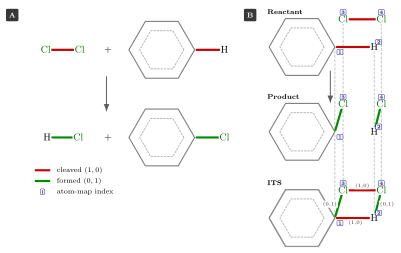

---
jupytext:
  text_representation:
    extension: .md
    format_name: myst
    format_version: 0.13
    jupytext_version: 1.19.4
kernelspec:
  display_name: synedu
  language: python
  name: python3
---

# S04: Atom Mapping as Graph Isomorphism

<div class="synedu-lesson-shell not-prose" style="box-sizing:border-box;margin:8px 0 24px;padding:20px;border:1px solid #243b53;border-radius:16px;background:#102a43;color:#fff;font-family:system-ui,-apple-system,BlinkMacSystemFont,'Segoe UI',sans-serif"><div class="synedu-lesson-shell__top" style="display:flex;align-items:flex-start;justify-content:space-between;gap:16px;flex-wrap:wrap"><div><div class="synedu-lesson-shell__eyebrow" style="margin-bottom:5px;color:#5eead4;font-size:11px;font-weight:800;letter-spacing:.12em;text-transform:uppercase">SynEdu learning path</div><div class="synedu-lesson-shell__meta" style="font-size:16px;font-weight:750">Lesson 4 of 9 <span style="color:#9fb3c8;font-weight:500">· Stage 2 · Rule construction</span></div></div><span class="synedu-lesson-shell__progress-label" style="color:#bcccdc;font-size:12px;font-weight:700">44% complete</span></div><div class="synedu-lesson-shell__track" style="height:5px;margin:16px 0 18px;overflow:hidden;border-radius:999px;background:#334e68"><span style="display:block;width:44%;height:100%;border-radius:inherit;background:#2dd4bf"></span></div><div class="synedu-notebook-actions" style="display:flex;align-items:center;gap:10px;flex-wrap:wrap" role="group" aria-label="Run this lesson"><a class="synedu-launch-badge" href="https://colab.research.google.com/github/TieuLongPhan/SynEdu/blob/main/docs/downloads/S04.ipynb"></a><a class="synedu-launch-badge" href="https://mybinder.org/v2/gh/TieuLongPhan/SynEdu/main?urlpath=lab/tree/docs/downloads/S04.ipynb"></a><a class="synedu-launch-badge" href="https://github.com/TieuLongPhan/SynEdu/raw/main/docs/downloads/S04.ipynb"></a><a class="synedu-launch-badge" href="../../docs/installing"></a></div></div>

This talktorial connects molecular alignment to atom-to-atom mapping. We build transparent MCS-based maps, compare them with RXNMapper, and use Imaginary Transition State (ITS) graphs as a map-number-invariant representation of reaction change [@phan2025synkit; @schwaller2021extraction; @fujita1986description].

+++

## Aim of this talktorial

1. Construct **MCS-based atom maps** between reactants and products.
2. Run **RXNMapper** and inspect attention information for student-facing interpretation.
3. Build and compare **ITS graphs** so atom-map equivalence can be checked by graph isomorphism.

---

## Learning outcomes

After completing this talktorial, you will be able to:

- construct a simple **MCS-based atom map** in code,
- run **RXNMapper** and parse mapped reaction SMILES,
- extract and visualize mapper attention for student-facing interpretation,
- build an **ITS graph** from a mapped reaction,
- separate the reactant and product views of an ITS graph for visualization, and
- decide whether two atom maps are equivalent by checking **ITS graph isomorphism**.

+++

## 0. Setup & Data

```{code-cell}
import rdkit
import pandas as pd
import networkx as nx
import warnings

warnings.filterwarnings("ignore")

print("RDKit:", rdkit.__version__)
print("NetworkX:", nx.__version__)

try:
    from rxnmapper import RXNMapper

    _HAS_RXNMAPPER = True
    print("rxnmapper: available")
except Exception:
    _HAS_RXNMAPPER = False
    print("rxnmapper: NOT available -> will skip RXNMapper cells")

data = pd.read_csv('./data/reaction_maps.csv')
```

## 1. Atom mapping
### 1.1. Alignment method

```{code-cell}
from synedu.Utils.rxn_vis import visualize_reaction
from IPython.display import SVG

from synedu.Utils import draw_rxn_graph


rsmi = 'CCO.[O]>>O.CC=O'


fig = draw_rxn_graph(
    rsmi,
    title="Oxidation",
)
```

Convert the reaction SMILES into reactant and product graphs with
`rsmi_to_graph`.

```{code-cell}
import matplotlib.pyplot as plt
from synedu.Utils.reaction import rsmi_to_graph
from synedu.Utils.vis import draw_molecular_graph

rsmi = 'CCO.[O]>>O.CC=O'
r, p = rsmi_to_graph(rsmi, drop_non_aam=False, use_index_as_atom_map=False)

fig, ax = plt.subplots(1, 2, figsize=(10, 4))
draw_molecular_graph(r, show_indices=True, ax=ax[0])
draw_molecular_graph(p, show_indices=True, ax=ax[1])
```

We now develop `mcs_networkx` to identify the Maximum Common Substructure (MCS), using the graph-matching perspective introduced in S03 and the classic MCS matching algorithms for chemical structures [@raymond2002maximum].
Note that in a reaction context, **bonds may be formed or broken** between
reactants and products. Therefore, bond attributes should **not** be used
as matching constraints (`edge_attrs`), and the MCS is computed based on
atom-level correspondence rather than bond-order equality.

```{code-cell}
import networkx as nx
from itertools import combinations
from networkx.algorithms.isomorphism import GraphMatcher, generic_node_match


def mcs_networkx(
    G1: nx.Graph,
    G2: nx.Graph,
    *,
    node_attrs=("element",),
    edge_attrs=(),
    require_connected=False,  # False => maximum DISCONNECTED common subgraph
    prune_symmetry=True,  # cheap symmetry pruning
    max_solutions=200,
):
    """
    Maximum common subgraph (MCS) via NetworkX GraphMatcher.

    - If require_connected=False: returns a maximum DISCONNECTED common subgraph (MDCS).
    - If require_connected=True: returns a maximum CONNECTED common subgraph.

    Returns
    -------
    list[dict[int, int]]
        List of maximum-size mappings (G1_subgraph -> G2_subgraph).
    """
    # --- node/edge matchers ---
    node_match = generic_node_match(
        list(node_attrs),
        [None] * len(node_attrs),
        [lambda a, b: a == b] * len(node_attrs),
    )

    edge_match = None
    if edge_attrs:
        edge_match = generic_node_match(
            list(edge_attrs),
            [None] * len(edge_attrs),
            [lambda a, b: a == b] * len(edge_attrs),
        )

    # --- search subgraphs of smaller graph for speed ---
    pattern, host, pattern_is_G1 = _prepare_orientation(G1, G2)

    pat_nodes = list(pattern.nodes())
    n = len(pat_nodes)

    best_k = 0
    candidates = []

    for k in range(n, 0, -1):
        level = []

        for subset in combinations(pat_nodes, k):
            sub_pat = pattern.subgraph(subset).copy()

            if (
                require_connected
                and sub_pat.number_of_nodes() > 1
                and not nx.is_connected(sub_pat)
            ):
                continue

            gm = GraphMatcher(
                host,
                sub_pat,
                node_match=node_match,
                edge_match=edge_match,
            )

            for iso_map in gm.subgraph_isomorphisms_iter():
                # GraphMatcher(host, pattern) yields host->pattern; invert to pattern->host
                inv = {pat: h for h, pat in iso_map.items()}
                level.append(inv)
                if len(level) >= max_solutions:
                    break
            if len(level) >= max_solutions:
                break

        if level:
            best_k = k
            candidates = level
            break

    if not candidates:
        return []

    # candidates currently map: pattern -> host
    # convert to G1 -> G2 orientation if needed
    if not pattern_is_G1:
        candidates = [{h: pat for pat, h in m.items()} for m in candidates]

    if prune_symmetry:
        candidates = _prune_by_node_sets(candidates)

    # keep only max-size
    candidates = [m for m in candidates if len(m) == best_k]
    return candidates


def _prepare_orientation(G1: nx.Graph, G2: nx.Graph):
    """Return (pattern, host, pattern_is_G1) where pattern is the smaller graph."""
    if G1.number_of_nodes() <= G2.number_of_nodes():
        return G1, G2, True
    return G2, G1, False


def _prune_by_node_sets(maps):
    """
    Cheap symmetry pruning: keep one mapping per (domain-set, image-set).
    Collapses many benzene-like symmetric mappings in practice.
    """
    seen = set()
    out = []
    for m in maps:
        key = (tuple(sorted(m.keys())), tuple(sorted(m.values())))
        if key not in seen:
            seen.add(key)
            out.append(m)
    return out
```

```{code-cell}
maps = mcs_networkx(
    r,
    p,
    node_attrs=("element",),
    edge_attrs=None,
    require_connected=False,
    prune_symmetry=True,
)
maps
```

Store the resulting atom correspondence as the `atom_map` node attribute.

```{code-cell}
for rid, pid in maps[0].items():
    r.nodes[rid]["atom_map"] = rid
    p.nodes[pid]["atom_map"] = rid
```

**Q1 — Assign atom maps from reactant–product alignment**

You are given a node mapping from a **reactant graph** `r` to a
**product graph** `p`, obtained from an MCS-based alignment.
Your task is to assign **atom-map numbers** to the corresponding atoms
on both sides of the reaction.

The convention is that each matched atom pair shares the **same
`atom_map` label**, which is taken from the reactant node index.

---

<details class="synedu-solution"> <summary><b>Solution:</b></summary>

```python
def assign_atom_map_r_to_p(r, p, mapping):
    """
    Assign atom_map attributes on both reactant and product graphs
    using an r -> p node mapping.

    Parameters
    ----------
    r : nx.Graph
        Reactant graph
    p : nx.Graph
        Product graph
    mapping : dict[int, int]
        Mapping r_index -> p_index
    """
    for r_idx, p_idx in mapping.items():
        if r_idx not in r:
            raise KeyError(f"Node {r_idx} not found in reactant graph")
        if p_idx not in p:
            raise KeyError(f"Node {p_idx} not found in product graph")

        # assign the same atom-map label to matched atoms
        r.nodes[r_idx]["atom_map"] = r_idx
        p.nodes[p_idx]["atom_map"] = r_idx

```

</details>

```{code-cell}
def assign_atom_map_r_to_p(r, p, mapping):
    """
    Assign atom_map attributes on both reactant and product graphs
    using an r -> p node mapping.

    Parameters
    ----------
    r : nx.Graph
        Reactant graph
    p : nx.Graph
        Product graph
    mapping : dict[int, int]
        Mapping r_index -> p_index
    """
    for r_idx, p_idx in mapping.items():
        if r_idx not in r:
            raise KeyError(f"Node {r_idx} not found in reactant graph")
        if p_idx not in p:
            raise KeyError(f"Node {p_idx} not found in product graph")

        # assign the same atom-map label to matched atoms
        r.nodes[r_idx]["atom_map"] = r_idx
        p.nodes[p_idx]["atom_map"] = r_idx
```

```{code-cell}
# Serialize the mapped graphs back to reaction SMILES.
from synedu.Utils.reaction import graph_to_rsmi

aam = graph_to_rsmi(r, p)

fig = draw_rxn_graph(aam, title="Oxidation", title_fontsize=24, show_indices=True)
```

#### Atom mapping colour coding

After MCS alignment, matched atom pairs share the same colour across the reactant and product graphs. Atoms that could not be matched (spectators or unmapped atoms) appear grey. Comparing the two panels reveals which atoms participate in the reaction center.

```{code-cell}
:tags: [hide-input]
import matplotlib.pyplot as plt
import matplotlib.patches as mpatches
from synedu.Utils.vis import draw_molecular_graph

_ATOM_MAP_PAL = [
    "#1F77B4",
    "#D62728",
    "#2CA02C",
    "#FF7F0E",
    "#9467BD",
    "#8C564B",
    "#E377C2",
    "#17BECF",
]

# Build a color palette shared between reactant and product graphs.
_all_ams = sorted(
    {
        d.get("atom_map", 0)
        for _, d in list(r.nodes(data=True)) + list(p.nodes(data=True))
        if d.get("atom_map", 0) != 0
    }
)
_map_to_col = {m: _ATOM_MAP_PAL[i % len(_ATOM_MAP_PAL)] for i, m in enumerate(_all_ams)}


def _aam_node_colors(G, map_to_col):
    return {
        n: map_to_col.get(G.nodes[n].get("atom_map", 0), "#BBBBBB") for n in G.nodes()
    }


fig, axes = plt.subplots(1, 2, figsize=(12, 5))
fig.suptitle(
    "Atom mapping — atoms with the same colour are mapped to each other\n"
    "(grey = unmapped / spectator)",
    fontsize=11,
    fontweight="bold",
)

draw_molecular_graph(
    r,
    ax=axes[0],
    title="Reactants  (CCO · [O])",
    show_indices=True,
    show_bond_labels=True,
    custom_node_colors=_aam_node_colors(r, _map_to_col),
)
draw_molecular_graph(
    p,
    ax=axes[1],
    title="Products   (O · CC=O)",
    show_indices=True,
    show_bond_labels=True,
    custom_node_colors=_aam_node_colors(p, _map_to_col),
)

_patches = [
    mpatches.Patch(color=c, label=f"atom_map {m}") for m, c in _map_to_col.items()
]
_patches.append(mpatches.Patch(color="#BBBBBB", label="unmapped"))
fig.legend(
    handles=_patches, loc="lower center", ncol=len(_patches), fontsize=9, framealpha=0.9
)
plt.tight_layout(rect=[0, 0.12, 1, 1])
plt.show()
```

The complete MCS-based mapping routine is:

```{code-cell}
def mcs_aam(rsmi, node_attrs=('element',)):
    r, p = rsmi_to_graph(rsmi, drop_non_aam=False, use_index_as_atom_map=False)

    maps = mcs_networkx(
        r,
        p,
        node_attrs=node_attrs,
        edge_attrs=None,
        require_connected=False,
        prune_symmetry=True,
    )
    aams = []
    for m in maps:
        assign_atom_map_r_to_p(r, p, m)
        aam = graph_to_rsmi(r, p)
        aams.append(aam)
    return aams
```

**Q2 — Atom mapping via MCS: full vs partial**

Consider the following reaction SMILES:

```text
CCCl.[OH-]>>CCO.[Cl-]
c1ccccc1.ClCl>>c1ccccc1Cl.Cl
CCO>>C=C
```
For each reaction, can we recover a full atom map using MCS-based alignment, or only a partial atom map?
Explain why.

---

<details class="synedu-solution"> <summary><b>Solution:</b></summary>

```python
aams = []
rsmis = ['CCCl.[OH-]>>CCO.[Cl-]', 'c1ccccc1.ClCl>>c1ccccc1Cl.Cl', 'CCO>>C=C']
for rsmi in rsmis:
    aam = mcs_aam(rsmi)
    print(aam)
    aams.append(aam)
    
```

Output

```text
['C([CH3:1])[Cl:3].[OH-:4]>>C([CH3:1])[OH:4].[Cl-:3]']
['Cl[Cl:7].[cH:1]1[cH:2][cH:3][cH:4][cH:5][cH:6]1>>Cl[c:6]1[cH:1][cH:2][cH:3][cH:4][cH:5]1.[ClH:7]', '[Cl:7][Cl:8].[cH:1]1[cH:2][cH:3][cH:4][cH:5][cH:6]1>>Cl[c:6]1[cH:1][cH:2][cH:3][cH:4][cH:5]1.[ClH:8]']
['O[CH2:2][CH3:1]>>[CH2:1]=[CH2:2]']
```

All three reactions yield **partial atom maps only**.

This is because:
- **Connectivity changes** (bond breaking/forming) prevent full graph isomorphism.
- **Stoichiometric imbalance** (missing species) leaves some atoms unmappable.

</details>

+++

### 1.2. Attention-guided atom mapping

**RXNMapper** extracts atom correspondences from **Transformer attention** learned on reaction SMILES with a masked-language objective (BERT family). It is **unsupervised** and does not require gold atom maps.

Write a reaction as a token sequence $x=(x_1,\dots,x_T)$ with reactant and product atom tokens. During pretraining the model minimizes the masked-token objective:

$$
\min_\theta \; \mathbb{E}\!\left[-\log p_\theta\big(x_{\mathcal{M}}\mid x_{\setminus\mathcal{M}}\big)\right].
$$

At inference we extract an attention alignment matrix between reactant and product atom tokens:

$$
A \in \mathbb{R}_{\ge 0}^{m\times n},\qquad
A_{ij} := \mathrm{Attn}(r_i \to p_j),
$$

(typically from a chosen head/layer and optionally sharpened). Atom mapping is then posed as a maximum-weight assignment over admissible matchings $\Pi$:

$$
\mu = \arg\max_{\mu\in\Pi}\sum_{i=1}^{m} A_{i,\mu(i)},
$$

where $\Pi$ enforces lightweight chemical constraints (element consistency, optional charge checks). Because the assignment is driven by attention, **bond-order preservation is not enforced**, so RXNMapper tolerates bond formation/cleavage and order changes.

Typical RXNMapper outputs:

- `mapped_rxn`: reaction SMILES annotated with atom-map indices induced by \(\mu\),  
- `confidence`: a scalar summary of alignment consistency (higher → more reliable).

We adopt this attention-guided strategy following the Molecular Transformer framework [@schwaller2019molecular] and RXNMapper [@schwaller2021extraction].

```{code-cell}
from typing import Any, Dict, Optional, Tuple


def rxnmapper_map(rxn: str) -> Tuple[Optional[str], Optional[float]]:
    if not _HAS_RXNMAPPER:
        return None, None
    mapper = RXNMapper()
    out = mapper.get_attention_guided_atom_maps([rxn])
    mapped = out[0].get("mapped_rxn", None)
    conf = out[0].get("confidence", None)
    return mapped, conf


def rxnmapper_map_detailed(rxn: str) -> Optional[Dict[str, Any]]:
    if not _HAS_RXNMAPPER:
        return None
    mapper = RXNMapper()
    return mapper.get_attention_guided_atom_maps([rxn], detailed_output=True)[0]


rsmis = ["CCCl.[OH-]>>CCO.[Cl-]", "c1ccccc1.ClCl>>c1ccccc1Cl.Cl", "CCO>>C=C"]

if _HAS_RXNMAPPER:
    for rxn in rsmis:
        mapped, conf = rxnmapper_map(rxn)
        print(f"conf={conf:.3f} | {mapped}")
else:
    print("rxnmapper not available; install with: pip install rxnmapper")
```

#### RXNMapper attention alignment heatmap

RXNMapper's raw output matrix is indexed product-by-reactant, i.e. the transpose $A^\top$ of the reactant-by-product matrix $A$ defined above: rows are product atom tokens and columns are reactant atom tokens. Bright cells indicate product atoms that strongly attend to a reactant atom. The final atom map is the high-weight assignment through this matrix, so visualising it helps connect the Transformer output to the atom-map numbers we use later.

```{code-cell}
:tags: [hide-input]
import numpy as np
import matplotlib.pyplot as plt
from matplotlib.patches import Rectangle
from textwrap import shorten


def _atom_tokens_from_rxnmapper_tokens(tokens):
    reactant_tokens, product_tokens = [], []
    side = "reactant"

    for tok in tokens:
        if tok in {"[CLS]", "[SEP]", "."}:
            continue
        if tok == ">>":
            side = "product"
            continue
        if tok.startswith(">"):
            continue

        if side == "reactant":
            reactant_tokens.append(tok)
        else:
            product_tokens.append(tok)

    return reactant_tokens, product_tokens


_demo_rxn = "CCCl.[OH-]>>CCO.[Cl-]"

if not _HAS_RXNMAPPER:
    raise RuntimeError("RXNMapper is unavailable.")

_detail = rxnmapper_map_detailed(_demo_rxn)

_attn = np.asarray(_detail["pxrrxp_attns"], dtype=float)
_r_labels, _p_labels = _atom_tokens_from_rxnmapper_tokens(_detail["tokens"])
_mapped_rxn = _detail["mapped_rxn"]
_mapping_tuples = _detail["mapping_tuples"]

n_product, n_reactant = _attn.shape

fig_width = max(6.5, 0.55 * n_reactant + 2.5)
fig_height = max(4.8, 0.45 * n_product + 2.5)

fig, ax = plt.subplots(figsize=(fig_width, fig_height), dpi=250)

vmax = max(1.0, float(np.nanmax(_attn)))
im = ax.imshow(
    _attn,
    cmap="Blues",
    vmin=0.0,
    vmax=vmax,
    aspect="auto",
)

ax.set_xticks(np.arange(n_reactant))
ax.set_yticks(np.arange(n_product))

ax.set_xticklabels(
    [f"r{i}: {tok}" for i, tok in enumerate(_r_labels)],
    rotation=45,
    ha="right",
    rotation_mode="anchor",
    fontsize=9,
)

ax.set_yticklabels(
    [f"p{i}: {tok}" for i, tok in enumerate(_p_labels)],
    fontsize=9,
)

ax.set_xlabel("Reactant atom tokens", fontsize=11)
ax.set_ylabel("Product atom tokens", fontsize=11)

ax.set_title(
    "RXNMapper Product → Reactant Attention",
    fontsize=14,
    fontweight="bold",
    pad=14,
)

# White grid between cells
ax.set_xticks(np.arange(n_reactant + 1) - 0.5, minor=True)
ax.set_yticks(np.arange(n_product + 1) - 0.5, minor=True)
ax.grid(which="minor", color="white", linestyle="-", linewidth=1.2)
ax.tick_params(which="minor", bottom=False, left=False)

# Highlight assigned atom mappings
for p_idx, r_idx, conf in _mapping_tuples:
    p_idx = int(p_idx)
    r_idx = int(r_idx)
    conf = float(conf)

    if not (0 <= p_idx < n_product and 0 <= r_idx < n_reactant):
        continue

    ax.add_patch(
        Rectangle(
            (r_idx - 0.48, p_idx - 0.48),
            0.96,
            0.96,
            fill=False,
            edgecolor="#D62728",
            linewidth=2.2,
        )
    )

    ax.scatter(
        r_idx,
        p_idx,
        s=90 + 160 * conf,
        facecolors="none",
        edgecolors="#D62728",
        linewidths=2.0,
    )

    text_color = "white" if _attn[p_idx, r_idx] >= 0.55 * vmax else "#111111"

    ax.text(
        r_idx,
        p_idx,
        f"{conf:.2f}",
        ha="center",
        va="center",
        fontsize=8,
        color=text_color,
        fontweight="bold",
    )

cbar = fig.colorbar(im, ax=ax, fraction=0.045, pad=0.035)
cbar.set_label("Attention weight", fontsize=10)

for spine in ax.spines.values():
    spine.set_visible(False)

fig.text(
    0.5,
    0.01,
    shorten(_mapped_rxn, width=140, placeholder=" ..."),
    ha="center",
    va="bottom",
    fontsize=8,
    family="monospace",
)

plt.tight_layout(rect=[0, 0.05, 1, 1])
plt.show()

print(_mapped_rxn)
```

## 2. Imaginary Transition State
The **Imaginary Transition State (ITS)** [@fujita1986description] (or Condensed Graph of the Reaction [@nugmanov2019cgrtools]) is a compact, chemistry-oriented way to represent *what changes* in a reaction by **superimposing reactants and products via an atom-atom map**.

Think of the ITS as a single graph whose **nodes are atom-map labels** (one node per mapped atom) and whose **edges record the bond before and after the reaction**. Reading the ITS tells you, at a glance, which bonds are preserved, broken or formed.

<figure class="se-figure">
  
  <figcaption>
    <b>Figure 1.</b> Constructing an ITS graph from an electrophilic aromatic
    substitution. <b>(A)</b> The reaction: the Cl–Cl and aromatic C–H bonds are
    cleaved (red), the C–Cl and H–Cl bonds are formed (green). <b>(B)</b> The
    atom-mapped reactant and product, and the ITS obtained by superimposing
    them. Each changed edge carries its bond order before and after the
    reaction, so <span class="se-tok">(1,0)</span> is a cleaved bond and
    <span class="se-tok">(0,1)</span> a formed one; preserved bonds keep the
    same pair and are drawn unchanged.
  </figcaption>
</figure>

---


Given a balanced reaction and an atom map $\alpha$ (a bijection between reactant and product atoms):

1. Let the ITS node set be the atom-map labels
   $$
   V=\{a_1,\dots,a_M\}
   $$

2. For each unordered pair of nodes \((i,j)\) read the bond order in reactants and in products:
   $$
   br_{ij}=\text{bond order of atoms mapped to }a_i,a_j\ \text{in reactants (or }0\text{ if absent)},
   $$
   $$
   bp_{ij}=\text{bond order of atoms mapped to }a_i,a_j\ \text{in products (or }0\text{ if absent)}.
   $$

3. Add an ITS edge between \(i\) and \(j\) labelled with the pair
   $$
   (br_{ij},\,bp_{ij}).
   $$

4. In the edge-edit model used in this lesson, the **reaction center** is the
   set of edges with a change:
   $$
   E_{\mathrm{rc}}=\{(i,j):\; br_{ij}\ne bp_{ij}\}.
   $$

---

How to read the ITS (chemical rules of thumb)

- An edge labelled (1,1) or (1.5,1.5) — bond **preserved** (single → single, or aromatic → aromatic).  
- (1,0) — bond **broken** (present in reactants, absent in products).  
- (0,1) — bond **formed** (new bond in products).  
- (2,1) — bond order **changed** (e.g. double → single).  
- Nodes keep atom identity via labels (element, charge, hybridization if desired) so you can tell *which atom* changed connectivity.

---

+++

**Definition (ITS Graph).**  
Given a fully atom-mapped reaction with atom mapping $\mu: V_R \to V_P$ (a bijection between reactant and product atoms), the *Imaginary Transition State graph* (ITS) is the labeled graph

$$
\Gamma = (V,\, E,\, \mathbf{a},\, \mathbf{b}_{\text{ITS}})
$$

where $V$ is the mapped atom set obtained by identifying each $v \in V_R$
with $\mu(v) \in V_P$, $E = E_R \cup E_P$ after this identification,
$\mathbf{a}(v)=\bigl(\mathbf{a}_r(v),\mathbf{a}_p(v)\bigr)$ stores the
reactant- and product-side atom attributes (an invariant attribute such as
element may be stored once), and the ITS edge attribute is:

$$
\mathbf{b}_{\text{ITS}}(e) = (b_r(e),\, b_p(e))
\quad b_r, b_p \in \{0, 1, 1.5, 2, 3\}
$$

where $b_r(e)$ is the bond order of edge $e$ in the reactants (0 if absent) and $b_p(e)$ is the bond order in the products (0 if absent).

**Definition (Reaction Center).**  
The *reaction center* $\mathrm{RC}(\Gamma)$ is the edge-defined subgraph of the
ITS containing exactly the edges where $b_r \neq b_p$ and their endpoints:

$$
E_{\mathrm{RC}} = \{e \in E(\Gamma) \mid b_r(e) \neq b_p(e)\}
$$

These are the bonds that are **broken** ($b_r > 0, b_p = 0$), **formed** ($b_r = 0, b_p > 0$), or **changed** ($b_r \neq b_p$, both $> 0$).

This is an **edge-defined reaction center**. A richer attributed-graph model
should also include vertices for which a tracked node attribute changes—for
example formal charge, radical state, or stereochemistry—even when no incident
bond order changes.

**Definition (ΔBE Entry).**  
Following the Dugundji–Ugi bond-electron matrix formalism [@dugundji1973algebraic], for each atom pair $(i, j)$ with $i \neq j$: $\Delta\mathrm{BE}_{ij} = b_p(i,j) - b_r(i,j)$.  
Positive values indicate bond formation; negative values indicate bond breaking.  
The diagonal entries represent changes in free-electron count (valence electrons not in bonds).

```{code-cell}
from synedu.Utils.reaction import rsmi_to_graph
from synedu.Utils.graph import print_graph_attributes
from synedu.Utils.its_vis import (
    its_to_side_graph,
    its_to_side_mol,
    visualize_its,
)
from IPython.display import SVG

rsmi = '[Cl:1][Cl:2].[H:9][c:3]1[cH:4][cH:5][cH:6][cH:7][cH:8]1>>[Cl:1][H:9].[Cl:2][c:3]1[cH:4][cH:5][cH:6][cH:7][cH:8]1'

fig = draw_rxn_graph(rsmi, title="substitution electrophile", title_fontsize=24)
r, p = rsmi_to_graph(rsmi)
print_graph_attributes(r)
```

```{code-cell}
import networkx as nx
from typing import Any, List, Optional, Tuple


def _get_edge_order(G: nx.Graph, u: Any, v: Any, order_key: str = "order") -> float:
    ed = G.get_edge_data(u, v)
    if not ed:
        return 0.0
    val = ed.get(order_key, 0.0)
    try:
        return float(val)
    except (TypeError, ValueError):
        return 0.0


def build_its(
    G_r: nx.Graph,
    G_p: nx.Graph,
    *,
    atom_map_key: str = "atom_map",
    node_attrs: Optional[List[str]] = None,
    order_key: str = "order",
    include_zero_edges: bool = False,
    require_element_match: bool = True,
) -> nx.Graph:

    map_r = {
        data[atom_map_key]: n
        for n, data in G_r.nodes(data=True)
        if atom_map_key in data and data[atom_map_key]
    }
    map_p = {
        data[atom_map_key]: n
        for n, data in G_p.nodes(data=True)
        if atom_map_key in data and data[atom_map_key]
    }
    all_maps = sorted(set(map_r.keys()) | set(map_p.keys()))

    # gather node attribute keys if not provided
    if node_attrs is None:
        keys = set()
        for _, d in G_r.nodes(data=True):
            keys.update(d.keys())
        for _, d in G_p.nodes(data=True):
            keys.update(d.keys())
        keys.discard(atom_map_key)
        keys.discard("element")
        node_attrs = sorted(keys)

    ITS = nx.Graph()
    ITS.add_nodes_from(all_maps)

    # populate node attributes (element + requested attrs)
    for m in all_maps:
        r_node = map_r.get(m)
        p_node = map_p.get(m)

        r_data = G_r.nodes[r_node] if r_node is not None else {}
        p_data = G_p.nodes[p_node] if p_node is not None else {}

        # element handling
        elem_r = r_data.get("element")
        elem_p = p_data.get("element")
        if elem_r is not None and elem_p is not None and elem_r != elem_p:
            if require_element_match:
                raise ValueError(
                    f"Element mismatch for atom_map {m}: reactant={elem_r!r} vs product={elem_p!r}"
                )
            ITS.nodes[m]["element"] = (elem_r, elem_p)
        else:
            ITS.nodes[m]["element"] = elem_r if elem_r is not None else elem_p

        # other attributes as (val_r, val_p)
        for key in node_attrs:
            ITS.nodes[m][key] = (r_data.get(key), p_data.get(key))

    # build ITS edges with single 'order' tuple (br, bp)
    for i_idx, j_idx in (
        (i, j) for idx, i in enumerate(all_maps) for j in all_maps[idx + 1 :]
    ):
        r_u = map_r.get(i_idx)
        r_v = map_r.get(j_idx)
        br = (
            _get_edge_order(G_r, r_u, r_v, order_key=order_key)
            if (r_u is not None and r_v is not None)
            else 0.0
        )

        p_u = map_p.get(i_idx)
        p_v = map_p.get(j_idx)
        bp = (
            _get_edge_order(G_p, p_u, p_v, order_key=order_key)
            if (p_u is not None and p_v is not None)
            else 0.0
        )

        if include_zero_edges or (br != 0.0 or bp != 0.0):
            ITS.add_edge(i_idx, j_idx, order=(br, bp))

    return ITS
```

```{code-cell}
its = build_its(r, p)
print_graph_attributes(its)

reactant_projection = its_to_side_graph(its, coordinate="reactant")
product_projection = its_to_side_graph(its, coordinate="product")
reactant_mol = its_to_side_mol(its, coordinate="reactant")
product_mol = its_to_side_mol(its, coordinate="product")
print(
    "ITS projections:",
    f"reactant bonds = {reactant_projection.number_of_edges()},",
    f"product bonds = {product_projection.number_of_edges()}",
)

ax = visualize_its(
    its,
    coordinate="reactant",
    show_edge_labels=True,
    show_node_labels=False,
    show_legend=False,
)
```

### 2.1. ITS graph — edge coloring by bond-change type


For drawing, the same ITS can be placed on different molecular coordinate systems.  
`coordinate="reactant"` projects the ITS onto the reactant-side bonds, while `coordinate="product"` projects it onto the product-side bonds. The edge colors and labels still show the full `(b_r, b_p)` change, but the picture is easier to read because the atom positions come from a chemically valid molecule instead of a generic graph layout.
`its_to_side_graph(...)` and `its_to_side_mol(...)` expose the reactant/product projections for later tasks. `its_coordinate_layout(...)` returns these coordinates directly, which is useful when you want to draw a reaction-center subgraph on the same frame as the full ITS.

Each edge in the ITS carries a pair $(b_r, b_p)$ encoding the bond order in reactants and products.  
We color edges by change type:

| $(b_r, b_p)$ | Interpretation | Color |
|---|---|---|
| $b_r = b_p > 0$ | **Preserved** bond | gray |
| $b_r > 0,\; b_p = 0$ | **Broken** bond | red |
| $b_r = 0,\; b_p > 0$ | **Formed** bond | green |
| $b_r \neq b_p$, both $> 0$ | **Changed** (e.g. single→double) | orange |

```{code-cell}
:tags: [hide-input]
import matplotlib.pyplot as plt
from synedu.Utils.its_vis import its_coordinate_layout, visualize_its

# Full ITS vs reaction-center subgraph, using the shared SynEdu ITS visualizer.
_rc_edges = [
    (u, v)
    for u, v, d in its.edges(data=True)
    if abs(float(d.get("order", (0, 0))[0]) - float(d.get("order", (0, 0))[1])) > 1e-6
]
_rc_nodes = {n for edge in _rc_edges for n in edge}
_rc = its.edge_subgraph(_rc_edges).copy()
_reactant_pos = its_coordinate_layout(its, coordinate="reactant")
_rc_pos = {n: _reactant_pos[n] for n in _rc.nodes()}

fig, axes = plt.subplots(1, 2, figsize=(14, 5))
visualize_its(
    its,
    ax=axes[0],
    title="Full ITS on reactant coordinates",
    pos=_reactant_pos,
    show_edge_labels=True,
    show_node_labels=True,
    show_legend=True,
)
visualize_its(
    _rc,
    ax=axes[1],
    title="Reaction center on the same coordinates",
    pos=_rc_pos,
    show_edge_labels=True,
    show_node_labels=True,
    show_legend=True,
)
fig.suptitle("ITS graph: full graph vs reaction center", fontsize=12, fontweight="bold")
plt.tight_layout()
plt.show()
print(
    f"Reaction center: {len(_rc_edges)} changing edges, {len(_rc_nodes)} atoms involved"
)
```

**Q3 — Reaction center**

Now develop function `get_reaction_center` to extract the reaction center

---

<details class="synedu-solution"> <summary><b>Solution:</b></summary>

```python
import networkx as nx


def get_reaction_center(
    its: nx.Graph,
    *,
    node_view: bool = False,
):
    rc_edges = []
    rc_nodes = set()

    for u, v, d in its.edges(data=True):
        br, bp = d.get("order", (0.0, 0.0))
        if br != bp:
            rc_edges.append((u, v))
            rc_nodes.update([u, v])

    if node_view:
        return rc_nodes

    rc = nx.Graph()
    rc.add_nodes_from((n, its.nodes[n]) for n in rc_nodes)
    rc.add_edges_from(
        (u, v, its.edges[u, v]) for u, v in rc_edges
    )

    return rc

```
</details>

+++

The parsing and ITS-construction steps are combined in `rsmi_to_its`:

```{code-cell}
import networkx as nx


def get_reaction_center(
    its: nx.Graph,
    *,
    node_view: bool = False,
):
    rc_edges = []
    rc_nodes = set()

    for u, v, d in its.edges(data=True):
        br, bp = d.get("order", (0.0, 0.0))
        if br != bp:
            rc_edges.append((u, v))
            rc_nodes.update([u, v])

    if node_view:
        return rc_nodes

    rc = nx.Graph()
    rc.add_nodes_from((n, its.nodes[n]) for n in rc_nodes)
    rc.add_edges_from((u, v, its.edges[u, v]) for u, v in rc_edges)

    return rc


def rsmi_to_its(rsmi, core=False):
    r, p = rsmi_to_graph(rsmi)
    its = build_its(r, p)
    if core:
        return get_reaction_center(its)
    return its
```

### 2.2. ITS reaction center and ΔBE matrix

The left panel shows the full ITS: **red edges** are broken bonds, **green edges** are formed bonds, **black edges** are preserved. The right panel isolates the **reaction center** — the subgraph where $b_r \ne b_p$.

The off-diagonal ΔBE entries encode the same information numerically: $\Delta\mathrm{BE}_{ij} = b^P_{ij} - b^R_{ij}$ for $i \neq j$ [@dugundji1973algebraic]. Red cells indicate bond cleavage; blue cells indicate bond formation. The pattern of signed changes is characteristic of the reaction type, though it is not in general a unique fingerprint (different reactions can share the same bond-change pattern).

```{code-cell}
:tags: [hide-input]
import numpy as np
import matplotlib.pyplot as plt

# Full ITS vs reaction-center subgraph
_rc = get_reaction_center(its)
_reactant_pos = its_coordinate_layout(its, coordinate="reactant")
_rc_pos = {n: _reactant_pos[n] for n in _rc.nodes()}

fig, axes = plt.subplots(1, 2, figsize=(14, 6))
fig.suptitle(
    "ITS analysis — full graph (left) vs reaction center (right)\n"
    "Red = broken bond  |  Green = formed bond  |  Black = preserved",
    fontsize=11,
    fontweight="bold",
)

visualize_its(
    its,
    ax=axes[0],
    title="Full ITS on reactant coordinates",
    pos=_reactant_pos,
    show_edge_labels=True,
    show_node_labels=True,
    show_legend=True,
)
visualize_its(
    _rc,
    ax=axes[1],
    title="Reaction center on shared reactant coordinates",
    pos=_rc_pos,
    show_edge_labels=True,
    show_node_labels=True,
    show_legend=True,
)

plt.tight_layout()
plt.show()

# ΔBE matrix: entries ΔBE[i,j] = b_product - b_reactant
_nodes = sorted(its.nodes())
_idx = {n: i for i, n in enumerate(_nodes)}
_n = len(_nodes)
_dbe = np.zeros((_n, _n))

for u, v, d in its.edges(data=True):
    br, bp = d.get("order", (0.0, 0.0))
    _dbe[_idx[u], _idx[v]] = float(bp) - float(br)
    _dbe[_idx[v], _idx[u]] = float(bp) - float(br)

_node_lbl = [f"{its.nodes[n].get('element','?')}{n}" for n in _nodes]

fig2, ax2 = plt.subplots(figsize=(6, 5))
im = ax2.imshow(_dbe, cmap="RdBu", vmin=-2, vmax=2)
plt.colorbar(im, ax=ax2, label="Δ bond order  (product − reactant)")
ax2.set_xticks(range(_n))
ax2.set_xticklabels(_node_lbl, rotation=45, ha="right", fontsize=8)
ax2.set_yticks(range(_n))
ax2.set_yticklabels(_node_lbl, fontsize=8)
for i in range(_n):
    for j in range(_n):
        if _dbe[i, j] != 0:
            ax2.text(
                j,
                i,
                f"{_dbe[i,j]:+.1f}",
                ha="center",
                va="center",
                fontsize=7,
                color="white",
                fontweight="bold",
            )
ax2.set_title(
    "ΔBond-order matrix  (red = bond broken, blue = bond formed)",
    fontsize=10,
    fontweight="bold",
)
plt.tight_layout()
plt.show()
```

### 2.3. ΔBE matrix heatmap

The off-diagonal entries of the Bond–Electron (BE) matrix introduced in **S01**
[@dugundji1973algebraic] are the pairwise bond orders; their reactant/product
difference $\Delta\mathrm{BE} = \mathrm{BE}_P - \mathrm{BE}_R$ restricted to
$i \neq j$ is exactly the off-diagonal information already stored in the ITS
edge labels $(b_r, b_p)$:

- **Positive** off-diagonal: bond formed
- **Negative** off-diagonal: bond broken
- **Zero**: atom-pair unchanged

Note that the ITS edge labels do not track the BE matrix's **diagonal**
(free/non-bonding electron count per atom), so the heatmap below only
reconstructs the bond-order part of $\Delta\mathrm{BE}$, not the full electron
reorganisation.

```{code-cell}
:tags: [hide-input]
import numpy as np
import matplotlib.pyplot as plt
import networkx as nx

# Compute ΔBE (off-diagonal bond-order part) from the ITS edge labels
_nodes_its = sorted(its.nodes())
_idx = {n: i for i, n in enumerate(_nodes_its)}
_n = len(_nodes_its)
_dbe = np.zeros((_n, _n))
for u, v, d in its.edges(data=True):
    br, bp = d.get('order', (0.0, 0.0))
    delta = float(bp) - float(br)
    if abs(delta) > 1e-6:
        _dbe[_idx[u], _idx[v]] = delta
        _dbe[_idx[v], _idx[u]] = delta

# Labels: element + index
_labels = [f"{its.nodes[n].get('element','?')}{n}" for n in _nodes_its]

fig, axes = plt.subplots(1, 2, figsize=(13, 5))

# Left: ΔBE heatmap
ax = axes[0]
vmax = max(abs(_dbe).max(), 1.0)
im = ax.imshow(_dbe, cmap='RdBu_r', vmin=-vmax, vmax=vmax, aspect='equal')
ax.set_xticks(range(_n))
ax.set_yticks(range(_n))
ax.set_xticklabels(_labels, rotation=45, ha='right', fontsize=8)
ax.set_yticklabels(_labels, fontsize=8)
ax.set_title(
    '$\\Delta$BE matrix\n(blue = formed, red = broken)', fontsize=10, fontweight='bold'
)
plt.colorbar(im, ax=ax, shrink=0.75, label='$\\Delta$bond order')
for i in range(_n):
    for j in range(_n):
        v = _dbe[i, j]
        if abs(v) > 1e-6:
            ax.text(
                j,
                i,
                f'{v:+.0f}',
                ha='center',
                va='center',
                fontsize=9,
                fontweight='bold',
                color='white' if abs(v) > vmax * 0.5 else 'black',
            )

# Right: reaction center summary bar
ax2 = axes[1]
_rc_edges = [
    (u, v, d)
    for u, v, d in its.edges(data=True)
    if abs(float(d.get('order', (0, 0))[1]) - float(d.get('order', (0, 0))[0])) > 1e-6
]
_types = {'Broken': 0, 'Formed': 0, 'Changed': 0}
for u, v, d in _rc_edges:
    br, bp = float(d['order'][0]), float(d['order'][1])
    if bp < 1e-6:
        _types['Broken'] += 1
    elif br < 1e-6:
        _types['Formed'] += 1
    else:
        _types['Changed'] += 1
colors = ['#D62728', '#2CA02C', '#FF7F0E']
ax2.bar(_types.keys(), _types.values(), color=colors, edgecolor='white', linewidth=1.5)
ax2.set_ylabel('Edge count', fontsize=10)
ax2.set_title('Reaction center bond-change summary', fontsize=10, fontweight='bold')
ax2.grid(axis='y', alpha=0.3)
for i, (k, v) in enumerate(_types.items()):
    ax2.text(i, v + 0.05, str(v), ha='center', va='bottom', fontweight='bold')

fig.suptitle('$\\Delta$BE Analysis of the ITS Graph', fontsize=12, fontweight='bold')
plt.tight_layout()
plt.show()
```

## 3. ITS equivalence

Now try with 3 reactions below

```{code-cell}
m1 = "[CH3:8][CH2:7][O:6][C:5](=[O:9])[CH2:4][C:2](=[O:3])[O:1][CH2:22][CH3:23].[O:14]=[N+:12]([O-:13])[CH:11]=[CH:10][C:15]1=[CH:16][CH:17]=[C:18]([Cl:19])[CH:20]=[CH:21]1>>[O:1]([C:2](=[O:3])[CH:4]([C:5]([O:6][CH2:7][CH3:8])=[O:9])[CH:10]([CH2:11][N+:12]([O-:13])=[O:14])[C:15]1=[CH:16][CH:17]=[C:18]([Cl:19])[CH:20]=[CH:21]1)[CH2:22][CH3:23]"
m2 = "[O:1]=[N+:2]([O-:3])[CH:4]=[CH:5][c:6]1[cH:7][cH:8][c:9]([Cl:10])[cH:11][cH:12]1.[O:13]=[C:14]([O:15][CH2:16][CH3:17])[CH2:18][C:19](=[O:20])[O:21][CH2:22][CH3:23]>>[CH2:4]([N+:2](=[O:1])[O-:3])[CH:5]([c:6]1[cH:12][cH:11][c:9]([cH:8][cH:7]1)[Cl:10])[CH:18]([C:14](=[O:13])[O:15][CH2:16][CH3:17])[C:19](=[O:20])[O:21][CH2:22][CH3:23]"
m3 = "[CH3:1][CH2:2][O:3][C:4](=[O:5])[CH2:6][C:7](=[O:8])[O:9][CH2:10][CH3:11].[O:12]=[N+:13]([O-:14])[CH:15]=[CH:16][C:17]1=[CH:18][CH:19]=[C:20]([CH:21]=[CH:22]1)[Cl:23]>>[O:3]([C:4](=[O:5])[CH:6]([C:7]([O:9][CH2:10][CH3:11])=[O:8])[CH:16]([CH2:15][N+:13]([O-:14])=[O:12])[C:17]1=[CH:18][CH:19]=[C:20]([Cl:23])[CH:21]=[CH:22]1)[CH2:2][CH3:1]"
```

```{code-cell}
:tags: [hide-input]
svg1 = visualize_reaction(
    m1,
    svg=True,
    highlight_changes=True,
    legend="aam1",
)
svg2 = visualize_reaction(
    m2,
    svg=True,
    highlight_changes=True,
    legend="aam2",
)
svg3 = visualize_reaction(
    m3,
    svg=True,
    highlight_changes=True,
    legend="aam3",
)
display(SVG(svg1))
display(SVG(svg2))
display(SVG(svg3))
```

Even for experienced chemists, it is non-trivial to determine whether three atom mappings are equivalent.

```{code-cell}
:tags: [hide-input]
import matplotlib.pyplot as plt

its1 = rsmi_to_its(m1)
its2 = rsmi_to_its(m2)
its3 = rsmi_to_its(m3)


fig, axes = plt.subplots(1, 3, figsize=(20, 8))
visualize_its(
    its1,
    ax=axes[0],
    title="ITS1",
    coordinate="product",
    font_size=16,
    show_node_labels=False,
    show_edge_labels=False,
)
visualize_its(
    its2,
    ax=axes[1],
    title="ITS2",
    coordinate="product",
    font_size=16,
    show_node_labels=False,
    show_edge_labels=False,
)
visualize_its(
    its3,
    ax=axes[2],
    title="ITS3",
    coordinate="product",
    font_size=16,
    show_node_labels=False,
    show_edge_labels=False,
)
plt.tight_layout()
plt.show()
```

For the fully mapped reactions and attribute schema used here, two atom maps
are equivalent up to renumbering if and only if their ITS graphs are
label-preserving isomorphic, a concept introduced in **S02**
[@bonchev1991chemical]. This statement is relative to the encoded attributes:
an omitted feature such as stereochemistry cannot be recovered by the
isomorphism test.

```{code-cell}
import networkx as nx
from networkx.algorithms.isomorphism import GraphMatcher, generic_node_match


def its_isomorphic(
    G1: nx.Graph,
    G2: nx.Graph,
    *,
    node_attrs=("element", "aromatic", "formal_charge", "hcount"),
    edge_attrs=("order",),
) -> bool:
    """
    Check whether two ITS graphs are isomorphic.

    Node attributes are compared by exact equality
    (including tuple-valued ITS attributes).
    """

    # --- node matcher (exact match for all attributes) ---
    node_match = generic_node_match(
        list(node_attrs),
        [None] * len(node_attrs),
        [lambda a, b: a == b] * len(node_attrs),
    )

    # --- edge matcher ---
    def edge_match(d1, d2):
        return all(d1.get(a) == d2.get(a) for a in edge_attrs)

    gm = GraphMatcher(
        G1,
        G2,
        node_match=node_match,
        edge_match=edge_match,
    )

    return gm.is_isomorphic()
```

```{code-cell}
print("Checking ITS graph equivalence via graph isomorphism")
print("- ITS₁ vs ITS₂:", its_isomorphic(its1, its2))
print("- ITS₁ vs ITS₃:", its_isomorphic(its1, its3))
```

**MCS vs RXNMapper — ITS isomorphism comparison**

Under this lesson's ITS attribute schema, two atom mappings are **equivalent**
if and only if their ITS graphs are label-preserving isomorphic. The table
below runs both methods on three test reactions and uses ITS isomorphism to
check whether they agree. Disagreement flags a different encoded atom
correspondence; deciding which correspondence is chemically preferable
requires additional evidence.

```{code-cell}
import pandas as pd

_COMPARE = [
    ("CCCl.[OH-]>>CCO.[Cl-]", "SN2 substitution"),
    (
        "[Cl:1][Cl:2].[cH:3]1[cH:4][cH:5][cH:6][cH:7][cH:8]1>>[ClH:1].[Cl:2][c:3]1[cH:4][cH:5][cH:6][cH:7][cH:8]1",
        "SE aromatic (pre-mapped)",
    ),
    ("CCO>>C=C", "E1 elimination"),
]

_rows = []
for rsmi_c, label in _COMPARE:
    # MCS-based mapping
    _mcs_maps = mcs_aam(rsmi_c)
    print(_mcs_maps)
    _mcs_n = len(_mcs_maps)

    # RXNMapper
    if _HAS_RXNMAPPER:
        _rxn_mapped, _rxn_conf = rxnmapper_map(rsmi_c)
    else:
        _rxn_mapped, _rxn_conf = None, None

    # ITS isomorphism comparison
    try:
        _its_mcs = rsmi_to_its(_mcs_maps[0]) if _mcs_maps else None
        _its_rxnm = rsmi_to_its(_rxn_mapped) if _rxn_mapped else None
        _agree = (
            its_isomorphic(_its_mcs, _its_rxnm)
            if _its_mcs is not None and _its_rxnm is not None
            else "N/A"
        )
    except Exception:
        _agree = "error"

    _rows.append(
        {
            "reaction": label,
            "MCS variants": _mcs_n,
            "RXNMapper conf": f"{_rxn_conf:.3f}" if _rxn_conf else "—",
            "ITS agree?": _agree,
        }
    )

_df_cmp = pd.DataFrame(_rows).set_index("reaction")
display(
    _df_cmp.style.map(
        lambda v: (
            "color:green;font-weight:bold"
            if v is True
            else "color:red;font-weight:bold" if v is False else ""
        ),
        subset=["ITS agree?"],
    ).set_caption("MCS vs RXNMapper atom mapping — ITS isomorphism agreement")
)
```

**Q4 — Atom-map equivalence**

Consider the dataset `data/reaction_maps.csv`
Each reaction is associated with three atom-mapped SMILES, generated by different atom-mapping methods (`map1`, `map2`, `map3`).


Tasks:
1. Write a function that determines whether three atom-mapped reactions are equivalent, by converting each to an ITS graph and checking graph isomorphism.
2. Apply this function to all reactions in the dataset.
3. Record, for each reaction, whether the three mappings are equivalent.

---

<details class="synedu-solution"> <summary><b>Solution:</b></summary>

```python
import pandas as pd
def is_maps_eq(
    maps,
    *,
    node_attrs=("element", "aromatic", "formal_charge", "hcount"),
    edge_attrs=("order",),
):
    """
    Check whether multiple mapped reactions are equivalent
    by comparing their ITS graphs up to isomorphism.
    """
    its_list = [rsmi_to_its(m) for m in maps]

    ref = its_list[0]
    for its in its_list[1:]:
        if not its_isomorphic(
            ref,
            its,
            node_attrs=node_attrs,
            edge_attrs=edge_attrs,
        ):
            return False
    return True

data = pd.read_csv('./data/reaction_maps.csv').to_dict('records')

for entry in data:
    maps = [entry["map1"], entry["map2"], entry["map3"]]
    entry["is_eq"] = is_maps_eq(maps)
data = pd.DataFrame(data)
data.head()
```

</details>

+++

## 4. Discussion

- **MCS** is a principled alignment baseline, but struggles with multi-component reactions, molecular symmetry, and unbalanced equations.
- **RXNMapper** offers a strong, practical solution by leveraging learned attention patterns and providing confidence estimates.
- **ITS graphs** compactly encode bond changes, abstracting away atom-map labeling details.
- **ITS isomorphism** provides a clean, map-number-invariant criterion for comparing atom mappings across methods.

+++

## 5. Quiz

1. Why can maximum common substructure mapping fail for reactions with multiple components, symmetry, or large structural rearrangements?
2. What information does RXNMapper use that is not explicitly enforced by a graph-only MCS alignment?
3. In one or two sentences, explain what an ITS graph represents chemically.
4. Why can two atom-mapped reaction SMILES look different but still describe equivalent chemistry, and how does ITS isomorphism help compare them?

+++ {"raw_mimetype": "text/x-rst"}

## 6. References

```{bibliography}
```
