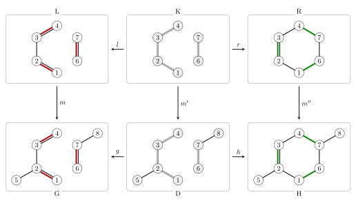

# S05: Reaction Rules as Graph Rewriting

This talktorial introduces Double Pushout (DPO) graph rewriting as a formal model for reaction rules. A rule is represented as a span that separates deleted, preserved, and created structure, then applied to molecular graphs by matching, deleting, and gluing [\[1\]](#6.-References), [\[2\]](#6.-References).


## Aim of this talktorial

1. Represent reaction rules as spans $L \leftarrow K \rightarrow R$.
2. Implement the DPO workflow: injective matching, pushout complement, and pushout construction.
3. Compare the hand-built workflow with **SynKit** `SynReactor` for forward and inverse rule application.

---

## Learning outcomes

After completing this talktorial, you will be able to:

- write a reaction rule as `L`, `K`, and `R`, and state what is deleted, preserved, and added,
- find injective rule matches in a host molecule,
- identify symmetry-related matches and choose canonical representatives,
- build the **pushout complement** and check the dangling condition,
- construct the **pushout** product graph, and
- chain the steps into a single pipeline that produces exact atom maps.

---

## Outline

- [0. Setup & Data](#0.-Setup-&-Data)
- [1. Reaction rules](#1.-Reaction-rules)
- [2. Double Pushout Graph Rewriting](#2.-Double-Pushout-Graph-Rewriting)
- [3. SynKit](#3.-SynKit)
- [4. Discussion](#4.-Discussion)
- [5. Quiz](#5.-Quiz)
- [6. References](#6.-References)


## 0. Setup & Data


**Example molecules used in this notebook**

We will use a classic *pericyclic* transformation:

- **Diene**: butadiene (SMILES: `C=CC=C`)
- **Dienophile**: ethene (SMILES: `C=C`)
- Combined as a disconnected reactant mixture: `C=CC=C.C=C`

> Chemistry caveat: this is a toy model (no stereochemistry, no substituents, no endo/exo control).
The point is to demonstrate **bond reorganisation** under a rule-based graph rewriting view.


## 1. Reaction rules

A reaction rule is a **DPO span** [\[2\]](#6.-References), [\[3\]](#6.-References)
$$
L \xleftarrow{\;\ell\;} K \xrightarrow{\;r\;} R,
$$
where $L$ is the reacting pattern, $R$ the replacement, and $K$ the preserved
**context**.

Chemically:
$$
V_K = \text{atoms with conserved identity},
$$
$$
E_L\setminus E_K = \text{bonds broken},\qquad
E_R\setminus E_K = \text{bonds formed}.
$$
Bond-order changes appear as deletion in $L$ and creation in $R$ with endpoints fixed in $K$.

Now we will use a classic *pericyclic* transformation:

- **Diene**: butadiene (SMILES: `C=CC=C`)
- **Dienophile**: ethene (SMILES: `C=C`)
- **Product**: cyclohexene (SMILES: `C1C=CCCC1`)


**Definition (DPO Reaction Rule / Span).**  
A *DPO reaction rule* is a pair of injective graph morphisms

$$
p:\quad L \xleftarrow{\;l\;} K \xrightarrow{\;r\;} R
$$

where $L$, $K$, $R$ are labeled graphs (with node attributes $\mathbf{a}$ and edge attributes $\mathbf{b}$), $l: K \hookrightarrow L$ and $r: K \hookrightarrow R$ are inclusions.

- $K$ — the *gluing graph* or *interface*: atoms and bonds **preserved** by the reaction  
- $L \setminus l(K)$ — atoms and bonds **consumed** (deleted) in the left-hand side  
- $R \setminus r(K)$ — atoms and bonds **produced** (created) in the right-hand side  

**Definition (Pattern Match).**  
A *match* of rule $p$ in a host graph $G$ is an injective graph morphism $m: L \hookrightarrow G$ that is *label-preserving*. A match is *valid* if it satisfies the **dangling condition**: no edge $e \in E(G)$ is incident to a deleted node $m(v)$, $v \in V(L) \setminus V(K)$, without also being in $m(E(L))$.

**Definition (DPO Rewriting Step).**  
Given a valid match $m: L \hookrightarrow G$, the *DPO rewriting step* $G \Rightarrow_p H$ produces the result graph $H$ by the double pushout construction:

$$
L \xleftarrow{l} K \xrightarrow{r} R
\quad\Big\Updownarrow\quad
G \xleftarrow{g} D \xrightarrow{h} H
$$

where $D = G \setminus m(L \setminus K)$ is the *pushout complement* (host minus deleted items) and $H$ is obtained by gluing $R$ to $D$ along $K$.


<figure style="text-align: center;">
  
  <figcaption>
    <b>Figure 1.</b> DPO span for the Diels&#x2013;Alder reaction: rule span
    <i>L</i> &larr;<sup><i>l</i></sup> <i>K</i> &rarr;<sup><i>r</i></sup> <i>R</i> (top)
    and its application
    <i>G</i> &larr;<sup><i>g</i></sup> <i>D</i> &rarr;<sup><i>h</i></sup> <i>H</i> (bottom).
    Red bonds are broken; green bonds are formed; grey nodes/bonds are preserved context.
  </figcaption>
</figure>


## 2. Double Pushout Graph Rewriting

Two categorical pushouts compactly encode [\[2\]](#6.-References), [\[3\]](#6.-References) the familiar chemical workflow **delete → add** (remove broken bonds / atoms, then glue in the new fragment). The usual DPO diagram is:

$$
\begin{array}{ccccc}
\displaystyle L & \xleftarrow{\;\ell\;} & \displaystyle K & \xrightarrow{\;r\;} & \displaystyle R \\[10pt]
\displaystyle \downarrow^{m} & & \displaystyle \downarrow^{m'} & & \displaystyle \downarrow^{m''} \\[10pt]
\displaystyle G & \xleftarrow{\;g\;} & \displaystyle D & \xrightarrow{\;h\;} & \displaystyle H
\end{array}
$$

- $L$ — **left-hand side** (pattern to match: atoms/bonds that may be deleted or preserved).  
- $R$ — **right-hand side** (pattern to be inserted).  
- $K$ — **interface / context** (the part preserved during the rewrite: $K\subseteq L,R$).  
- $m$ — the **match** $L\hookrightarrow G$ (where the rule is found inside the host graph $G$).  
- $D$ — the **pushout complement** (result of deleting $L\setminus K$ from $G$).  
- $H$ — the **product graph** after the rewrite.


**Chemical intuition**

1. find the pattern $L$ in molecule $G$ (this chooses *where* the chemistry happens);  
2. remove the atoms/bonds that should disappear (everything in $L\setminus K$) — this is the **deletion** step;  
3. attach the new fragment $R\setminus K$ to the remaining context $K$ — this is the **addition** step;  
4. the result $H$ is the new molecule after the transformation.


**Formal constraints**

1. *Injective match*
The mapping $m:L\hookrightarrow G$ must be **injective** (no two distinct nodes in $L$ map to the same node of $G$). This prevents unwanted atom merging.

2. *Dangling condition (no half-bonds)*
If a node of $G$ is removed, we must not leave an edge with only one endpoint. Formally:

Let $S=m(V(L)\setminus V(K))$ be the deleted nodes and
$E_{\mathrm{del}}=m(E(L)\setminus E(K))$ be the deleted edges. Formally:
$$
\forall\ \{x,y\}\in E(G):\qquad
(x\in S \lor y\in S)\Longrightarrow \{x,y\}\in E_{\mathrm{del}}.
$$

Equivalently: no host edge outside $E_{\mathrm{del}}$ may be incident to a deleted node, otherwise you would create a dangling (half) bond.

3. *Chemical sanity after rewrite*
After forming $H$ check chemical invariants you care about (valence bounds, formal charge consistency, stereochemistry handling, etc.). These are *domain-specific* checks not enforced by the abstract DPO construction.


Now we try with Diels Alder reaction as an example


### 2.1. Pattern matching (where a rule applies)

A reaction rule is given as a span
$$
p := \bigl( L \xleftarrow{\;\ell\;} K \xrightarrow{\;r\;} R \bigr),
$$
where $L$ is the reactant pattern, $R$ the product pattern, and $K$ the
interface of conserved atoms.

Given a host (reactant) molecular graph $G$, the rule applies at any
**injective match**
$$
m : L \hookrightarrow G,
$$
that is, a labeled subgraph monomorphism embedding the reaction pattern $L$
into the host graph $G$ and thereby identifying the reaction center.


**Q1 — Pattern match**

Implement `find_pattern_match(G, L)` using `node_match`, `edge_match`, `_automorphisms`; enumerate all injective embeddings $m: L \hookrightarrow G$ and yield one canonical representative per `Aut(L)` orbit, then run on the given `L`/`G`.

---

<details> <summary><b>Solution:</b></summary>

```python
def find_pattern_match(G: nx.Graph, L: nx.Graph) -> Iterable[Dict[Any, Any]]:
    """Yield one representative per Aut(L)-orbit of subgraph monomorphisms L -> G."""
    # automorphisms of L (L -> L)
    auts = list(iso.GraphMatcher(L, L, node_match=node_match, edge_match=edge_match).isomorphisms_iter())
    L_nodes = tuple(sorted(L.nodes()))
    seen: Set[Tuple[Any, ...]] = set()

    # find embeddings (G -> L -> invert to L -> G)
    GM = iso.GraphMatcher(G, L, node_match=lambda Gd, Ld: node_match(Ld, Gd),
                                  edge_match=lambda Gd, Ld: edge_match(Ld, Gd))
    for m_G_to_L in GM.subgraph_isomorphisms_iter():
        m = {l: g for g, l in m_G_to_L.items()}  # L -> G
        key = min((tuple(m[a[n]] for n in L_nodes) for a in auts), default=tuple(m[n] for n in L_nodes))
        if key in seen:
            continue
        seen.add(key)
        yield m

maps  = find_pattern_match(G, L)
for i in maps:
    print(i)
```
Output
```text
{5: 6, 6: 7, 2: 3, 3: 4, 4: 5, 1: 2}
```

- `raw` lists all injective embeddings (here: **4** raw maps).  
- **Do not** quotient by the full `Aut(L)` when `L` is disconnected — that mixes symmetries across fragments and over-collapses distinct placements.  
- **Fix (generic):** choose **one anchor component** (e.g. largest or explicit `anchor_nodes`) and **do not** quotient that component; quotient only the other components by their own `Aut`.  
- Use a component-aware matcher (e.g. `find_pattern_match_components(anchor="largest")`).  
- With this policy your example yields **2** canonical maps (diene orientations kept distinct, ethene deduped) instead of 1.

</details>


#### Pattern match gallery — all valid matches of $L$ in $G$

Pattern matching is the subgraph-isomorphism step that decides where a rule may apply [\[4\]](#6.-References).

We enumerate all injective matches $m: L \hookrightarrow G$ and display each one,
highlighting the matched subgraph in $G$. Orbit-deduplication then collapses
symmetry-equivalent matches.


### 2.2. Pushout Complement

Given graphs $L$, $K \subseteq L$, a host graph $G$, and an injective match
$$
m : L \hookrightarrow G,
$$
the **pushout complement** is
$$
D = G \setminus m(L \setminus K),
$$
if it exists.

**Deletion**
$$
V_{\text{del}} = m\!\left(V(L)\setminus V(K)\right), \qquad
E_{\text{del}} = m\!\left(E(L)\setminus E(K)\right).
$$
$$
D = \bigl(V(G)\setminus V_{\text{del}},\; E(G)\setminus E_{\text{del}}\bigr),
$$
with all attributes and node IDs inherited from \(G\).

**Dangling condition**
$$
\forall\, \{u,v\}\in E(G):\quad
(u\in V_{\text{del}} \lor v\in V_{\text{del}}) \Rightarrow \{u,v\}\in E_{\text{del}}.
$$

**Interface map**
$$
m' : K \hookrightarrow D, \qquad m'(v)=m(v)\ \ \forall v\in V(K).
$$


#### Example — Dangling condition

Consider a **molecular graph** (ethanol):

$$
G:\quad \mathrm{C_1{-}C_2{-}O_3}
$$

Edges:
$$
E(G)=\{\{C_1,C_2\},\{C_2,O_3\}\}
$$

---

#### Invalid pushout complement (dangling)

Let
$$
L = \{C_2\}, \qquad K=\varnothing,
$$
with injective match
$$
m(C_2)=C_2.
$$

Then
$$
V_{\text{del}}=\{C_2\}.
$$

But in $G$:
$$
\{C_2,O_3\}\in E(G),\quad
C_2\in V_{\text{del}},\; O_3\notin V_{\text{del}}.
$$

This would leave a **dangling bond** at $O_3$.

❌ **Dangling condition violated → no pushout complement.**

---

#### Valid pushout complement (corrected)

Consider the ethanol host graph
$$
G:\quad \mathrm{C_1{-}C_2{-}O_3}.
$$

Let the rule delete the **entire molecule**:
$$
L=\{C_1,C_2,O_3\}, \qquad K=\varnothing,
$$
with injective match
$$
m(C_1)=C_1,\; m(C_2)=C_2,\; m(O_3)=O_3.
$$

Then
$$
V_{\text{del}}=\{C_1,C_2,O_3\}.
$$

Every edge of \(G\) is incident to deleted nodes and is contained in \(m(E(L))\),
so no half-edges are created.

Remaining graph:
$$
D=\varnothing.
$$

✅ **Dangling condition satisfied.**


**Q2 — Dangling condition**

Implement `violates_dangling(G, L, K, m)` to verify whether a given match `m : L -> G`
violates the DPO dangling condition (i.e. some edge in `G` is incident to a deleted node
but is not deleted as part of `L \ K`).

---

<details> <summary><b>Solution</b></summary>

```python
import networkx as nx
from typing import Dict, Hashable, Set, FrozenSet

def violates_dangling(
    G: nx.Graph,
    L: nx.Graph,
    K: nx.Graph,
    m: Dict[Hashable, Hashable],  # L.node -> G.node
) -> bool:
    
    # basic sanity checks
    if not set(K.nodes).issubset(set(L.nodes)):
        raise ValueError("K must be a subgraph of L (K.nodes ⊆ L.nodes).")
    if set(m.keys()) != set(L.nodes) and not set(L.nodes).issubset(set(m.keys())):
        # allow m to be defined on a superset but require mapping for all L.nodes
        raise ValueError("Mapping m must provide an image for every node in L.")
    if len(set(m[v] for v in L.nodes)) != len(list(L.nodes)):
        raise ValueError("Mapping m must be injective on L.nodes.")

    # nodes to be deleted: image of L \ K
    V_del: Set[Hashable] = {m[v] for v in L.nodes if v not in K.nodes}

    # edges to be deleted: image of edges in L that are not fully contained in K
    E_del: Set[FrozenSet[Hashable]] = set()
    for u, v in L.edges:
        # if at least one endpoint lies in L\K, that L-edge will be removed
        if (u not in K.nodes) or (v not in K.nodes):
            E_del.add(frozenset({m[u], m[v]}))

    # check every edge in G: if it touches a deleted node it must be in E_del
    for u, v in G.edges:
        e = frozenset({u, v})
        if (u in V_del) or (v in V_del):
            if e not in E_del:
                return True
    return False


# 1) Invalid: delete only middle carbon -> dangling at O3
L1 = nx.Graph()
L1.add_node("c2")
K1 = nx.Graph()  # empty
m1 = {"c2": 2}
print("case1 (delete c2 only) ->", violates_dangling(G, L1, K1, m1))  # True

# 2) Invalid: delete c2 + o3 but L does NOT include edge {c1,c2} -> dangling at C1
L2 = nx.Graph()
L2.add_nodes_from(["c2", "o3"])
L2.add_edge("c2", "o3")
K2 = nx.Graph()  # empty
m2 = {"c2": 2, "o3": 3}
print("case2 (delete c2+o3 but L misses c1-c2) ->", violates_dangling(G, L2, K2, m2))  # True

# 3) Valid substitution: delete O3 (leaving group), preserve C1-C2 backbone
L3 = nx.Graph()
L3.add_nodes_from(["c1", "c2", "o3"])
L3.add_edges_from([("c1", "c2"), ("c2", "o3")])
K3 = nx.Graph()
K3.add_nodes_from(["c1", "c2"])
K3.add_edge("c1", "c2")
m3 = {"c1": 1, "c2": 2, "o3": 3}
print("case3 (substitution C-C-O -> C-C-? ) ->", violates_dangling(G, L3, K3, m3))  # False
```

</details>


Now we have 2 `D` since we have 2 maps


#### Pushout complement: $G \to D$ (deletion step)

$D$ is obtained by removing the atoms/bonds in $L \setminus K$ from $G$.
The highlighted region in $G$ shows which nodes/edges are matched and will be deleted.


### 2.3 Pushout

Now we have $D$ and $m'$ (or $m_K$); with interface $K$ and right pattern $R$, we construct the pushout $H$


$$
  V(H)=V(D)\;\cup_{V(K)}\;V(R)
  =
  \bigl(V(D)\sqcup V(R)\bigr)\ /\ \{\,r(x)\sim m'(x)\mid x\in V(K)\,\},
  $$
  $$
  E(H)=E(D)\;\cup\;m''\bigl(E(R)\bigr),
$$
where $m'':V(R)\to V(H)$ maps $x\mapsto m_K(x)$ for $x\in K$ and sends $x\in V(R)\setminus V(K)$ to fresh copies in $H$.


#### Pushout step by step

DPO rewriting proceeds in two stages:

1. **Pushout complement** $D = G \setminus m(L \setminus K)$ — remove the matched atoms/bonds that belong to $L$ but not $K$ (orange region).
2. **Pushout** $H = D \cup_K R$ — glue $R$ onto $D$ along the interface $K$.

Each panel below corresponds to one stage for match 1 of the Diels-Alder rule.


**Q3 — Implicit hydrogen**

Convert explicit hydrogen nodes into an integer `hcount` attribute on their bonded heavy atom.
Robust, configurable, and returns a new graph (or mutates in-place).

---

<details> <summary><b>Solution</b></summary>

```python
import networkx as nx
def h_to_implicit(G: nx.Graph) -> nx.Graph:
    """Convert explicit hydrogen atoms to implicit counts on heavy atoms.

    For each hydrogen atom ('element' == 'H'), its neighbor (assumed to be a heavy atom)
    will have its 'hcount' attribute incremented. The hydrogen nodes are then removed.

    Parameters
    ----------
    G : nx.Graph
        Input graph with explicit hydrogen atoms as nodes (element='H').
        Heavy atoms must have 'element' and optionally 'hcount' attributes.

    Returns
    -------
    nx.Graph
        A copy of the original graph with hydrogen atoms removed and their counts
        added to the corresponding heavy atoms' 'hcount' attribute.
    """
    H2 = G.copy()
    h_nodes = [n for n, d in H2.nodes(data=True) if d.get("element") == "H"]

    for h in h_nodes:
        neighbors = list(H2.neighbors(h))
        for heavy in neighbors:
            if H2.nodes[heavy].get("element") != "H":
                H2.nodes[heavy]["hcount"] = H2.nodes[heavy].get("hcount", 0) + 1
        H2.remove_node(h)

    return H2

```

</details>


Now we make it into 1 pipeline now


How do we obtain **atom maps** for the generated reactions?

In DPO rewriting we explicitly construct the transformation
$$
G \;\longrightarrow\; H,
$$
rather than inferring correspondence post hoc.

**Key observation**

- Nodes of the host graph \(G\) that are **preserved** through the
  pushout complement and pushout remain the *same graph nodes* in \(H\).
- Therefore, **node indices are preserved along the rewrite**.

**Consequence**

We can directly use the node index as the atom-map number:
$$
\texttt{atom\_map}(v) \;=\; \texttt{node\_id}(v),
\qquad v \in V(H).
$$


**Q4 — Inverse rule application**

Given an input SMILES `CC1C=CCCC1C=O`, can we apply the **inverse** of the above rule?

---

<details> <summary><b>Solution</b></summary>

Yes.  
In DPO rewriting, a rule
$$
p:\quad L \xleftarrow{} K \xrightarrow{} R
$$
is inverted simply by **swapping $L$ and $R$**. The same categorical
construction (match → pushout complement → pushout) applies.


```python

def dpo_rule_apply(smiles, rule, use_aam=True, inverse = False):

    # 0. Parse input
    G = smiles_to_graph(smiles)
    
    if inverse:
        R, L = rsmi_to_graph(rule)
    else:
        L, R = rsmi_to_graph(rule)

    # 1. Find matches m : L -> G
    matches = list(find_pattern_match_components(host=G, pattern=L))
    if not matches:
        return []

    # 2. Pushout complements
    Ds = []
    mks = []
    for m in matches:
        try:
            D, mk = pushout_complement(L, K, G, m)
        except ValueError:
            # dangling condition or invalid match
            continue
        Ds.append(D)
        mks.append(mk)

    if not Ds:
        return []

    # 3. Pushouts
    Hs = []
    for D, mk in zip(Ds, mks):
        try:
            H, _ = pushout(R, K, D, mk)
        except ValueError:
            continue
        Hs.append(h_to_implicit(H))

    if not Hs:
        return []

    if use_aam:
        G = set_atom_map_from_node_index(G)
        smiles = graph_to_smi(G)
        Hs = [set_atom_map_from_node_index(i) for i in Hs]
    # 4. Convert to SMILES (single evaluation, deduplicated)
    out_smi = {
        smi
        for H in Hs
        if (smi := graph_to_smi(H)) is not None
    }

    return [f"{smiles}>>{smi}" for smi in out_smi]

```

</details>


## 3. SynKit

Instead of implementing the full DPO pipeline manually, we can directly use
`SynReactor` from **SynKit**, which natively supports DPO rewriting with
implicit hydrogens.


### Forward vs inverse rule application

The same DPO span $L \xleftarrow{l} K \xrightarrow{r} R$ works in both directions:
- **Forward**: Diels–Alder cyclization (diene + dienophile → cyclohexene)
- **Inverse**: retrosynthetic disconnection (cyclohexene → diene + dienophile)

Swapping $L$ and $R$ is all it takes.


<a id="4-discussion"></a>

## 4. Discussion

### Key Takeaways

**DPO graph rewriting provides a precise, reversible, and composable framework for reaction rules.**

---

#### The span representation

A reaction rule as a span $L \xleftarrow{\,l\,} K \xrightarrow{\,r\,} R$ cleanly separates:

| Component | Meaning | Chemical interpretation |
|---|---|---|
| $L \setminus K$ | deleted items | bonds broken, atoms leaving |
| $K$ | preserved context | atoms present in both reactant and product |
| $R \setminus K$ | created items | bonds formed, atoms added |

For bond changes, this corresponds to the non-zero off-diagonal entries of the ΔBE matrix introduced in **S04**.

---

#### The dangling condition

The dangling condition is not a limitation — it is a *correctness guarantee*. Ignoring it would produce invalid graphs (edges pointing to deleted nodes). In practice, SynKit resolves this by tracking implicit hydrogens separately: an atom deleted from the heavy-atom graph implicitly releases its H-count, which is then re-assigned after the rewrite.

---

#### Reversibility

DPO rules are **naturally invertible**: swapping $L$ and $R$ turns any forward synthesis rule into a retrosynthetic disconnection rule. This is the theoretical foundation for the backward prediction pipeline in **S08**: the same `SynReactor` engine is reused with $L$ and $R$ exchanged.

---

#### Orbit-aware deduplication (connection to S02)

Two matches $m_1, m_2: L \hookrightarrow G$ that differ only by an automorphism of $L$ produce **isomorphic** products $H_1 \cong H_2$. Collapsing them before running the rewrite avoids redundant computation and prevents inflated candidate lists in the prediction pipeline (**S08**).

---

#### Practical limitations

- **NP-completeness**: Pattern matching (subgraph isomorphism) is NP-complete in general, but sparse molecular graphs keep it tractable in practice.
- **Selectivity**: A rule with a small $K$ (minimal context) fires many times; one with a large $K$ fires rarely. The trade-off between specificity and coverage is studied quantitatively in **S09**.
- **Rule composition**: Chaining two DPO rules into a single multi-step pathway requires careful handling of intermediate graphs. This is an active research direction beyond the current series.

---

### Connection to the rest of the series

| Concept | First seen | Re-used in |
|---|---|---|
| DPO span $L \leftarrow K \rightarrow R$ | **S05** (here) | S07 (rule library), S08 (prediction), S09 (context) |
| Orbit-aware match dedup | S02 | S07 (WL clustering), S08 (candidate dedup) |
| Rule inversion | **S05** (here) | S08 (backward prediction) |
| ITS graph as $K$-encoding | S04 | S06 (canonicalization), S07 (clustering) |
| ΔBE ↔ span equivalence | S04 (ΔBE), S05 (span) | S07 (rule fingerprint) |


<a id="5-quiz"></a>

## 5. Quiz

Answer using **DPO graph-rewriting terminology**.

1. What is the dangling condition? Give one chemical example where ignoring it would create an invalid graph.
2. In a DPO rule span $L \leftarrow K \rightarrow R$, what is deleted, what is preserved, and what is created?
3. Why are inverse DPO rules useful for retrosynthesis, and what changes when the forward rule is inverted?
4. How can automorphisms of the left-hand pattern create duplicate-looking matches, and why should these be deduplicated before prediction?


## 6. References

1. Phan, T.-L. *et al.* SynKit: A graph-based framework for rule-based reaction modeling. *Journal of Chemical Information and Modeling* (2025). https://doi.org/10.1021/acs.jcim.5c02123
2. Ehrig, H.; Ehrig, K.; Prange, U.; Taentzer, G. *Fundamentals of Algebraic Graph Transformation*. Springer (2006). https://doi.org/10.1007/3-540-31188-2
3. Ehrig, H.; Kreowski, H.-J.; Rozenberg, G. *Handbook of Graph Grammars and Computing by Graph Transformation, Volume 1: Foundations*. World Scientific (1997).
4. NetworkX documentation. https://networkx.org/documentation/stable/
5. RDKit documentation. https://www.rdkit.org/docs/
6. Schwaller, P. *et al.* Molecular Transformer: A Model for Uncertainty-Calibrated Chemical Reaction Prediction. *ACS Central Science* (2019). https://doi.org/10.1021/acscentsci.9b00576
7. Schwaller, P. *et al.* Extraction of organic chemistry grammar from unsupervised learning of chemical reactions. *Science Advances* **7**, eabe4166 (2021). https://doi.org/10.1126/sciadv.abe4166
8. Phan, T.-L. *et al.* SynTemp: Efficient Extraction of Graph-Based Reaction Rules from Large-Scale Reaction Databases. *Journal of Chemical Information and Modeling* (2025). https://doi.org/10.1021/acs.jcim.4c01795
9. Nugmanov, R. I. *et al.* CGRtools: Python Library for Molecule, Reaction, and Condensed Graph of Reaction Processing. *Journal of Chemical Information and Modeling* **59**, 2516-2521 (2019). https://doi.org/10.1021/acs.jcim.9b00102
10. Andersen, J. L.; Flamm, C.; Merkle, D.; Stadler, P. F. A software package for chemically inspired graph transformation. In *International Conference on Graph Transformation*, 73-88 (Springer, 2016). https://doi.org/10.1007/978-3-319-40530-8_5
