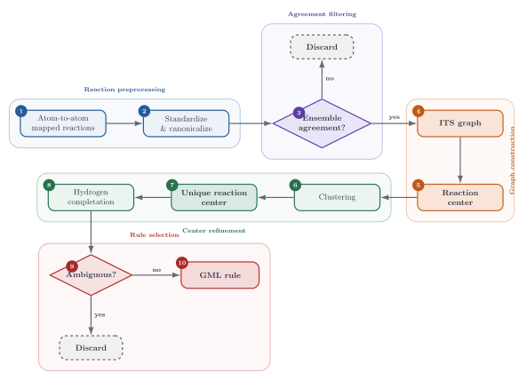

---
jupytext:
  text_representation:
    extension: .md
    format_name: myst
    format_version: 0.13
    jupytext_version: 1.19.4
kernelspec:
  display_name: synedu
  language: python
  name: python3
---

# S07: From Atom-Mapped Reactions to DPO Rules

<div class="synedu-lesson-shell not-prose" style="box-sizing:border-box;margin:8px 0 24px;padding:20px;border:1px solid #243b53;border-radius:16px;background:#102a43;color:#fff;font-family:system-ui,-apple-system,BlinkMacSystemFont,'Segoe UI',sans-serif"><div class="synedu-lesson-shell__top" style="display:flex;align-items:flex-start;justify-content:space-between;gap:16px;flex-wrap:wrap"><div><div class="synedu-lesson-shell__eyebrow" style="margin-bottom:5px;color:#5eead4;font-size:11px;font-weight:800;letter-spacing:.12em;text-transform:uppercase">SynEdu learning path</div><div class="synedu-lesson-shell__meta" style="font-size:16px;font-weight:750">Lesson 7 of 9 <span style="color:#9fb3c8;font-weight:500">· Stage 2 · Rule construction</span></div></div><span class="synedu-lesson-shell__progress-label" style="color:#bcccdc;font-size:12px;font-weight:700">78% complete</span></div><div class="synedu-lesson-shell__track" style="height:5px;margin:16px 0 18px;overflow:hidden;border-radius:999px;background:#334e68"><span style="display:block;width:78%;height:100%;border-radius:inherit;background:#2dd4bf"></span></div><div class="synedu-notebook-actions" style="display:flex;align-items:center;gap:10px;flex-wrap:wrap" aria-label="Run this lesson"><a class="synedu-launch-badge" href="https://colab.research.google.com/github/TieuLongPhan/SynEdu/blob/main/docs/downloads/S07.ipynb"></a><a class="synedu-launch-badge" href="https://mybinder.org/v2/gh/TieuLongPhan/SynEdu/main?urlpath=lab/tree/docs/downloads/S07.ipynb"></a><a class="synedu-launch-badge" href="https://github.com/TieuLongPhan/SynEdu/raw/main/docs/downloads/S07.ipynb"></a><a class="synedu-launch-badge" href="/docs/installing"></a></div></div>

This talktorial builds the bridge from atom-mapped reaction records to a reusable DPO reaction-rule library. It combines standardization, ensemble mapping, ITS construction, WL prefiltering, graph isomorphism, and optional MØD export [@phan2025synkit; @shervashidze2011weisfeiler; @andersen2016software].

+++

## Aim of this talktorial

1. Standardize and canonicalize mapped reaction strings so equivalent maps can be compared reliably.
2. Construct high-confidence reaction centers from ensemble atom maps and ITS graphs.
3. Cluster, deduplicate, and export reaction centers as DPO rules.

---

## Learning outcomes

After completing this talktorial, you will be able to:

- standardize and canonicalize mapped reaction SMILES,
- construct an **ensemble atom map** by comparing multiple mapper outputs,
- build an **ITS graph** from a mapped reaction,
- extract a **reaction center** from an ITS graph,
- cluster reaction centers using **WL hashing** and exact **graph isomorphism**,
- convert a reaction center into a **DPO rule** $L \leftarrow K \rightarrow R$, and
- explain why consensus mapping and deduplication improve the reliability of a rule library.

+++

<p>
  The complete S07 workflow can be summarized as a linear pipeline.
  Each step progressively reduces mapping ambiguity and improves the reproducibility
  of graph-based reaction rule extraction.
</p>

<figure class="se-figure se-figure--left">
  
  <figcaption>
    <b>Figure 1.</b> Overview of the S07 workflow for extracting graph-based reaction
    rules from atom-to-atom mapped reactions. Reactions are first standardized and
    canonicalized, filtered by ensemble agreement, converted into ITS graphs, and
    reduced to reaction centers. Reaction centers are clustered to identify unique
    representatives, completed with hydrogen information, and finally exported as
    GML reaction rules. Discard branches indicate cases rejected because of
    insufficient mapping consensus or ambiguous hydrogen completion.
  </figcaption>
</figure>

+++

## 0. Setup & data

+++

This notebook uses **SynKit** [@phan2025synkit]. to accelerate development: fast access to molecular graphs, rule application (DPO/ITS), pattern matching, and utilities for building reaction-centric workflows.

we can easily install synkit via pypi:
```bash
pip install synkit
```

```{code-cell}
import logging
import os
import warnings

# SynKit reports progress with tqdm. Outside a live Jupyter session tqdm falls
# back to a text bar that writes one stderr line per update, which buries the
# actual results. Bars stay on when you run this notebook yourself.
os.environ.setdefault("TQDM_DISABLE", "1")
logging.disable(logging.INFO)
warnings.filterwarnings("ignore")

import rdkit
import pandas as pd
import networkx as nx
from pathlib import Path
from tqdm.auto import tqdm
from synedu.Utils import load_database

print("RDKit version:", rdkit.__version__)
print("NetworkX version:", nx.__version__)

DATA_DIR = Path("data")
DATA_PATH = DATA_DIR / "data_aam.json.gz"
data = pd.DataFrame(
    load_database(DATA_PATH)[:100]
)  # 100 reactions for manageable runtime
display(data.head())
print(data.shape)
```

The dataset incorporates three distinct atom mapping methodologies: `rxn_mapper` [@schwaller2021extraction], `graphormer` mapper [@nugmanov2022bidirectional], and `local_mapper` [@chen2024precise].

+++

## 1. Reaction preprocessing

1. Validate & standardize SMILES using `Standardize` [@schneider2016whats] (drop invalid/unparsable).

2. Canonicalize atom-map numbers with `CanonRSMI` (from **S06**) for identical mappings.

```{code-cell}
from tqdm.auto import tqdm
from synkit.Chem.Reaction.standardize import Standardize
from synkit.Chem.Reaction.canon_rsmi import CanonRSMI

tqdm.pandas(desc="Canonicalizing")


def std_canon(aam: str):
    if aam is None:
        return None
    try:
        std = Standardize()
        canon = CanonRSMI(wl_iterations=4)
        aam_std = std.fit(aam, remove_aam=False)
        canon_out = canon.canonicalise(aam_std)
        return getattr(canon_out, "canonical_rsmi", None)
    except Exception:
        return None


tqdm.pandas(desc="Canonicalizing — rxn_mapper")
data['rxn_canon'] = data['rxn_mapper'].progress_apply(std_canon)

tqdm.pandas(desc="Canonicalizing — graphormer")
data['graph_canon'] = data['graphormer'].progress_apply(std_canon)

tqdm.pandas(desc="Canonicalizing — local_mapper")
data['local_canon'] = data['local_mapper'].progress_apply(std_canon)
```

## 2. Ensemble atom-to-atom mapping agreement

Compare the canonicalized mapper outputs by exact string equality; rows where all canonical maps match are high-confidence AAM assignments [@phan2025syntemp].

+++

**Definition (Canonical Reaction SMILES).**  
Two atom-mapped reaction SMILES $s_1$ and $s_2$ are *equivalent* if their corresponding ITS graphs $\Gamma_1$ and $\Gamma_2$ are isomorphic as labeled graphs: $\Gamma_1 \cong \Gamma_2$. The *canonical reaction SMILES* $\mathrm{canon}(s)$ is the lexicographically smallest string in the equivalence class, obtained by applying a canonical atom-map permutation $\pi: \mathbb{N} \to \mathbb{N}$ computed via WL refinement (approximation) or IR (exact).

**Definition (Ensemble Agreement).**  
Given $n$ atom-mapping functions $\varphi_1, \ldots, \varphi_n$ applied to the same reaction $\varrho$, the ensemble *agrees* on $\varrho$ if all canonical strings are identical:

$$
\mathrm{canon}(\varphi_1(\varrho)) = \mathrm{canon}(\varphi_2(\varrho)) = \cdots = \mathrm{canon}(\varphi_n(\varrho))
$$

When the ensemble disagrees, *refinement* (exact isomorphism check) is used to resolve the discrepancy.

**Definition (WL Reaction Hash).**  
The *WL hash* of a reaction center ITS $\Gamma_{\mathrm{RC}}$ is the string representation of the stable WL partition histogram:

$$
h_{\mathrm{WL}}(\Gamma_{\mathrm{RC}}) = \mathrm{encode}\!\left(\mathcal{P}^*(\Gamma_{\mathrm{RC}})\right)
$$

Reactions with identical WL hashes are *candidate isomorphs*; exact isomorphism (graph matching) [@cordella2004subgraph] is then used to confirm.

```{code-cell}
import pandas as pd
from typing import Tuple, List, Union, Sequence


def extract_aam(
    df: pd.DataFrame,
    keys: Sequence[str] = ("rxn_mapper", "graphormer", "local_mapper"),
    strip: bool = True,
    require_not_none: bool = True,
    return_indices: bool = False,
    inplace: bool = False,
) -> Union[
    Tuple[pd.DataFrame, pd.DataFrame],
    Tuple[pd.DataFrame, List[int], pd.DataFrame, List[int]],
]:
    k0, k1, k2 = keys
    s0, s1, s2 = df[k0].copy(), df[k1].copy(), df[k2].copy()
    if strip:
        mask0 = s0.map(lambda x: isinstance(x, str))
        mask1 = s1.map(lambda x: isinstance(x, str))
        mask2 = s2.map(lambda x: isinstance(x, str))
        if mask0.any():
            s0.loc[mask0] = s0.loc[mask0].str.strip()
        if mask1.any():
            s1.loc[mask1] = s1.loc[mask1].str.strip()
        if mask2.any():
            s2.loc[mask2] = s2.loc[mask2].str.strip()
    if require_not_none:
        non_null = s0.notna() & s1.notna() & s2.notna()
    else:
        non_null = pd.Series(True, index=df.index)
    eq_mask = non_null & s0.eq(s1) & s1.eq(s2)
    out_df = df.loc[eq_mask].copy()
    non_out_df = df.loc[~eq_mask].copy()
    if not out_df.empty:
        out_df = out_df.assign(aam=s0.loc[eq_mask].values)
        out_df = out_df.drop(columns=[k0, k1, k2], errors="ignore")
    if inplace:
        df.drop(df.index, inplace=True)
        for col in out_df.columns:
            df[col] = out_df[col].values
        df.reset_index(drop=True, inplace=True)
    if return_indices:
        return out_df, out_df.index.to_list(), non_out_df, non_out_df.index.to_list()
    return out_df, non_out_df


out, rest = extract_aam(data, keys=("rxn_canon", "graph_canon", "local_canon"))
print("Equivalent maps:", len(out))
print("Non equivalent maps:", len(rest))
```

Weisfeiler-Lehman [@shervashidze2011weisfeiler] based canonicalization is fast but not exact. Use WL/canonical strings as a cheap filter, then run exact ITS isomorphism on rows where canonical strings disagree or ambiguity remains.

In **SynKit**, we expose `AAMValidator` to compare directly atom-to-atom map by converting to ITS and checking isomorphism

```{code-cell}
import pandas as pd
from typing import Sequence, Tuple, Optional
from synkit.Chem.Reaction.aam_validator import AAMValidator


def refinement(
    df: pd.DataFrame,
    aam_cols: Sequence[str] = ("rxn_canon", "graph_canon", "local_canon"),
    validator: Optional[AAMValidator] = None,
) -> Tuple[pd.DataFrame, pd.DataFrame]:
    if validator is None:
        validator = AAMValidator()
    cols = list(aam_cols)
    if len(cols) < 2:
        raise ValueError("aam_cols must contain at least two columns")
    missing = [c for c in cols if c not in df.columns]
    if missing:
        raise KeyError(f"missing columns: {missing}")
    df2 = df.copy()
    df2[cols] = df2[cols].map(lambda x: x.strip() if isinstance(x, str) else x)
    ref = cols[0]
    solved_idx, unsolved_idx = [], []
    for idx, row in df2[cols].iterrows():
        ref_val = row[ref]
        if ref_val is None or pd.isna(ref_val):
            unsolved_idx.append(idx)
            continue
        ok = True
        for c in cols[1:]:
            val = row[c]
            if val is None or pd.isna(val):
                ok = False
                break
            try:
                if not bool(validator.smiles_check(ref_val, val)):
                    ok = False
                    break
            except Exception:
                ok = False
                break
        (solved_idx if ok else unsolved_idx).append(idx)
    solved = df2.loc[solved_idx].copy()
    solved = solved.drop(columns=[c for c in cols if c != ref], errors="ignore")
    solved = solved.rename(columns={ref: "aam"})
    unsolved = df2.loc[unsolved_idx].copy()
    return solved, unsolved


solve, unsolve = refinement(rest)
```

```{code-cell}
df_aam = pd.concat([out, solve], axis=0)
df_aam.shape
```

### Ensemble mapper agreement distribution

Three mappers (RXNMapper, Graphormer, Local Mapper) each produce an atom map for each reaction. The ensemble step classifies reactions by how many mappers agree. High-confidence reactions (all three agree) form the primary training signal; disagreements are resolved by WL-based isomorphism checking or discarded.

```{code-cell}
:tags: [hide-input]
import matplotlib.pyplot as plt

print(f"df_aam shape: {df_aam.shape}")
print(f"Columns: {list(df_aam.columns)}")

if "class" in df_aam.columns:
    _vc_class = df_aam["class"].value_counts().sort_index()
    fig, ax = plt.subplots(figsize=(max(6, len(_vc_class) * 1.5), 4))
    bars = ax.bar(
        _vc_class.index.astype(str),
        _vc_class.values,
        color="#1F77B4",
        alpha=0.85,
        edgecolor="white",
    )
    ax.bar_label(bars, padding=3, fontsize=9)
    ax.set_xlabel("Agreement class", fontsize=10)
    ax.set_ylabel("Number of reactions", fontsize=10)
    ax.set_title(
        "Ensemble mapping — mapper agreement class distribution",
        fontsize=11,
        fontweight="bold",
    )
    ax.spines[["top", "right"]].set_visible(False)
    plt.xticks(rotation=20, ha="right", fontsize=9)
    plt.tight_layout()
    plt.show()
    print(f"Total ensemble-validated reactions: {len(df_aam)}")
else:
    print("'class' column not found. Available columns:", list(df_aam.columns))
    display(df_aam.head(3))
```

**Q1 — Ensemble mapping**

Given a DataFrame with several mapper columns, `ensemble_maps(df, map_cols)`:
- canonicalizes each mapper column with `std_canon(...)`,
- accepts rows where all canonical values are identical,
- runs `refinement(...)` on the leftovers,
- returns `(solved_df, unsolved_df)` where `solved_df` keeps only metadata + one `aam` column.
- combine all high-confident maps and drop duplicate if possible


---

<details> <summary><b>Solution:</b></summary>

```python
from typing import List, Tuple
import pandas as pd
from tqdm.auto import tqdm

tqdm.pandas() 

def ensemble_maps(df: pd.DataFrame, map_cols: List[str]) -> Tuple[pd.DataFrame, pd.DataFrame]:
    missing = [c for c in map_cols if c not in df.columns]
    if missing:
        raise KeyError(f"missing columns: {missing}")

    canon_cols = []
    for col in map_cols:
        tgt = f"{col}_canon"
        canon_cols.append(tgt)
        tqdm.pandas(desc=f"Canonicalization {col}") 
        df[tgt] = df[col].progress_apply(std_canon)

    match, unmatch = extract_aam(df, keys=tuple(canon_cols))
    solve, unsolve = refinement(unmatch, aam_cols=tuple(canon_cols))

    out = pd.concat([match, solve], axis=0).reset_index(drop=True)
    out = out.drop_duplicates(subset="aam", keep="first").reset_index(drop=True)
    return out, unsolve

    
```
</details>

+++

## 3. Rule library construction

With high-confidence `aam` maps in hand, convert each mapped reaction into an ITS graph, extract the reaction center, and turn that center into a reusable rule entry for the library.

+++

### 3.1. Graph construction

```{code-cell}
df_aam.drop_duplicates(subset='aam', inplace=True)
```

We now use **synedu.Utils** to convert each atom-mapped reaction to an ITS graph and extract the reaction center.

```{code-cell}
from synedu.Utils import rsmi_to_its
from synedu.Utils.its_vis import visualize_its
import matplotlib.pyplot as plt


def _safe_rsmi_to_its(rsmi, core=False):
    """Wrap rsmi_to_its to silently return None on bad/unmapped SMILES."""
    try:
        if not isinstance(rsmi, str) or ">>" not in rsmi:
            return None
        return rsmi_to_its(rsmi, core=core)
    except Exception:
        return None


tqdm.pandas(desc="ITS construction")
df_aam["ITS"] = df_aam["aam"].progress_apply(lambda s: _safe_rsmi_to_its(s, core=False))

tqdm.pandas(desc="Reaction center construction")
df_aam["RC"] = df_aam["aam"].progress_apply(lambda s: _safe_rsmi_to_its(s, core=True))

# Drop rows where ITS/RC could not be built
_before = len(df_aam)
df_aam.dropna(subset=["ITS", "RC"], inplace=True)
df_aam.reset_index(drop=True, inplace=True)
print(f"Kept {len(df_aam)}/{_before} reactions with valid ITS/RC")

fig, ax = plt.subplots(1, 2, figsize=(20, 8))
_idx = df_aam.index[1]
visualize_its(df_aam["ITS"][_idx], show_node_labels=False, ax=ax[0], show_legend=False)
visualize_its(df_aam["RC"][_idx], show_node_labels=False, ax=ax[1], show_legend=False)
ax[0].set_title("ITS graph", fontsize=24, fontweight="bold")
ax[1].set_title("Reaction center", fontsize=24, fontweight="bold")
plt.tight_layout()
plt.show()
```

### 3.2. Core refinement

+++

#### Graph Clustering

Now we have a set of reaction centers, but some of them can be isomorphic [@cordella2004subgraph], so we develop a simple pairwise grouping algorithm

With a set $S=\{\Gamma_1,\Gamma_2,\dots,\Gamma_n\},\qquad n\ge 2$, we want a partition $T$ of $S$ into isomorphism classes.

**Pseudocode**

$$
\begin{array}{l}
T \leftarrow \varnothing\\[4pt]
S \leftarrow \{\Gamma_1,\Gamma_2,\dots,\Gamma_n\}\\[6pt]
\text{while } S \neq \varnothing :\\
\quad q^{*} \leftarrow \text{arbitrary element of } S\\
\quad S \leftarrow S \setminus \{q^{*}\}\\
\quad C \leftarrow \{q^{*}\}\\
\quad \text{for each } q \in \mathrm{copy}(S) :\\
\quad\quad \text{if }\operatorname{VF2\_iso}(q,q^{*}) \text{ then}\\
\quad\quad\quad C \leftarrow C \cup \{q\}\\
\quad\quad\quad S \leftarrow S \setminus \{q\}\\
\quad\quad \text{end if}\\
\quad \text{end for}\\
\quad T \leftarrow T \cup \{C\}\\
\text{end while}\\[4pt]
\text{return } T
\end{array}
$$

+++

In SynKit, this algorithm is implemented in `GraphCluster`

```{code-cell}
from synedu.Utils import cluster_its_graphs

_rc_graphs = df_aam["RC"].tolist()
_labels = cluster_its_graphs(
    _rc_graphs,
    node_attrs=["element", "formal_charge"],
    edge_attrs=["order"],
)
df_aam["class"] = _labels
result = df_aam.to_dict("records")
print(f"Total reactions: {len(result)},  unique rule classes: {len(set(_labels))}")
result[0]
```

**Q2 — Unique rules**

You have a list of dictionaries where each item represents a reaction-center record and contains a `class` label (the isomorphism class). Implement `get_unique_rc(...)` to extract one representative reaction center per class.

---

<details> <summary><b>Solution:</b></summary>

```python
from typing import List, Dict, Any

def get_unique_rc(
    items: List[Dict[str, Any]],
    class_key: str = "class",
    rc_key: str = "RC",
    keep: str = "first",
) -> List[Any]:
    if keep not in ("first", "last"):
        raise ValueError("keep must be 'first' or 'last'")

    reps: dict = {}  # class -> (idx, rc)
    for i, it in enumerate(items):
        cls = it.get(class_key)
        if cls is None:
            continue
        rc = it.get(rc_key)
        if keep == "first":
            if cls not in reps:
                reps[cls] = (i, rc)
        else:  # keep == "last"
            reps[cls] = (i, rc)

    # sort by stored index and return rc values
    ordered = sorted(reps.values(), key=lambda x: x[0])
    return [rc for _, rc in ordered]


    
```
</details>

+++

Alternatively, we can leverage Synkit’s utility functions

```{code-cell}
from synedu.Utils import stratified_sample

rc_records = stratified_sample(result, key="class")  # one record per class
rc = [r["RC"] for r in rc_records]
print(f"Representative reaction centers: {len(rc)}")
```

#### Hydrogen completion in reaction centers

Implicit hydrogens are stored as a `hcount = (h_r, h_p)` tuple on each ITS node.
When `h_r ≠ h_p` a hydrogen atom is *transferred* between molecules.
Graph Modelling Language format requires **explicit H nodes** so the rule engine can track every atom.

**`h_expand_its` — four-step pipeline**

| Step | Action |
|------|--------|
| ① | Decompose ITS → separate reactant / product graphs (convert tuple attrs → scalars) |
| ② | Identify *donor* atoms (`h_r > h_p`) and *acceptor* atoms (`h_r < h_p`) |
| ③ | Pair donors ↔ acceptors (`n_shared = min(|donors|, |acceptors|)`); add one **shared H node** per pair |
| ④ | Rebuild ITS — the shared H node gets **two edges** |

| H edge | `order` | GML block | Colour |
|--------|---------|-----------|--------|
| H – donor    | `(1, 0)` | `left`  | 🔴 broken |
| H – acceptor | `(0, 1)` | `right` | 🟢 formed |

> **Only balanced transfers are expanded.**  
> If donors and acceptors do not have the same count (e.g. H is gained from an unmapped
> solvent molecule), the surplus is left implicit.  Adding single-ended H nodes (broken
> *or* formed only) to a DPO rule would introduce atoms with no counterpart on the other
> side — chemically meaningless and rejected by MØD.

> **Ambiguous cases** — when multiple donors and acceptors exist, different pairings can
> produce **non-isomorphic** reaction centers (see §3.2).

```{code-cell}
import networkx as nx
import matplotlib.pyplot as plt
from synedu.Utils.reaction import build_its
from synedu.Utils.its_vis import visualize_its


def its_decompose(its: nx.Graph):
    """Decompose ITS back into reactant and product molecular graphs."""
    r, p = nx.Graph(), nx.Graph()
    for n, data in its.nodes(data=True):
        r_attrs, p_attrs = {}, {}
        for k, v in data.items():
            if isinstance(v, tuple) and len(v) == 2:
                r_attrs[k], p_attrs[k] = v[0], v[1]
            else:
                r_attrs[k] = p_attrs[k] = v
        r_attrs["atom_map"] = p_attrs["atom_map"] = n
        r.add_node(n, **r_attrs)
        p.add_node(n, **p_attrs)
    for u, v, data in its.edges(data=True):
        br, bp = data.get("order", (0.0, 0.0))
        if float(br) > 0:
            r.add_edge(u, v, order=float(br))
        if float(bp) > 0:
            p.add_edge(u, v, order=float(bp))
    return r, p


def h_expand_its(its: nx.Graph) -> nx.Graph:
    """
    Expand implicit H transfers in an ITS into explicit H nodes.

    Only *balanced* donor-acceptor pairs are made explicit.
    Explicit H atoms already present in the ITS (from mapped SMILES) are
    skipped — their bonds are already encoded as ITS edges, so treating them
    as donors/acceptors would create spurious H-H bonds.
    """
    r, p = its_decompose(its)

    donors, acceptors = [], []
    for n in sorted(set(r.nodes()) & set(p.nodes())):
        if r.nodes[n].get("element") == "H":
            continue  # already explicit — skip to avoid H-H bonds
        hr = int(r.nodes[n].get("hcount", 0) or 0)
        hp = int(p.nodes[n].get("hcount", 0) or 0)
        # GetTotalNumHs() counts explicit H neighbours — subtract them
        # so we only track *implicit* transfers (explicit H nodes are
        # already encoded as ITS edges and must not be double-counted).
        expl_r = sum(1 for m in r.neighbors(n) if r.nodes[m].get("element") == "H")
        expl_p = sum(1 for m in p.neighbors(n) if p.nodes[m].get("element") == "H")
        implicit_r = max(0, hr - expl_r)
        implicit_p = max(0, hp - expl_p)
        donors.extend([n] * max(0, implicit_r - implicit_p))
        acceptors.extend([n] * max(0, implicit_p - implicit_r))

    n_shared = min(len(donors), len(acceptors))
    if n_shared == 0:
        return its  # no balanced transfers to expand

    next_id = max(set(r.nodes()) | set(p.nodes()), default=0) + 1
    for i in range(n_shared):
        hid = next_id + i
        _h_attrs = dict(
            element="H", formal_charge=0, aromatic=False, hcount=0, atom_map=hid
        )
        r.add_node(hid, **_h_attrs)
        r.add_edge(donors[i], hid, order=1.0)
        r.nodes[donors[i]]["hcount"] = max(
            0, (r.nodes[donors[i]].get("hcount", 0) or 0) - 1
        )
        p.add_node(hid, **_h_attrs)
        p.add_edge(acceptors[i], hid, order=1.0)
        p.nodes[acceptors[i]]["hcount"] = max(
            0, (p.nodes[acceptors[i]].get("hcount", 0) or 0) - 1
        )

    return build_its(r, p)


rc_h = [h_expand_its(g) for g in rc]
print(f"H-expanded reaction centers: {len(rc_h)}")

# ── Show comparison: first RC with a shared H transfer ───────────────
_show_idx = next(
    (i for i, g in enumerate(rc_h) if g.number_of_nodes() > rc[i].number_of_nodes()), 0
)
fig, (ax1, ax2) = plt.subplots(1, 2, figsize=(14, 5), facecolor="white")
visualize_its(
    rc[_show_idx],
    ax=ax1,
    title="RC — implicit H",
    show_legend=False,
    layout="kamada_kawai",
)
visualize_its(
    rc_h[_show_idx],
    ax=ax2,
    title="RC — explicit H transfer",
    show_legend=True,
    layout="kamada_kawai",
)
plt.suptitle(
    "Reaction center before / after hydrogen expansion", fontsize=11, fontweight="bold"
)
plt.tight_layout()
plt.show()

_with_h = sum(1 for a, b in zip(rc, rc_h) if b.number_of_nodes() > a.number_of_nodes())
print(f"{_with_h}/{len(rc)} rule classes have explicit H transfer")
```

#### Ambiguous hydrogen expansion

When an RC contains **multiple donor atoms and multiple acceptor atoms**,
more than one valid donor-acceptor pairing exists.  Different pairings can produce
**non-isomorphic** reaction centers, each representing a different mechanistic picture.

The reaction below involves **trichloroacetonitrile reacting with an *N*-hydroxy compound**.
Its RC has two donors and two acceptors:

| Atom | Role | hcount change |
|------|------|---------------|
| **O6** (N–O–H oxygen) | donor  | (1→0) loses H |
| **C12** (aromatic C–H) | donor  | (1→0) loses H |
| **N5** (amine nitrogen) | acceptor | (0→1) gains H |
| **N18** (nitrile nitrogen) | acceptor | (0→1) gains H |

This gives **two distinct pairings**:

| Pairing | O6 donates to | C12 donates to | Topology |
|---------|---------------|----------------|----------|
| A (natural) | **N5** | **N18** | H stays near its original bond partner |
| B (crossed) | **N18** | **N5**  | H crosses — different bridge topology |

`h_expand_all` enumerates every permutation and returns only the **structurally distinct** outcomes.

```{code-cell}
from itertools import permutations as _perms
import networkx as nx
import matplotlib.pyplot as plt
from synedu.Utils import rsmi_to_its, wl_hash
from synedu.Utils.reaction import build_its
from synedu.Utils.its_vis import visualize_its


def h_expand_all(its: nx.Graph):
    """
    Return all structurally distinct H-expanded ITS graphs.

    Tries every permutation of donor-acceptor pairings;
    de-duplicates by WL hash before returning.
    """
    r, p = its_decompose(its)
    donors, acceptors = [], []
    for n in sorted(set(r.nodes()) & set(p.nodes())):
        if r.nodes[n].get("element") == "H":
            continue
        hr = int(r.nodes[n].get("hcount", 0) or 0)
        hp = int(p.nodes[n].get("hcount", 0) or 0)
        expl_r = sum(1 for m in r.neighbors(n) if r.nodes[m].get("element") == "H")
        expl_p = sum(1 for m in p.neighbors(n) if p.nodes[m].get("element") == "H")
        implicit_r = max(0, hr - expl_r)
        implicit_p = max(0, hp - expl_p)
        donors.extend([n] * max(0, implicit_r - implicit_p))
        acceptors.extend([n] * max(0, implicit_p - implicit_r))

    if not donors or not acceptors:
        return [its]

    n_shared = min(len(donors), len(acceptors))
    donors = donors[:n_shared]
    acceptors = acceptors[:n_shared]
    results, seen = [], set()

    for acc_perm in _perms(acceptors):
        r_c, p_c = r.copy(), p.copy()
        nxt = max(set(r.nodes()) | set(p.nodes()), default=0) + 1
        for i, (d, a) in enumerate(zip(donors, acc_perm)):
            hid = nxt + i
            _h = dict(
                element="H", formal_charge=0, aromatic=False, hcount=0, atom_map=hid
            )
            r_c.add_node(hid, **_h)
            r_c.add_edge(d, hid, order=1.0)
            r_c.nodes[d]["hcount"] = max(0, (r_c.nodes[d].get("hcount", 0) or 0) - 1)
            p_c.add_node(hid, **_h)
            p_c.add_edge(a, hid, order=1.0)
            p_c.nodes[a]["hcount"] = max(0, (p_c.nodes[a].get("hcount", 0) or 0) - 1)
        cand = build_its(r_c, p_c)
        h = wl_hash(cand, node_attrs=["element", "formal_charge"], edge_attrs=["order"])
        if h not in seen:
            seen.add(h)
            results.append(cand)
    return results


# ── Real reaction: trichloroacetonitrile + N-hydroxy compound ────────────
_rsmi_amb = (
    "[CH3:1][O:2][C:3](=[O:4])[N:5]([OH:6])[c:7]1[cH:8][cH:9][cH:10][cH:11][cH:12]1"
    ".[N:18]#[C:17][C:14]([Cl:13])([Cl:15])[Cl:16]"
    ">>"
    "[CH3:1][O:2][C:3](=[O:4])[NH:5][c:7]1[cH:8][cH:9][cH:10][cH:11][c:12]1"
    "[NH:18][C:17](=[O:6])[C:14]([Cl:13])([Cl:15])[Cl:16]"
)

_rc_amb = rsmi_to_its(_rsmi_amb, core=True)

print("RC summary:")
for n in sorted(_rc_amb.nodes()):
    d = _rc_amb.nodes[n]
    hc = d.get("hcount", (0, 0))
    role = (
        "donor"
        if isinstance(hc, tuple) and hc[0] > hc[1]
        else "acceptor" if isinstance(hc, tuple) and hc[1] > hc[0] else ""
    )
    if role:
        print(f"  atom {n:2d} ({d.get('element')})  hcount={hc}  → {role}")

candidates = h_expand_all(_rc_amb)
print(f"\n→ {len(candidates)} structurally distinct expansion(s)")

_wl_fn = lambda g: wl_hash(
    g, node_attrs=["element", "formal_charge"], edge_attrs=["order"]
)
for i, cand in enumerate(candidates):
    print(
        f"  Pairing {i+1}: {cand.number_of_nodes()} nodes, "
        f"{cand.number_of_edges()} edges  WL={_wl_fn(cand)[:12]}…"
    )

# ── Visualize: RC + both expansions ─────────────────────────────────────
_n = len(candidates)
_pair_titles = [
    "Pairing A  (natural)\nO6→N5,  C12→N18\nH stays near its bond partner",
    "Pairing B  (crossed)\nO6→N18,  C12→N5\nH bridges across the RC",
]

fig, axes = plt.subplots(1, _n + 1, figsize=(6.5 * (_n + 1), 6), facecolor="white")

visualize_its(
    _rc_amb,
    ax=axes[0],
    title="Ambiguous RC (implicit H)\n2 donors · 2 acceptors",
    show_legend=False,
    show_edge_labels=True,
    layout="kamada_kawai",
)
axes[0].text(
    0.5,
    -0.05,
    "Donors: O6 (N–OH) · C12 (Ar–H)\nAcceptors: N5 (amine) · N18 (nitrile N)",
    ha="center",
    va="top",
    transform=axes[0].transAxes,
    fontsize=8,
    color="#333",
    bbox=dict(boxstyle="round,pad=0.3", fc="lightyellow", alpha=0.95),
)

for i, cand in enumerate(candidates):
    ttl = _pair_titles[i] if i < len(_pair_titles) else f"Pairing {i+1}"
    visualize_its(
        cand,
        ax=axes[i + 1],
        title=ttl,
        show_legend=(i == _n - 1),
        show_edge_labels=True,
        layout="kamada_kawai",
    )
    axes[i + 1].text(
        0.5,
        -0.05,
        f"WL: {_wl_fn(cand)[:14]}…",
        ha="center",
        va="top",
        transform=axes[i + 1].transAxes,
        fontsize=7,
        color="#666",
    )

plt.suptitle(
    "Ambiguous H expansion — 2 non-isomorphic reaction centers\n"
    "(trichloroacetonitrile + N-hydroxy compound)",
    fontsize=11,
    fontweight="bold",
)
plt.tight_layout()
plt.show()
```

### 3.3. Rule selection

+++

#### Rule library size vs dataset size

A key question: does the rule vocabulary *saturate* (good for generalization)
or grow indefinitely (poor coverage at test time)?
We subsample the dataset at increasing sizes and plot unique rule count.

```{code-cell}
from synedu.Utils import wl_hash
```

```{code-cell}
tqdm.pandas(desc="WL hash calculation")
_wl = lambda g: wl_hash(
    g, node_attrs=["element", "formal_charge"], edge_attrs=["order"]
)
df_aam["wl_hash"] = df_aam["RC"].progress_apply(_wl)
df_aam["wl_hash_its"] = df_aam["ITS"].progress_apply(_wl)
```

```{code-cell}
df_aam['wl_hash'].value_counts()
```

```{code-cell}
:tags: [hide-input]
import matplotlib.pyplot as plt
import numpy as np

_sizes = [100, 300, 500, 1000, 2000, 5000, len(df_aam)]
_sizes = [s for s in _sizes if s <= len(df_aam)]
_unique_rules = []

for sz in _sizes:
    _sub = df_aam.sample(n=sz, random_state=42) if sz < len(df_aam) else df_aam
    _unique_rules.append(_sub['wl_hash'].nunique())

fig, ax = plt.subplots(figsize=(8, 4), facecolor='white')
ax.plot(
    _sizes,
    _unique_rules,
    'o-',
    color='#1F77B4',
    linewidth=2.2,
    markersize=7,
    markerfacecolor='white',
    markeredgewidth=2,
)
ax.fill_between(_sizes, _unique_rules, alpha=0.12, color='#1F77B4')

# Fit power law for annotation
_xs = np.log(np.array(_sizes, dtype=float))
_ys = np.log(np.array(_unique_rules, dtype=float))
with warnings.catch_warnings():
    # Few points on a log-log fit; the conditioning warning is expected here.
    warnings.simplefilter("ignore")
    _coef = np.polyfit(_xs, _ys, 1)
ax.text(
    0.05,
    0.92,
    f'Growth exponent $\\alpha \\approx {_coef[0]:.2f}$\n'
    f'($<$1 = sub-linear = saturation)',
    transform=ax.transAxes,
    fontsize=9,
    va='top',
    bbox=dict(boxstyle='round,pad=0.3', fc='white', ec='#ccc', alpha=0.9),
)

ax.set_xlabel('Dataset size (reactions)', fontsize=10)
ax.set_ylabel('Unique rule classes (WL hash)', fontsize=10)
ax.set_title('Rule Library Size vs Dataset Size', fontsize=11, fontweight='bold')
ax.grid(alpha=0.3)
plt.tight_layout()
plt.show()
print(f'At full dataset ({_sizes[-1]} rxns): {_unique_rules[-1]} unique rules')
```

Applying the same reduction logic to isomorphic ITS graphs is feasible, though computationally more expensive than focusing solely on the reaction center.
To optimize the computationally intensive ITS reduction, we can leverage Weisfeiler-Lehman [@shervashidze2011weisfeiler] pre-filtering (per **S06**). This ensures that expensive isomorphism checks are only performed on high-probability candidates

+++

#### Rule frequency and cluster size distribution

The WL hash partitions reactions by their reaction-centre topology. The **left panel** shows the distribution of cluster sizes on a log scale — a long tail is typical (a few very common rules, many rare ones). The **right panel** shows the 20 most frequent rules. Singleton clusters represent unique reaction patterns seen only once in the dataset.

+++

#### Top-10 rule classes — reaction center gallery

The most frequent WL hash classes represent the most common reaction mechanisms in the dataset.  
We visualize the reaction center ITS graph for the representative of each top-10 class.

```{code-cell}
:tags: [hide-input]
import matplotlib.pyplot as plt
from synedu.Utils.its_vis import visualize_its

# For each WL hash, pick the *most frequent* exact isomorphism class.

# 1. majority exact class per WL hash
_wl_majority_class = (
    df_aam.groupby("wl_hash")["class"]
    .agg(lambda s: s.value_counts().idxmax())
    .to_dict()
)

# 2. class-indexed lookups from rc_records
_class_to_rch = {}
_class_to_rc = {}
_class_to_its = {}
for i, rec in enumerate(rc_records):
    cls = rec.get("class")
    if cls not in _class_to_rch:
        _class_to_rch[cls] = rc_h[i]
        _class_to_rc[cls] = rc[i]
        if "ITS" in rec:
            _class_to_its[cls] = rec["ITS"]


def _has_dangling_h(g):
    """True if any H atom in g has no heavy-atom neighbour.

    This signals incomplete atom mapping: H was tracked but the heavy
    atom it bonds to was not mapped, so the H appears disconnected.
    Classes with dangling H are skipped in the gallery.
    """
    for n in g.nodes():
        if g.nodes[n].get("element") != "H":
            continue
        heavy_nbrs = [m for m in g.neighbors(n) if g.nodes[m].get("element") != "H"]
        if not heavy_nbrs:
            return True
    return False


def _has_hh_edge(g):
    return any(
        g.nodes[u].get("element") == "H" and g.nodes[v].get("element") == "H"
        for u, v in g.edges()
    )


def _augment_rc_with_closure(rc_graph, its_full):
    """Add preserved ITS bonds between RC nodes to close cycles."""
    if its_full is None:
        return rc_graph
    aug = rc_graph.copy()
    rc_nodes = set(rc_graph.nodes())
    for u, v, d in its_full.edges(data=True):
        if u not in rc_nodes or v not in rc_nodes or aug.has_edge(u, v):
            continue
        order = d.get("order", (0.0, 0.0))
        br, bp = order if isinstance(order, tuple) else (float(order), float(order))
        if abs(float(br) - float(bp)) < 1e-9 and float(br) > 0:
            aug.add_edge(u, v, **d)
    return aug


# Top-10 by WL hash frequency.
# Skip classes where H atoms are dangling (no heavy-atom neighbour):
# these have incomplete atom mapping and produce misleading disconnected H.
_freq = df_aam["wl_hash"].value_counts()
_freq_items = list(_freq.items())

fig, axes = plt.subplots(2, 5, figsize=(16, 7), facecolor="white")
axes = axes.flatten()

_shown, _rank = 0, 0
while _shown < 10 and _rank < len(_freq_items):
    wl_key, count = _freq_items[_rank]
    _rank += 1

    maj_cls = _wl_majority_class.get(wl_key)
    g_try = _class_to_rch.get(maj_cls)

    if g_try is None:
        row = df_aam[df_aam["wl_hash"] == wl_key].iloc[0]
        g_try = h_expand_its(row["RC"])

    # Skip classes with dangling H atoms (incomplete atom mapping)
    if _has_dangling_h(g_try):
        continue

    if _has_hh_edge(g_try):
        raw_rc = _class_to_rc.get(maj_cls)
        its_ref = _class_to_its.get(maj_cls)
        if raw_rc is not None and its_ref is not None:
            g_display = _augment_rc_with_closure(raw_rc, its_ref)
        else:
            g_display = g_try
    else:
        g_display = g_try

    ax = axes[_shown]
    try:
        visualize_its(
            g_display,
            ax=ax,
            title=f"#{_shown + 1}  n={count}",
            show_legend=False,
            show_edge_labels=True,
            node_size=420,
            font_size=7,
            layout="kamada_kawai",
        )
    except Exception as exc:
        ax.text(
            0.5,
            0.5,
            str(exc)[:40],
            ha="center",
            va="center",
            transform=ax.transAxes,
            fontsize=7,
        )
        ax.set_title(f"#{_shown + 1}  n={count}", fontsize=8, fontweight="bold")
        ax.axis("off")
    _shown += 1

from matplotlib.patches import Patch

_LEG = [
    Patch(color="#888888", label="preserved"),
    Patch(color="#D62728", label="broken"),
    Patch(color="#2CA02C", label="formed"),
    Patch(color="#FF7F0E", label="changed"),
]
fig.legend(
    handles=_LEG,
    loc="lower center",
    ncol=4,
    fontsize=9,
    title="Edge type",
    title_fontsize=9,
)
fig.suptitle(
    "Top-10 Reaction Center Classes  (by WL hash frequency) — H-expanded",
    fontsize=12,
    fontweight="bold",
)
plt.tight_layout(rect=[0, 0.07, 1, 1])
plt.show()
```

```{code-cell}
:tags: [hide-input]
import matplotlib.pyplot as plt
import numpy as np

_vc = df_aam['wl_hash'].value_counts()
_sizes = _vc.values

fig, axes = plt.subplots(1, 2, figsize=(13, 4))
fig.suptitle(
    "Reaction rule distribution — WL hash clusters", fontsize=11, fontweight="bold"
)

# Left: log-log histogram of cluster sizes
_max = max(_sizes)
_bins = np.logspace(0, np.log10(_max + 1), min(30, _max + 2))
axes[0].hist(_sizes, bins=_bins, color="#1F77B4", alpha=0.85, edgecolor="white")
axes[0].set_xscale("log")
if _sizes.max() > 5:
    axes[0].set_yscale("log")
axes[0].set_xlabel("Cluster size  (reactions per WL hash)")
axes[0].set_ylabel("Number of clusters")
axes[0].set_title("Cluster size distribution")
axes[0].spines[["top", "right"]].set_visible(False)

# Right: top-20 most frequent rules
_top = _vc.head(20)
axes[1].barh(
    range(len(_top)), _top.values[::-1], color="#D62728", alpha=0.85, edgecolor="white"
)
axes[1].set_yticks(range(len(_top)))
axes[1].set_yticklabels([f"rule {i+1}" for i in range(len(_top))][::-1], fontsize=8)
axes[1].set_xlabel("Frequency  (# reactions)")
axes[1].set_title("Top-20 most frequent rules")
axes[1].spines[["top", "right"]].set_visible(False)

plt.tight_layout()
plt.show()

print(f"Unique rules (WL hashes):  {len(_vc)}")
print(f"Most frequent rule:        {_sizes.max()} reactions")
print(
    f"Singleton rules:           {(_sizes == 1).sum()}  ({(_sizes==1).sum()/len(_vc)*100:.1f}%)"
)
```

While `wl_hash` effectively yields the same equivalence classes as graph isomorphism in this instance, it is important to note that the WL hash is an approximation. For absolute precision, it should be supplemented or replaced by a formal isomorphism check.

+++

**Q3 — ITS uniqueness**

Now integrate a function named `cluster_with_wl_prefilter(df, graph_key, wl_key)` to prefilter the bucket before

---

<details> <summary><b>Solution:</b></summary>

```python
import pandas as pd
from synedu.Utils import cluster_its_graphs

def cluster_with_wl_prefilter(
    df: pd.DataFrame,
    graph_key: str = "RC",
    wl_key: str = "wl_hash",
) -> pd.DataFrame:
    df2 = df.copy()
    if wl_key not in df2.columns:
        raise KeyError(f"{wl_key} not found in DataFrame")

    results = []
    next_class = 0
    for wl_val, idxs in df2.groupby(wl_key).groups.items():
        bucket = df2.loc[idxs]
        graphs = bucket[graph_key].tolist()
        labels = cluster_its_graphs(graphs)
        bucket = bucket.copy()
        bucket["class"] = [lbl + next_class for lbl in labels]
        next_class = int(bucket["class"].max()) + 1
        results.append(bucket)

    return pd.concat(results, ignore_index=True) if results else pd.DataFrame()
```
</details>

+++

#### DPO rules

Each representative reaction center in `rc_h` (the H-expanded list built in §3.1)
is now converted to a **MØD GML rule** — the formal DPO representation $L \leftarrow K \rightarrow R$.

| GML block | Meaning | ITS edges included |
|-----------|---------|-------------------|
| `left`    | bonds **broken** in the reaction | `order = (b_r, 0)` — exist only in reactant |
| `right`   | bonds **formed** in the reaction | `order = (0, b_p)` — exist only in product |
| `context` | bonds **unchanged** + all atoms | `order = (b, b)` with `b > 0` |

Because we use `rc_h`, every transferred hydrogen is represented as an **explicit H node**
with a broken bond to its donor (`left`) and a formed bond to its acceptor (`right`).
This satisfies the MØD requirement that all atoms — including hydrogens — are tracked explicitly.

+++

**Building `its_to_gml` — step by step**

The conversion has three sub-tasks:

| Sub-task | Input | Output |
|----------|-------|--------|
| ① Classify each edge | `order = (b_r, b_p)` tuple | `left` / `right` / `context` |
| ② Label each node | `element`, `formal_charge` attrs | atom label string (e.g. `"N+"`) |
| ③ Label each bond | scalar bond order `b` | GML bond string (`"1"`, `"2"`, `"#"`, `"3"`) |

Consider the small RC below.
Each edge carries an `order = (b_r, b_p)` tuple:

| Edge | `order` | GML block | Meaning |
|------|---------|-----------|---------|
| C – O | `(1, 0)` | `left` | bond **broken** |
| C – N | `(0, 1)` | `right` | bond **formed** |
| C – C | `(1, 1)` | `context` | bond **preserved** |
| N – H | `(0, 1)` | `right` | H **transferred** (formed on acceptor) |
| O – H | `(1, 0)` | `left` | H **transferred** (broken on donor) |

```{code-cell}
import networkx as nx
import matplotlib.pyplot as plt
from synedu.Utils.its_vis import visualize_its

# ── Minimal demo RC: C-O broken, C-N formed, C-C preserved, + H transfer ──
_demo = nx.Graph()
_demo.add_node(
    1, element="C", formal_charge=(0, 0), hcount=(0, 0), aromatic=(False, False)
)
_demo.add_node(
    2, element="O", formal_charge=(0, 0), hcount=(1, 0), aromatic=(False, False)
)
_demo.add_node(
    3, element="N", formal_charge=(0, 0), hcount=(0, 1), aromatic=(False, False)
)
_demo.add_node(
    4, element="C", formal_charge=(0, 0), hcount=(0, 0), aromatic=(False, False)
)
_demo.add_node(
    5, element="H", formal_charge=(0, 0), hcount=(0, 0), aromatic=(False, False)
)

_demo.add_edge(1, 2, order=(1.0, 0.0))  # C-O  broken    → left
_demo.add_edge(1, 3, order=(0.0, 1.0))  # C-N  formed    → right
_demo.add_edge(1, 4, order=(1.0, 1.0))  # C-C  preserved → context
_demo.add_edge(2, 5, order=(1.0, 0.0))  # O-H  broken    → left
_demo.add_edge(3, 5, order=(0.0, 1.0))  # N-H  formed    → right

# ── Edge classification ────────────────────────────────────────────────────
_BOND_LBL = {1.0: "1", 1.5: "#", 2.0: "2", 3.0: "3"}

print(f"{'Edge':>7}  {'order':>12}  GML block")
print("-" * 40)
for u, v, d in _demo.edges(data=True):
    br, bp = float(d["order"][0]), float(d["order"][1])
    eu, ev = _demo.nodes[u]["element"], _demo.nodes[v]["element"]
    if br == bp and br > 0:
        block = "context"
    elif br > 0 and bp == 0:
        block = "left"
    elif br == 0 and bp > 0:
        block = "right"
    else:
        block = "left + right"  # bond order changes (e.g. single→double)
    print(f"{eu:>2}-{ev:<2}  {str(d['order']):>14}  {block}")

# ── Visualise ─────────────────────────────────────────────────────────────
fig, ax = plt.subplots(figsize=(5, 4), facecolor="white")
visualize_its(
    _demo,
    ax=ax,
    title="Demo RC — edge classification",
    show_legend=True,
    show_edge_labels=True,
    layout="kamada_kawai",
)
plt.tight_layout()
plt.show()
```

##### Step ① — helper functions

Two small helpers underpin `its_to_gml`:

| Helper | Input | Output | Example |
|--------|-------|--------|---------|
| `_bond_label(b)` | scalar float bond order | GML label string | `2.0 → "2"`, `1.5 → "#"` |
| `_node_label(attrs)` | node attribute dict | atom label string | `{"element":"N","formal_charge":1} → "N+"` |

```{code-cell}
def _bond_label(order: float) -> str:
    """Map a scalar bond order to its GML label string."""
    return {1.0: "1", 1.5: "#", 2.0: "2", 3.0: "3"}.get(
        round(float(order), 2), str(order)
    )


def _node_label(attrs: dict) -> str:
    """Return element symbol with optional charge suffix (e.g. N+, O-)."""
    elem = attrs.get("element", "*")
    chg_raw = attrs.get("formal_charge", 0)
    # formal_charge can be a scalar or an ITS (r, p) tuple — take reactant side
    chg = int((chg_raw[0] if isinstance(chg_raw, tuple) else chg_raw) or 0)
    if chg > 0:
        return f"{elem}+"
    if chg < 0:
        return f"{elem}-"
    return str(elem)


# ── Quick tests ──────────────────────────────────────────────────────────
print("_bond_label tests:")
for b, expected in [(1.0, "1"), (2.0, "2"), (1.5, "#"), (3.0, "3")]:
    out = _bond_label(b)
    print(f"  _bond_label({b}) = {out!r}  {'✓' if out == expected else '✗'}")

print("\n_node_label tests:")
cases = [
    ({"element": "C", "formal_charge": 0}, "C"),
    ({"element": "N", "formal_charge": 1}, "N+"),
    ({"element": "O", "formal_charge": -1}, "O-"),
    ({"element": "N", "formal_charge": (1, 1)}, "N+"),  # ITS tuple form
]
for attrs, expected in cases:
    out = _node_label(attrs)
    print(f"  _node_label({attrs}) = {out!r}  {'✓' if out == expected else '✗'}")
```

##### Step ② — assembling `its_to_gml`

With the helpers in place, the full function is a single pass over edges:

```
for each edge (u, v):
    br, bp = order
    if br > 0 and bp == 0  →  left  (broken)
    if br == 0 and bp > 0  →  right (formed)
    if br > 0 and bp > 0
        br ≠ bp             →  left + right (order changes)
        br == bp            →  context (preserved, optional)

all nodes always go into context
```

```{code-cell}
import networkx as nx
from typing import Union


def its_to_gml(
    its: nx.Graph,
    rule_id: Union[int, str] = 0,
    include_context_edges: bool = True,
) -> str:
    """Convert an ITS / H-expanded RC graph to a MØD GML rule string.

    :param its: ITS graph (edge order = (b_r, b_p) tuples).
    :param rule_id: Identifier written to the ``ruleID`` field.
    :param include_context_edges: If True, preserved bonds are emitted in
        the ``context`` block (required by MØD for bond-order context).
    :returns: GML rule string.
    """
    left_edges, right_edges, ctx_edges = [], [], []

    for u, v, d in its.edges(data=True):
        order = d.get("order", (0.0, 0.0))
        br, bp = (
            (float(order[0]), float(order[1]))
            if isinstance(order, (tuple, list))
            else (float(order), float(order))
        )

        if abs(br - bp) < 1e-9:  # preserved bond
            if br > 0 and include_context_edges:
                ctx_edges.append((u, v, _bond_label(br)))
        else:
            if br > 0:
                left_edges.append((u, v, _bond_label(br)))  # broken
            if bp > 0:
                right_edges.append((u, v, _bond_label(bp)))  # formed

    lines = [f'rule [', f'  ruleID "{rule_id}"', '  left [']
    for u, v, lbl in left_edges:
        lines.append(f'    edge [ source {u} target {v} label "{lbl}" ]')
    lines.append('  ]')

    lines.append('  context [')
    for n in sorted(its.nodes()):
        lines.append(f'    node [ id {n} label "{_node_label(its.nodes[n])}" ]')
    for u, v, lbl in ctx_edges:
        lines.append(f'    edge [ source {u} target {v} label "{lbl}" ]')
    lines.append('  ]')

    lines.append('  right [')
    for u, v, lbl in right_edges:
        lines.append(f'    edge [ source {u} target {v} label "{lbl}" ]')
    lines.append('  ]')
    lines.append(']')
    return '\n'.join(lines)


# ── Apply to the demo RC and inspect the output ──────────────────────────
gml_demo = its_to_gml(_demo, rule_id="demo", include_context_edges=True)
print(gml_demo)
```

```{code-cell}
# Generate one GML rule string per unique H-expanded reaction center
rules = [
    its_to_gml(g, rule_id=i, include_context_edges=True) for i, g in enumerate(rc_h)
]
print(f"Generated {len(rules)} GML rules")
print("\nFirst rule:")
print(rules[0] if rules else "(empty)")
```

**Q5 — Implement `its_to_gml`**

Using the edge classification logic above, implement `its_to_gml(its, rule_id, include_context_edges)` that converts an ITS/RC graph to a MØD GML string.

Requirements:
- `_bond_label(order)` maps a scalar float bond order to its GML string: `1.0→"1"`, `1.5→"#"`, `2.0→"2"`, `3.0→"3"`.
- `_node_label(attrs)` returns the element symbol with `+` or `-` suffix if `formal_charge ≠ 0`; handle both scalar and `(fc_r, fc_p)` tuple forms.
- For each edge `(b_r, b_p)`: if `b_r ≠ b_p`, put the reactant side (`b_r > 0`) in `left` and the product side (`b_p > 0`) in `right`; if `b_r == b_p > 0` and `include_context_edges` is True, put it in `context`.
- Always emit every node in the `context` block.

---

<details> <summary><b>Solution:</b></summary>

```python
import networkx as nx
from typing import Union


def _bond_label(order: float) -> str:
    o = round(float(order), 2)
    return {1.0: "1", 1.5: "#", 2.0: "2", 3.0: "3"}.get(o, str(o))


def _node_label(attrs: dict) -> str:
    elem = attrs.get("element", "*")
    chg_raw = attrs.get("formal_charge", 0)
    chg = int((chg_raw[0] if isinstance(chg_raw, tuple) else chg_raw) or 0)
    if chg > 0: return f"{elem}+"
    if chg < 0: return f"{elem}-"
    return str(elem)


def its_to_gml(
    its: nx.Graph,
    rule_id: Union[int, str] = 0,
    include_context_edges: bool = True,
) -> str:
    left_edges, right_edges, ctx_edges = [], [], []
    for u, v, d in its.edges(data=True):
        br, bp = d.get("order", (0.0, 0.0))
        br, bp = float(br), float(bp)
        if br != bp:
            if br > 0:
                left_edges.append((u, v, _bond_label(br)))
            if bp > 0:
                right_edges.append((u, v, _bond_label(bp)))
        elif include_context_edges and br > 0:
            ctx_edges.append((u, v, _bond_label(br)))

    lines = [f'rule [', f'  ruleID "{rule_id}"', '  left [']
    for u, v, lbl in left_edges:
        lines.append(f'    edge [ source {u} target {v} label "{lbl}" ]')
    lines.append('  ]')

    lines.append('  context [')
    for n in sorted(its.nodes()):
        lines.append(f'    node [ id {n} label "{_node_label(its.nodes[n])}" ]')
    for u, v, lbl in ctx_edges:
        lines.append(f'    edge [ source {u} target {v} label "{lbl}" ]')
    lines.append('  ]')

    lines.append('  right [')
    for u, v, lbl in right_edges:
        lines.append(f'    edge [ source {u} target {v} label "{lbl}" ]')
    lines.append('  ]')
    lines.append(']')
    return '\n'.join(lines)
```

Test on the demo RC:
```python
print(its_to_gml(_demo, rule_id="demo", include_context_edges=True))
```
</details>

+++

**Example GML output** (one rule, L/K/R encoded as sub-blocks):

```text
rule [
  ruleID "0"
  left [
    edge [ source 5 target 19 label "1" ]
  ]
  context [
    node [ id 5 label "N" ]
    node [ id 19 label "H" ]
    node [ id 23 label "N" ]
  ]
  right [
    edge [ source 23 target 19 label "1" ]
  ]
]
```

**Interpretation**

| Block | DPO component | Meaning |
|-------|---------------|---------|
| `context` (K) | preserved subgraph | atoms that exist in both reactant and product; all nodes always appear here |
| `left` (L∖K) | deleted bonds | bonds present only in the reactant — broken during the reaction |
| `right` (R∖K) | created bonds | bonds present only in the product — formed during the reaction |

In the example above, the H node (id 19) bridges from `N` (atom 5) in the reactant to `N` (atom 23) in the product — a direct N→N proton transfer encoded as an explicit H node with one broken and one formed bond.

Because `rc_h` contains H-expanded reaction centers, every transferred hydrogen already appears as an explicit node. The resulting GML rules are directly compatible with **MØD** [@andersen2016software] without further post-processing.

```{code-cell}
# Print a GML rule with H transfer (if one exists), else print the first rule
_ex = next((r for r in rules if "H" in r), rules[0] if rules else "(no rules)")
print(_ex)
```

**Q4 — Data pipeline**

Implement a single high-level function that ingests a pandas DataFrame containing multiple atom-mapping candidates per reaction and produces a deduplicated library of reaction centers / DPO rules (optionally exported to GML), plus the rows that remain ambiguous.

---

<details> <summary><b>Solution:</b></summary>

```python
from typing import List
from synedu.Utils import rsmi_to_its, cluster_its_graphs, stratified_sample, wl_hash

def rule_lib_pipeline(
        data: pd.DataFrame,
        map_cols: List[str],
        export_gml: bool = False):

    # 1. get high-confidence aam
    data, _ = ensemble_maps(data, map_cols)

    # 2. convert to RC
    tqdm.pandas(desc="ITS construction")
    data["ITS"] = data["aam"].progress_apply(lambda s: rsmi_to_its(s, core=False))

    tqdm.pandas(desc="Reaction center construction")
    data["RC"] = data["aam"].progress_apply(lambda s: rsmi_to_its(s, core=True))

    # 3. compute wl_hash for prefilter
    tqdm.pandas(desc="WL hash")
    _wl = lambda g: wl_hash(g, node_attrs=["element", "formal_charge"], edge_attrs=["order"])
    data["wl_hash"] = data["RC"].progress_apply(_wl)

    # 4. clustering
    rc_graphs = data["RC"].tolist()
    data["class"] = cluster_its_graphs(rc_graphs,
                                       node_attrs=["element", "formal_charge"],
                                       edge_attrs=["order"])
    result = data.to_dict("records")

    # 5. get unique reaction centers and expand H
    rc_records = stratified_sample(result, key="class")
    rc = [r["RC"] for r in rc_records]
    rc_h = [h_expand_its(g) for g in rc]

    # 6. convert to GML
    if export_gml:
        return [its_to_gml(g, rule_id=i, include_context_edges=False)
                for i, g in enumerate(rc_h)]
    return rc_h
```
</details>

+++

## 4. Discussion

- Atom-mapping quality can be significantly improved through ensemble techniques, specifically by performing isomorphism checks on generated ITS graphs [@phan2025syntemp].
- While WL-based canonicalization is effective for pre-filtering and deduplication, it remains an approximation and cannot fully replace exact isomorphism checks for definitive verification.
- Clustering reaction centers in large-scale datasets is computationally intensive; however, implementing a WL hashing pre-filter significantly accelerates the process by pruning the search space.
- Rules can be persisted as NetworkX graph objects for deep computational tasks or exported in GML format for a lightweight, human-readable, and explainable representation.

+++

## 5. Quiz

1. Why is reaction standardization needed before comparing atom-mapped reactions from different mappers?
2. How does comparing several mapper outputs help identify high-confidence atom mappings?
3. Why is WL hashing useful for clustering reaction centers, and why is exact isomorphism still needed?
4. What information must a DPO rule preserve so it can be exported and reused as a reaction-rule library entry?

+++

## 6. References

```{bibliography}
```
